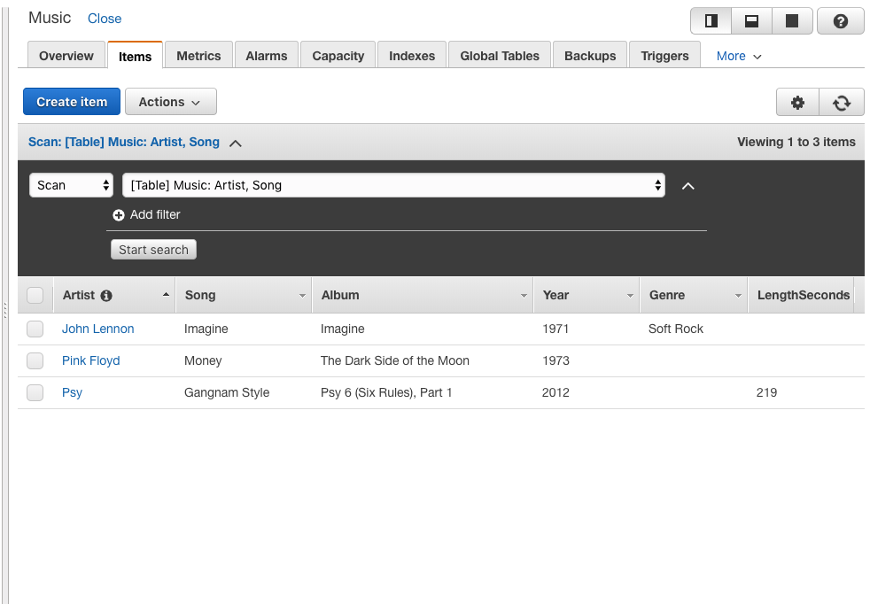
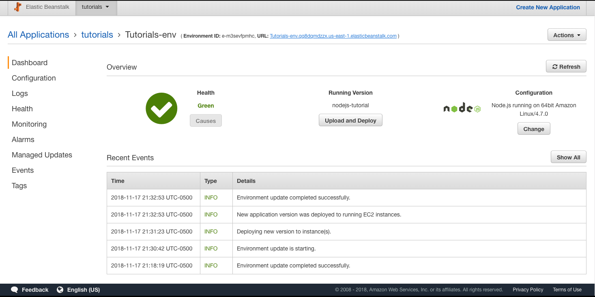
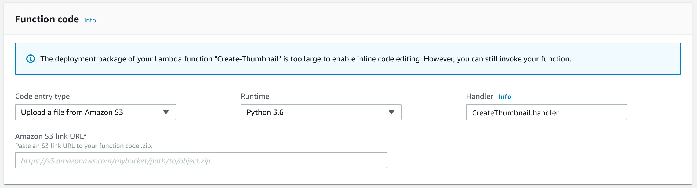
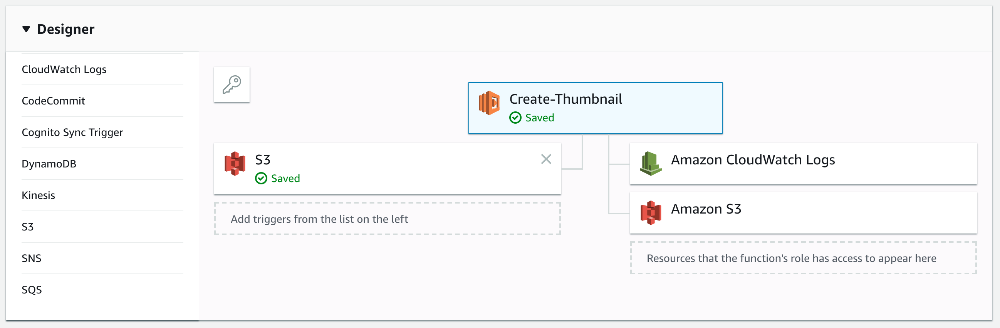
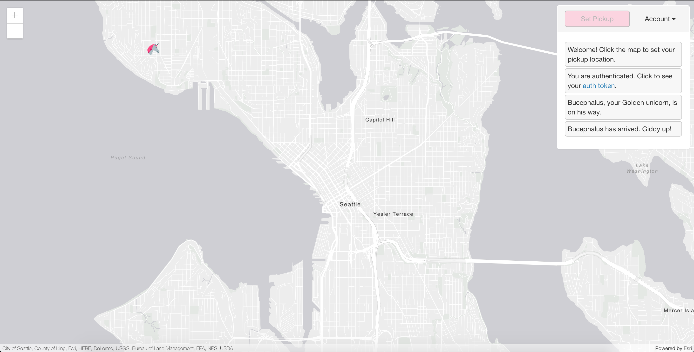

# Distributed Systems Practice
Notes from learning about distributed systems in [GW CS 6421](https://gwdistsys18.github.io/) with [Prof. Wood](https://faculty.cs.gwu.edu/timwood/)

## Docker and Container

Beginner Level:

[Video: Why Docker?](https://www.youtube.com/watch?v=RYDHUTHLf8U&t=0s&list=PLBmVKD7o3L8tQzt8QPCINK9wXmKecTHlM&index=23)

Why now -> New tech: Moving to Serverless ( FAAS : Function as a Service )

All inclusive solution, that is not just a Dev-Ops solution. It reduces the complexity of developing ( 80% Maintenance, 20% Developping ) to a move developping oriented.


[Lab](https://training.play-with-docker.com/ops-s1-hello/)

To download an image, and run a command inside a container run:

``` bash
docker image pull alpine
docker container run alpine ls -l
```

To start/resume a container run `docker container start <ID>`
To execute a command `docker container exec <ID>`
To inspect `docker image inspect <ID / name>`
to ls `docker container ls`

`docker exec -it <CONTAINER ID> /bin/bash`

Images can be the sam ebut execution is isolated, as well as filesystems
and Namespaces. Kernel is shared with other containers, and run as an
isolated process in userspace.

There is the Docker daemon -> Service that manages building, running and
distribution of containers.
The Docker client and the Docker Store.


[Video: What are Containers?](https://www.youtube.com/watch?v=EnJ7qX9fkcU)

It's a runtime sandboxed process with it's own namespace. It's lifecycle
is usually tied to the process lifecycle.

Image layering is the notion of an arraged hierarchy, in a parent-child
fashion. Tree Diagrams are a way to understand (you can make an analogy
to OOP)

A Dockerfile is the environment file that can be used to deploy and
create images using bulding blocs or base images. Containers are
packaged with all dependencies. These are not 'installed' but rather sit
on top of the kernel.

The registry contain the images ( from where you `push` and `pull`)
to the Docker Host. The host runs the image cache as well as the Docker
Daemon, who exposes API's to the client.
The client can `pull` `create` `run`

[Video: VMs Versus Containers](https://www.youtube.com/watch?v=L1ie8negCjc)

VM's interacts with HW through Agents, Kernel Modules, NIC. You can size
it and decide the storage. Containers live under the the application
layer on userspace.
On Vm's dependencies are associated to the OS while container
dependencies are on top of the OS inside the container.

[Lab](https://training.play-with-docker.com/beginner-linux/)

Run a Docker container and access its shell.

``` bash
docker container run --interactive --tty --rm ubuntu bash
```

In this example, we’re giving Docker three parameters:

- --interactive says you want an interactive session.
- --tty allocates a pseudo-tty.
- --rm tells Docker to go ahead and remove the container when it’s done executing.

You can potentionally run with `--detach` `--name` or `-e`

they are self explanatory `-e` inject an environment variable.

`docker container logs <name>` and `docker container top <name>` check the status
inside the container

You can also use `docker container exec` to connect to a new shell
process inside an already-running container: ` docker exec -it <name> sh` 
this will open a shell

Dockerfile:

```bash
FROM nginx:latest

COPY index.html /usr/share/nginx/html
COPY linux.png /usr/share/nginx/html

EXPOSE 80 443

CMD ["nginx", "-g", "daemon off;"]
```

- FROM specifies the base image to use as the starting point for this new image you’re creating. For this example we’re starting from nginx:latest.
- COPY copies files from the Docker host into the image, at a known location. In this example, COPY is used to copy two files into the image: index.html. and a graphic that will be used on our webpage.
- EXPOSE documents which ports the application uses.
- CMD specifies what command to run when a container is started from the image. Notice that we can specify the command, as well as run-time arguments.

`docker image build <name>:<version> <directory>`, which builds the
image

you can use `docker container run` to execute the image

```bash
docker container run \
 --detach \
 --publish 80:80 \
 --name <local name> \
 <name>:<version>
 ```

Important is the use of `--publish` which maps port 80 inside the container onto port 80 on the host

Use `docker container stop` and `docker container rm` to delete a
container

If you want to modify the image on the run which you're executing you
can mount a directry inside the container

```bash
 docker container run \
 --detach \
 --publish 80:80 \
 --name <local_name> \
 --mount type=bind,source="$(pwd)",target=/usr/share/nginx/html \
 <name>:<version
 ```

This changes the local but not the image. You need to build the image
again but this time it will be quicker given the the unchanged layers
have been cached. Only the changed one is build again.

To list images: `docker image ls`

In order to publish an image you need to login using `docker login`

To publish : `docker image push <name>:<version>`

[Video: VMs Versus Containers Deep Dive](https://www.youtube.com/watch?v=PoiXuVnSxfE)

3 Misconceptions:

- Size
- Isolation
- Boot Time

Size:

VM: Everything expect for HW is inside the disk image
Container: App and dependencies

Isolation:

VM: Boundaries outside `x86`: `EFI / BIOS`, `Kernel`, `Init`,... Very
hard to break
Container: The process understand and can brake the container. But the
it's up to the Kernel to protect itself.

Boot time:

VM: Slow but can be optimize with `EFI` and `D-Init`
Container: Time to boot Kernel Sandbox + Application

[Lab](https://training.play-with-docker.com/docker-networking-hol/)

For networking the command to create interfaces is `docker network`
you can `ls`, `inspect`, `create`,...

the brctl command shows the list the Linux bridges on your Docker host

containers connect by defaults to bridges connections.

```bash
docker run --name web1 -d -p 8080:80 nginx
```

run a linux nginx image with port mapping of host 8080 to container 80

`docker network create -d overlay <name>` creates an overlay network
for swarm mode

`docker network inspect <name>`

Swarm mode can run services inside the nodes:

```bash
docker service create --name <name of service> \
--network overnet \
--replicas 2 \
ubuntu sleep infinity
```

`--replicas` tells the number of instamces needed

You can ping from containers to each other and the VIP resolved by the
local DNS. This way you can run `ping -c5 <name of service>` and ping
correctly.

cat /etc/resolv.conf form inside of the container gives the DNS IP

```bash
docker exec -it yourcontainerid /bin/bash
cat /etc/resolv.conf
search ivaf2i2atqouppoxund0tvddsa.jx.internal.cloudapp.net
nameserver 127.0.0.11
options ndots:0
```

The value that we are interested in is the nameserver 127.0.0.11. This value sends all DNS queries from the container to an embedded DNS resolver running inside the container listening on 127.0.0.11:53. All Docker container run an embedded DNS server at this address.

Execute the docker service rm myservice command to remove the service called myservice.

`docker service rm <name of service>`

[Video: Kubernetes vs Swarm](https://www.youtube.com/watch?v=L8xuFG49Fac)

[Video: Kubernetes in 5 Minutes](https://www.youtube.com/watch?v=PH-2FfFD2PU)

Both Kubernetes and Docker Swarm are orquestration tools,

Kubernetes is an open source platform created by Google for container deployment. The idea was to automate deployment operation and scaling factors. It is sold as a production-ready, enterprise-grade, self-healing. This means that the fault-tolenrance of Kubernetes is very high.

Swarm uses a lot of the tools that regular Docker containers use. So that brings a simplicity. But Kubernetes has it's own Command Line Interface (CLI) that is incompatible with Docker.
Kubernetes itself is more complicate to use because the API is more complex. But it's more modular and a more all-in-one solution. Pods provide an easier organization compared to the only service / micro-service based Swarm

Intersting Links:

- [Kubernetes vs. Docker Swarm: What’s the Difference?](https://thenewstack.io/kubernetes-vs-docker-swarm-whats-the-difference/)
- [Kubernetes Tutorial](https://kubernetes.io/docs/tutorials/kubernetes-basics/)

Kubernetes:


Each node has a Kuberlet instance that run in each node to communicate
with the master node


A node is a worker machine in Kubernetes and may be a VM or physical machine, depending on the cluster. Multiple Pods can run on one Node.

To start a `BASH` inside a pod `kubectl exec -ti $POD_NAME bash`.
POD_NAME is the ID of the pod running inside the node

```bash
kubectl get - list resources
kubectl describe - show detailed information about a resource
kubectl logs - print the logs from a container in a pod
kubectl exec - execute a command on a container in a pod
```

A Service routes traffic across a set of Pods. Services are the abstraction that allow pods to die and replicate in Kubernetes without impacting your application. Discovery and routing among dependent Pods (such as the frontend and backend components in an application) is handled by Kubernetes Services.


To create a new service and expose it to external traffic we’ll use the expose command with NodePort as parameter (minikube does not support the LoadBalancer option yet).

```bash
kubectl expose deployment/kubernetes-bootcamp --type="NodePort" --port 8080
```

label creation: `kubectl label pod $POD_NAME app=v1`. `app=v1` is the label.

Using the abstraction of srvices to expose pods to the outside world. We can scale very quickly


To list your deployments use the get deployments command: `kubectl get deployments`

To scale `kubectl scale deployments/<name> --replicas=4`, you use labels to access the desired application

To get info use `kubectl describe <kind>/<name>`

To perform a rolling update use: `kubectl set image deployments/<name> <name>=<url>:<version>`

To rollback: `kubectl rollout undo deployments/<name>`

[AWS Tutorial: Break a Monolith Application into Microservices](https://aws.amazon.com/getting-started/projects/break-monolith-app-microservices-ecs-docker-ec2/?trk=gs_card)

In this tutorial, the idea is to deploy a monolithic node.js application to a Docker container, then decouple the application into microservices without any downtime. The node.js application hosts a simple message board with threads and messages between users.

The tutorial is divided into modules

[Repo](https://github.com/awslabs/amazon-ecs-nodejs-microservices)

1. Monolithic Application


To login use `$(aws ecr get-login --no-include-email --region us-east-1)`

`docker build -t sebas_api .`

But it is advised to tag the image to push it into the ECS instance.

If you cannot login to push use this `eval $(aws ecr get-login --no-include-email | sed 's|https://||')`


## Cloud Web Apps

[AWS LAB](https://aws.amazon.com/getting-started/tutorials/launch-a-virtual-machine/)

This lab is a simple way to access AWS Console and launch a simple Free tier EC2 instance with minimal resources. Remember to save the .perm (certificate) in a secure location. Also rememeber to run `chmod 400 mykey.perm` to change write permission and use the `-i` flag for the ssh

[QwikLab: Intro to S3](https://awseducate.qwiklabs.com/focuses/30?parent=catalog)

Amazon Simple Storage Service (Amazon S3) is storage for the internet. You can use Amazon S3 to store and retrieve any amount of data at any time, from anywhere on the web.

For this you launch a new S3 instance bucket through the AWS console and then create a new bucket. You can upload objects and be able to set permissions for the access of such information. For this "LAB", we uploaded an image with 2 version and designed a `Bucket Policy`

```Javascript
{
    "Version": "2012-10-17",
    "Id": "Policy1540610210977",
    "Statement": [
        {
            "Sid": "Stmt1540610202751",
            "Effect": "Allow",
            "Principal": "*",
            "Action": [
                "s3:GetObject",
                "s3:GetObjectVersion"
            ],
            "Resource": "arn:aws:s3:::mybucket567/*"
        }
    ]
}
```

[Video: Virtualization](https://www.youtube.com/watch?v=GIdVRB5yNsk)

Virtualization is a concept developped by IBM in the 1970's to boost the
IBM 360 sales. VMWARE pionnered the softwared based virtualization.
Intel decided that provided support in their x86 architecture was a good
idea, and so they added this 'Hardware Virtualization" or VT-x to their
architecture. Another open source architecture is XEN based and known as
paravirtualization. CLoud service providers, use this fact to sell you a
part of the computer through virtualization ( AWS, Azure, ... )

[AWS Tutorial: Install a LAMP Web Server on Amazon Linux 2](AWS Tutorial: Install a LAMP Web Server on Amazon Linux 2)


In order to use do this tutorial you require an EC2 Linux 2 instance
that has port 80, port 443 and port 22 open. Open HTTP, HTTPS and SSH. 

To install packages: `sudo amazon-linux-extras install -y
lamp-mariadb10.2-php7.2 php7.2`

use `sudo systemctl start httpd` and `sudo systemctl enable httpd` to
start the apache service. It's important to set the permissions
correctly. To secure server `sudo systemctl start mariadb` and `sudo
mysql_secure_installation`


[QwikLab: Intro to DynamoDB](https://awseducate.qwiklabs.com/focuses/23?parent=catalog)

Introduction on how to use DynamoDB aka basic introduction on NoSQL. We
added 3 key-value pairs based on Artist and Song names. We used Query
and Scan to search the database.



[AWS Tutorial: Deploy a Scalable Node.js Web
App](https://aws.amazon.com/getting-started/projects/deploy-nodejs-web-app/?trk=gs_card)


[Tutorial](https://docs.aws.amazon.com/elasticbeanstalk/latest/dg/nodejs-dynamodb-tutorial.html?refid=gs_card)

This tutorial provides an introduction to AWS Elastic Beanstalk.
it composed of:
 - EC2 instance
 - Instance security group
 - Load Balancer
 - Load balancer security group
 - Auto Scaling group
 - Amazon S3 bucket
 - Amazon CloudWatch alarms
 - AWS CloudFormation stack
 - Domain name aka `subdomain.region.elasticbeanstalk.com`

The beanstalk manages all those resources. There is EB CLI to manage it
or you can create a zip file with all the require files.

You can create a separate instance of DynamoDB so it's not tied to the
beanstalk. .ebextensions are what setup the beanstalk. These files
provide a good foundation to use this service.




[QwikLab: Intro to AWS Lambda](https://awseducate.qwiklabs.com/focuses/36?parent=catalog)

In this tutorial, we use AWS Lambda to create a function, an event
source using Amazon S3. And use CloudWatch log to monitor it. This is an
introduction to serverless computing.


In this tutorial, we creating a Lambda function that creates Thumbnails. 

This is the python 3.6 Lambda function:

``` python
import boto3
import os
import sys
import urllib
from PIL import Image
import PIL.Image

s3_client = boto3.client('s3')

def resize_image(image_path, resized_path):
    with Image.open(image_path) as image:
        image.thumbnail((128,128))
        image.save(resized_path)

def handler(event, context):
    for record in event['Records']:
        bucket = record['s3']['bucket']['name']
        key = record['s3']['object']['key']
        raw_key = urllib.parse.unquote_plus(key)
        download_path = '/tmp/{}'.format(key)
        upload_path = '/tmp/resized-{}'.format(key)

        s3_client.download_file(bucket, raw_key, download_path)
        resize_image(download_path, upload_path)
        s3_client.upload_file(upload_path,
             '{}-resized'.format(bucket),
             'thumbnail-{}'.format(raw_key),
             ExtraArgs={'ContentType': 'image/jpeg'})
```

It resizes a an image and adds it to another S3 instance with `-resize`
appended to the bucket name

[QwikLab: Intro to Amazon API Gateway](https://awseducate.qwiklabs.com/focuses/21?parent=catalog)

For this application, we implemented an FAQ random querry using AWS Lambda and
Node.js ( dictionary ). This time, we are going to trigger the lambda
function with an API call.





`https://me73khn9zd.execute-api.us-west-2.amazonaws.com/myDeployment/FAQ`
=> This was the API URL to trigger the event. 

``` javascript
var json = {
  "service": "lambda",
  "reference": "https://aws.amazon.com/lambda/faqs/",
  "questions": [{
    "q": "What is AWS Lambda?",
    "a": "AWS Lambda lets you run code without provisioning or managing servers. You pay only for the compute time you consume - there is no charge when your code is not running. With Lambda, you can run code for virtually any type of application or backend service - all with zero administration. Just upload your code and Lambda takes care of everything required to run and scale your code with high availability. You can set up your code to automatically trigger from other AWS services or call it directly from any web or mobile app."
  },{
   "q":"What events can trigger an AWS Lambda function?",
   "a":"You can use AWS Lambda to respond to table updates in Amazon DynamoDB, modifications to objects in Amazon S3 buckets, logs arriving in Amazon CloudWatch logs, incoming emails to Amazon Simple Email Service, notifications sent from Amazon SNS, messages arriving in an Amazon Kinesis stream, client data synchronization events in Amazon Cognito, and custom events from mobile applications, web applications, or other web services. You can also invoke a Lambda function on a defined schedule using the AWS Lambda console."
  },{
   "q":"When should I use AWS Lambda versus Amazon EC2?",
   "a":"Amazon Web Services offers a set of compute services to meet a range of needs. Amazon EC2 offers flexibility, with a wide range of instance types and the option to customize the operating system, network and security settings, and the entire software stack, allowing you to easily move existing applications to the cloud. With Amazon EC2 you are responsible for provisioning capacity, monitoring fleet health and performance, and designing for fault tolerance and scalability. AWS Elastic Beanstalk offers an easy-to-use service for deploying and scaling web applications in which you retain ownership and full control over the underlying EC2 instances. Amazon Elastic Container Service is a scalable management service that supports Docker containers and allows you to easily run distributed applications on a managed cluster of Amazon EC2 instances. AWS Lambda makes it easy to execute code in response to events, such as changes to Amazon S3 buckets, updates to an Amazon DynamoDB table, or custom events generated by your applications or devices. With Lambda you do not have to provision your own instances; Lambda performs all the operational and administrative activities on your behalf, including capacity provisioning, monitoring fleet health, applying security patches to the underlying compute resources, deploying your code, running a web service front end, and monitoring and logging your code. AWS Lambda provides easy scaling and high availability to your code without additional effort on your part."
  },{
    "q":"What kind of code can run on AWS Lambda?",
    "a":"AWS Lambda offers an easy way to accomplish many activities in the cloud. For example, you can use AWS Lambda to build mobile back-ends that retrieve and transform data from Amazon DynamoDB, handlers that compress or transform objects as they are uploaded to Amazon S3, auditing and reporting of API calls made to any Amazon Web Service, and server-less processing of streaming data using Amazon Kinesis."
  },{
    "q":"What languages does AWS Lambda support?",
    "a":"AWS Lambda supports code written in Node.js (JavaScript), Python, and Java (Java 8 compatible). Your code can include existing libraries, even native ones. Lambda functions can easily launch processes using languages supported by Amazon Linux, including Bash, Go, and Ruby. Please read our documentation on using Node.js, Python and Java."
  },{
    "q":"Can I access the infrastructure that AWS Lambda runs on?",
    "a":"No. AWS Lambda operates the compute infrastructure on your behalf, allowing it to perform health checks, apply security patches, and do other routine maintenance."
  },{
    "q":"How does AWS Lambda isolate my code?",
    "a":"Each AWS Lambda function runs in its own isolated environment, with its own resources and file system view. AWS Lambda uses the same techniques as Amazon EC2 to provide security and separation at the infrastructure and execution levels."
  },{
    "q":"How does AWS Lambda secure my code?",
    "a":"AWS Lambda stores code in Amazon S3 and encrypts it at rest. AWS Lambda performs additional integrity checks while your code is in use."
  },{
    "q":"What is an AWS Lambda function?",
    "a":"The code you run on AWS Lambda is uploaded as a Lambda function. Each function has associated configuration information, such as its name, description, entry point, and resource requirements. The code must be written in a stateless style i.e. it should assume there is no affinity to the underlying compute infrastructure. Local file system access, child processes, and similar artifacts may not extend beyond the lifetime of the request, and any persistent state should be stored in Amazon S3, Amazon DynamoDB, or another Internet-available storage service. Lambda functions can include libraries, even native ones."
  },{
    "q":"Will AWS Lambda reuse function instances?",
    "a":"To improve performance, AWS Lambda may choose to retain an instance of your function and reuse it to serve a subsequent request, rather than creating a new copy. Your code should not assume that this will always happen."
  },{
    "q":"What if I need scratch space on disk for my AWS Lambda function?",
    "a":"Each Lambda function receives 500MB of non-persistent disk space in its own /tmp directory."
  },{
    "q":"Why must AWS Lambda functions be stateless?",
    "a":"Keeping functions stateless enables AWS Lambda to rapidly launch as many copies of the function as needed to scale to the rate of incoming events. While AWS Lambda's programming model is stateless, your code can access stateful data by calling other web services, such as Amazon S3 or Amazon DynamoDB."
  },{
    "q":"Can I use threads and processes in my AWS Lambda function code?",
    "a":"Yes. AWS Lambda allows you to use normal language and operating system features, such as creating additional threads and processes. Resources allocated to the Lambda function, including memory, execution time, disk, and network use, must be shared among all the threads/processes it uses. You can launch processes using any language supported by Amazon Linux."
  },{
    "q":"What restrictions apply to AWS Lambda function code?",
    "a":"Lambda attempts to impose few restrictions on normal language and operating system activities, but there are a few activities that are disabled: Inbound network connections are managed by AWS Lambda, only TCP/IP sockets are supported, and ptrace (debugging) system calls are restricted. TCP port 25 traffic is also restricted as an anti-spam measure."
  },{
    "q":"How do I create an AWS Lambda function using the Lambda console?",
    "a":"You can author the code for your function using the inline editor in the AWS Lambda console. You can also package the code (and any dependent libraries) as a ZIP and upload it using the AWS Lambda console from your local environment or specify an Amazon S3 location where the ZIP file is located. Uploads must be no larger than 50MB (compressed). You can use the AWS Eclipse plugin to author and deploy Lambda functions in Java and Node.js. If you are using Node.js, you can author the code for your function using the inline editor in the AWS Lambda console. Go to the console to get started."
  },{
    "q":"How do I create an AWS Lambda function using the Lambda CLI?",
    "a":"You can package the code (and any dependent libraries) as a ZIP and upload it using the AWS CLI from your local environment, or specify an Amazon S3 location where the ZIP file is located. Uploads must be no larger than 50MB (compressed). Visit the Lambda Getting Started guide to get started."
  },{
    "q":"Which versions of Python are supported?",
    "a":"Lambda provides a Python 2.7-compatible runtime to execute your Lambda functions. Lambda will include the latest AWS SDK for Python (boto3) by default."
  },{
    "q":"How do I compile my AWS Lambda function Java code?",
    "a":"You can use standard tools like Maven or Gradle to compile your Lambda function. Your build process should mimic the same build process you would use to compile any Java code that depends on the AWS SDK. Run your Java compiler tool on your source files and include the AWS SDK 1.9 or later with transitive dependencies on your classpath. For more details, see our documentation."
  },{
    "q":"What is the JVM environment Lambda uses for execution of my function?",
    "a":"Lambda provides the Amazon Linux build of openjdk 1.8."
  }
  ]
}

exports.handler = function(event, context) {
    var rand = Math.floor(Math.random() * json.questions.length);
    console.log("Quote selected: ", rand);

    var response = {
        body: JSON.stringify(json.questions[rand])
    };
    console.log(response);
    context.succeed(response);
};
```


[AWS Tutorial: Build a Serverless Web Application](https://aws.amazon.com/getting-started/projects/build-serverless-web-app-lambda-apigateway-s3-dynamodb-cognito/?trk=gs_card)

In this tutorial, we will take a look at creating a serverless web app using AWS lambda, API gateway, S3, DynamoDb and Cognito

We will create a simple serverless web application that enables users to request unicorn rides from the Wild Rydes fleet. The application will present users with an HTML based user interface for indicating the location where they would like to be picked up and will interface on the backend with a RESTful web service to submit the request and dispatch a nearby unicorn. The application will also provide facilities for users to register with the service and log in before requesting rides.


The tutorial has many modules: 

- Static Web Hosting

    We use an S3 instace to host the static website and use a AWS domain
    for simplicity

`http://{your-bucket-name}.s3-website.{region}.amazonaws.com`

- Manage Users

    Using Amazon Congnito, we can create a list of Authorized users.

- Serverless Service Backend

    Use AWS Lambda and AWS DynamoDB to create a backend.

Code to test:
``` javascript
{
    "path": "/ride",
    "httpMethod": "POST",
    "headers": {
        "Accept": "*/*",
        "Authorization": "eyJraWQiOiJLTzRVMWZs",
        "content-type": "application/json; charset=UTF-8"
    },
    "queryStringParameters": null,
    "pathParameters": null,
    "requestContext": {
        "authorizer": {
            "claims": {
                "cognito:username": "the_username"
            }
        }
    },
    "body": "{\"PickupLocation\":{\"Latitude\":47.6174755835663,\"Longitude\":-122.28837066650185}}"
}
```

- RESTful API

    use Amazon API Gateway to expose the Lambda function you built in the previous module as a RESTful API. This API will be accessible on the public Internet. It will be secured using the Amazon Cognito user pool you created in the previous module. Using this configuration you will then turn your statically hosted website into a dynamic web application by adding client-side JavaScript that makes AJAX calls to the exposed APIs.

We used the RESTful api to link the lambda funciton, cognito authorized users and the DynamoDB database.



[AWS Tutorial: Build a Modern Web Application](https://aws.amazon.com/getting-started/projects/build-modern-app-fargate-lambda-dynamodb-python/?trk=gs_card)

We build a sample website called Mythical Mysfits that enables visitors to adopt a fantasy creature (mysfit) as pet. You can see a working sample of this [website](www.mythicalmysfits.com). We create a well-architected sample web application using AWS tools. Use an S3 to host the static then turn it dynamic. We will link the  web application on a front-end web server  to a backend database.


We will use the python based tutorial. 

Modules:

- Create Static Website Build a static website, using Amazon Simple Storage Service (S3) that serves static content (images, static text, etc.) for your website.
    We learned how to host a static website on an S3 instance. But we did use the AWS cli which made the process easier

``` bash
aws s3 mb s3://REPLACE_ME_BUCKET_NAME // Create S3 bucket
aws s3 website s3://REPLACE_ME_BUCKET_NAME --index-document index.html // Config for Static Website referenceing a index.html
aws s3api put-bucket-policy --bucket REPLACE_ME_BUCKET_NAME --policy file://policy.json // Uploading policies
aws s3 cp web/index.html s3://REPLACE_ME_BUCKET_NAME/index.html //cp index to bucket
```

- Build Dynamic Website Host your application logic on a web server, using an API backend microservice deployed as a container through AWS Fargate.

We use a microservice hosted using AWS Fargate integrate with an application backend. AWS Fargate is a deployment option in Amazon Elastic Container Service (ECS) that allows you to deploy containers without having to manage any clusters or servers. For our Mythical Mysfits backend, we will use Python and create a Flask app in a Docker container behind a Network Load Balancer. These will form the microservice backend for the frontend website.

Why [AWS Fargate](https://aws.amazon.com/fargate/)?

We chose Fargate here because it's a great choice for building long-running processes such as microservices backends for web and mobile and PaaS platforms. With Fargate, you get the control of containers and the flexibility to choose when they run without worrying about provisioning or scaling servers. It offers full control of networking, security, and service to service communication and is natively integrated with AWS services for security, networking, access control, developer tooling, monitoring, and logging.
In addition to Fargate, customers also have the option of using AWS Lambda for their compute needs. While Lambda offers the same serverless benefits as Fargate, Lambda is great for data-driven applications that need to respond in real-time to changes in data, shifts in system state, or actions by users.

In order to setup the Fargate, we need to setup the core insfraestructure: Network, permissions for ECS and containers. We will use AWS CloudFormartion to automate the process from a simple JSON or YAML template file. For this module, we created a VPC, 2 NAT Gateways, a DynamoDB endpoint VPC that we will implement in the next module, open port 8080 so the containers can get traffic and IAM roles.

Launch it with:
`aws cloudformation create-stack --stack-name MythicalMysfitsCoreStack --capabilities CAPABILITY_NAMED_IAM --template-body file://module-2/cfn/core.yml`

and check status with:

`aws cloudformation describe-stacks --stack-name MythicalMysfitsCoreStack`

We use containers and a Dockerimage to create the Flask service. Remeber
to tag the docker image so we can upload it to AWS ECR

Same as for the container project: `aws ecr create-repository --repository-name mythicalmysfits/service`

To create fargate, you need an AWS ECS cluster, AWS CloudWatch group, a ECS task definition (A task in ECS is a set of container images that should be scheduled together. A task definition declares that set of containers and the resources and configuration those containers require), A load balanced Fargate service and the configure the URL to call the NLB (Network Load Balancer).

To provision a new NLB: `aws elbv2 create-load-balancer --name mysfits-nlb --scheme internet-facing --type network --subnets REPLACE_ME_PUBLIC_SUBNET_ONE REPLACE_ME_PUBLIC_SUBNET_TWO > ~/environment/nlb-output.json`

To create a NLB group: `aws elbv2 create-target-group --name MythicalMysfits-TargetGroup --port 8080 --protocol TCP --target-type ip --vpc-id REPLACE_ME_VPC_ID --health-check-interval-seconds 10 --health-check-path / --health-check-protocol HTTP --healthy-threshold-count 3 --unhealthy-threshold-count 3 > ~/environment/target-group-output.json`

To create the listener: `aws elbv2 create-listener --default-actions TargetGroupArn=REPLACE_ME_NLB_TARGET_GROUP_ARN,Type=forward --load-balancer-arn REPLACE_ME_NLB_ARN --port 80 --protocol TCP`

Additionally, we use AWS Code Services to automate the update of our container and such in case we want to update the code aka Continuous Integration and Continuous Delivery or CI/CD.


AWS CodeCommit offers version control tools as well as a pipeline to trigger builds
AWS CodePipeline allows to trigger a build anytime there is a push into the repository.

```
Your pipeline in CodePipeline will do just what I described above.
Anytime a code change is pushed into your CodeCommit repository,
CodePipeline will deliver the latest code to your AWS CodeBuild project
so that a build will occur. When successfully built by CodeBuild,
CodePipeline will perform a deployment to ECS using the latest container
image that the CodeBuild execution pushed into ECR.
```

- Store Mysfit Data Externalize all of the mysfit data and persist it with a managed NoSQL database provided by Amazon DynamoDB.

For this module, we will simply link AWS Fargate to a Dynamo DB. We will
use AWS cli. `aws dynamodb create-table --cli-input-json file://dynamodb-table.json`

- Add User Registration Enable users to registration, authentication, and authorization so that Mythical Mysfits visitors can like and adopt myfits, enabled through AWS API Gateway and its integration with Amazon Cognito.

Very similar to the AWS tutorial from above. But we are using AWS cli. AWS Cognito with REST API.

``` BASH
aws cognito-idp create-user-pool --pool-name MysfitsUserPool --auto-verified-attributes email
aws cognito-idp create-user-pool-client --user-pool-id REPLACE_ME --client-name MysfitsUserPoolClient
```
For the REST API, we used the Amazon API Gateway. In order for API
Gateway to privately integrate with our NLB, we will configure an API
Gateway VPC Link that enables API Gateway APIs to directly integrate
with backend web services that are privately hosted inside a VPC.

`aws apigateway create-vpc-link --name MysfitsApiVpcLink --target-arns
REPLACE_ME_NLB_ARN > ~/environment/api-gateway-link-output.json`

We SWAGGER to create the API from a JSON file and use 'stages' to manage it


- Capture User Clicks Capture user behavior with a clickstream analysis microservice that will record and analyze clicks on the website using AWS Lambda and Amazon Kinesis Firehose.


In this module, we use AWS Lambda function to tract some statistics. In addition to AWS Lambda, we are using AWS Kinesis Firehose delivery system. Kinesis Firehose is a highly available and managed real-time streaming service that accepts data records and automatically ingests them into several possible storage destinations within AWS, such as Amazon S3 bucket, or Amazon Redshift data warehouse cluster. Kinesis Firehose also enables all of the records received by the stream to be automatically delivered to a serverless function created with AWS Lambda

Learned how to use the SAM cli with the CloudFormation as well as the
API endpoint it creates.
