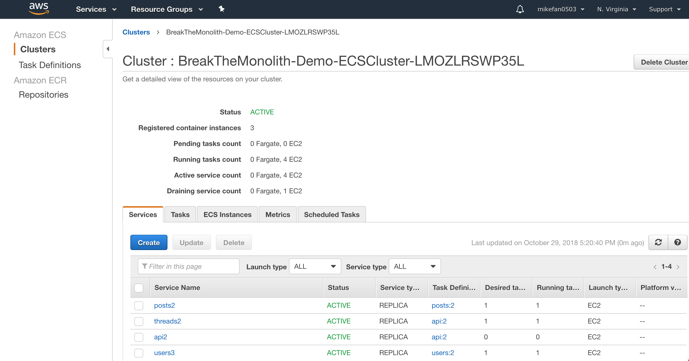
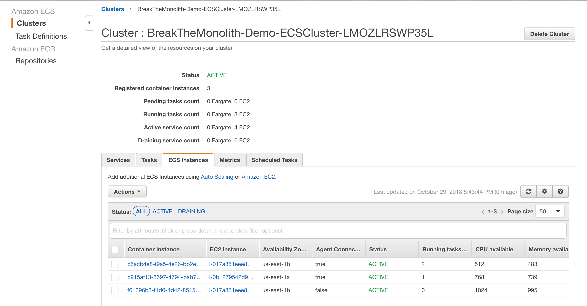

# Distributed Systems Practice
Notes from learning about distributed systems in [GW CS 6421](https://gwdistsys18.github.io/) with [Prof. Wood](https://faculty.cs.gwu.edu/timwood/)

## Docker and Containers
1. Why Docker? (10min)
* Docker (containerization) is becoming more popular
* Containerization can reduce cost and complexity
2. DevOps Docker Beginners Guide (45min)
* Docker image is a snapshot of a Docker container (can be obtained from Docker Store)
* Docker container is a running instance of a Docker image
* Use `docker run -it` to run the container under interactive mode
* The change in one container will not affect the image or other containers
3. What are Containers? (18min)
* The container is based on cgroups and process namespace of Linux
* The Docker image has a tree structure, which speeds up the rebuild process after any changes
* Structure of Docker (Host, daemon, volume, etc.)
4. VMs Versus Containers (8min)
* Containers are more "lightweight" and have faster booting time
* VM provides better isolation
* Containers can pack up all its dependencies (require less dependencies on OS level)
5. Docker Intro (20min)
* Use `docker container run --detach` to keep a container running in the background
* Use `docker exec` to execute a command inside a running container
* Docker images can be built from Docker files
* Bind mount can mount a directory from host to a container (easier file modification)
* Use `--publish` flag to map a host port to a port inside a container
6. Doing more with Docker Images (30min)
* Use `docker container commit` to create a new image from the change inside a docker container
* Dockerfiles can be used to build images
* The layer structure inside a docker image (skip all unmodified steps during building process)
7. VMs Versus Containers Deep Dive (9min)
* VMs generally have larger size than containers
* VM has slower booting time
* It's harder for a process to penetrate through the sandbox of container
8. Docker Networking (30min)
* `docker network inspect` will show the information of current networks on the Docker host in json format
* Use NAT for network between outside and container
9. Swarm Mode Introduction (30min)
* Compose controls multiple containers on a single system, while Swarm Mode also provides multi-host networking and other features such as load-balancing
* Swarm Mode is made up by containers acting as worker nodes or manager nodes
* A stack is made of several services (one or more containers)
* Use `docker service scale` to add more replicas to a service
10. Kubernetes vs Swarm (4min)
* Swarm is easier to set up but works better on simple architecture
* Kubernetes can automatically scale up the containers according to server traffic
* Swarm does load-balancing automatically
* Kubernetes is more powerful in general
11. Kubernetes in 5 Minutes (5min)
* The basic computation unit is a node
* A pod contains multiple nodes. The application can be scaled up in the unit of pods.
* A deployment controller controls how to create and run pods (example: number of replicas)
* k8s cluster service redistribute tasks to other pods if one of them is down
12. Learn more about Kubernetes on your own (30min)
* For example, `kubectl run kubernetes-bootcamp --image=gcr.io/google-samples/kubernetes-bootcamp:v1 --port=8080` will create a new deployment "kubernetes-bootcamp" using image "google-samples/kubernetes-bootcamp:v1" and run (expose) the application on the port 8080
* Use `kubectl scale` to scale up the application (create more replicas)
* Kubernetes automatically rollback to previous version if the new version fails
13. Install Docker on a cluster of EC2 VMs and use Kubernetes to orchestrate them (90min)
* One advantage of running application on a cluster of containers is that the restart of containers (or changing the tasks) does not affect the function of application
* The load-balancer routes the incoming traffic to the right containers according to configuration policy
* The cluster is configured using .yml file. The file contains the information such as network configuration and number of replicas
* A task is a job running inside one or multiple containers. The task definition defines how a task is run by one or multiple containers. The service is an abstraction that manages multiple running tasks. If one of the container failed, the service will start the old task on a new container.

* After running the application, it is important to go through the cleanup process and delete the cluster in order to avoid additional charges

## Cloud Web Applications
1. AWS Tutorial: Launch a VM (15min)
* Choose the EC2 instance with the proper computation power and storage on AWS console
* Choose the right OS (linux distribution) for the EC2
* How to create a key pair for SSH login
* How to terminate the EC2 instance
2. QwikLab: Intro to S3 (12min)
* S3 stands for Simple Storage Service, which provides online storage
* User can manage the permission on each object, or change the permission of the entire bucket by editing the bucket policy
* S3 can store different version of each object by enabling versioning
3. Video: Virtualization
The video introduced the history and different types of virtual machine (same as the materials discussed during lecture) as well as how cloud providers today build on this technology. The idea of vitualization went back to the era of mainframe computer. Even with some performance overhead, virtualization provides more flexibility and ability to run different OS on different architecture. VM supports such as Intel VT-x boost the performance.
4. AWS Tutorial: Install a LAMP Web Server on Amazon Linux 2
* Setting up Apache Httpd + mariaDB + php on the server
* Use the phpMyAdmin to manage the database
* For addtional security, we can configure the SSL/TLS for the web server
The tutorial went through the steps to set up a web server on EC2. Besides the installation of required softwares, setting up the proper permission is also important. For example, to allow traffic enter the EC2 instance, we need to add a security rule for incoming traffic. It is important not to change the existing rule for SSH, otherwise it will block the attempt to SSH into the instance.
5. S3 vs EC2 + Database
S3 has cheaper storage but EC2 is more flexible. S3 has a very user-friendly interface. 
6. QwikLab: Intro to DynamoDB

