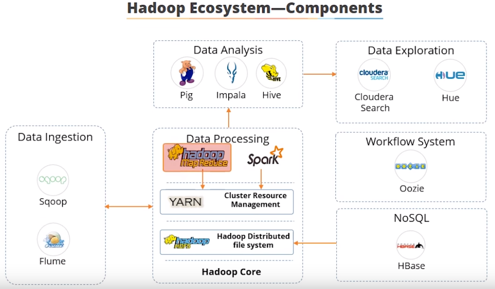
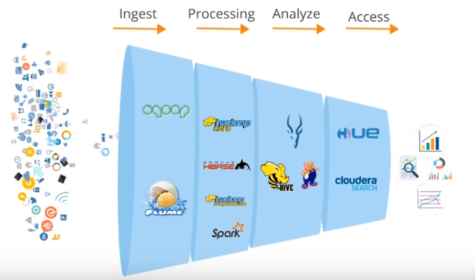
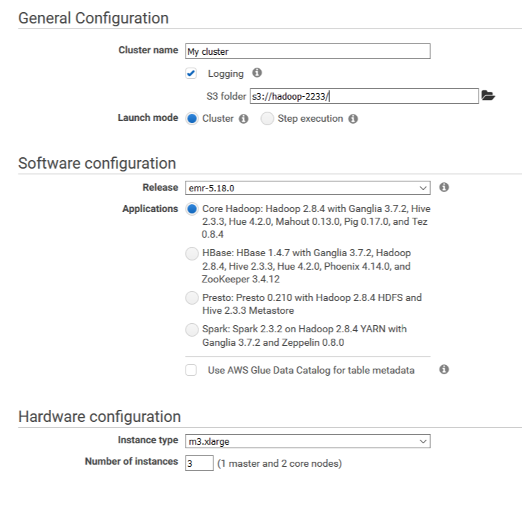
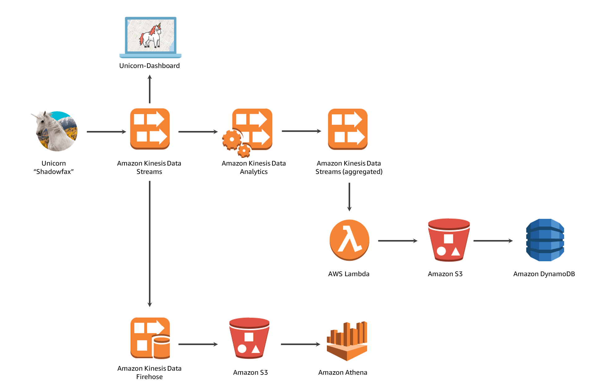
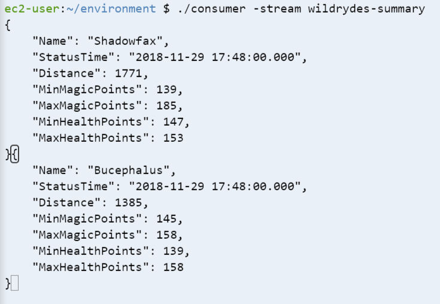
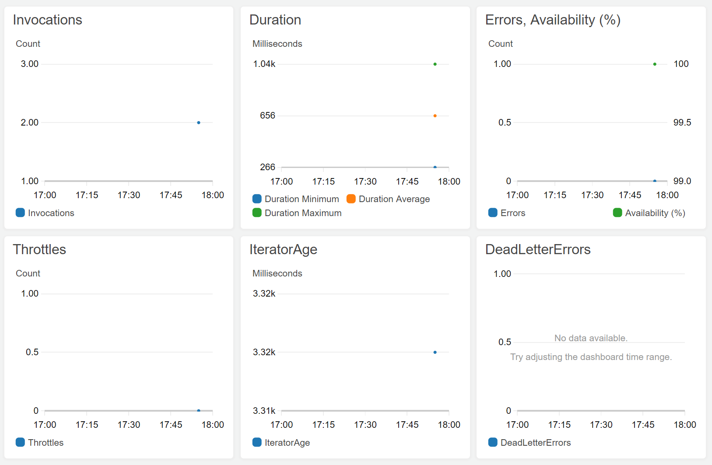
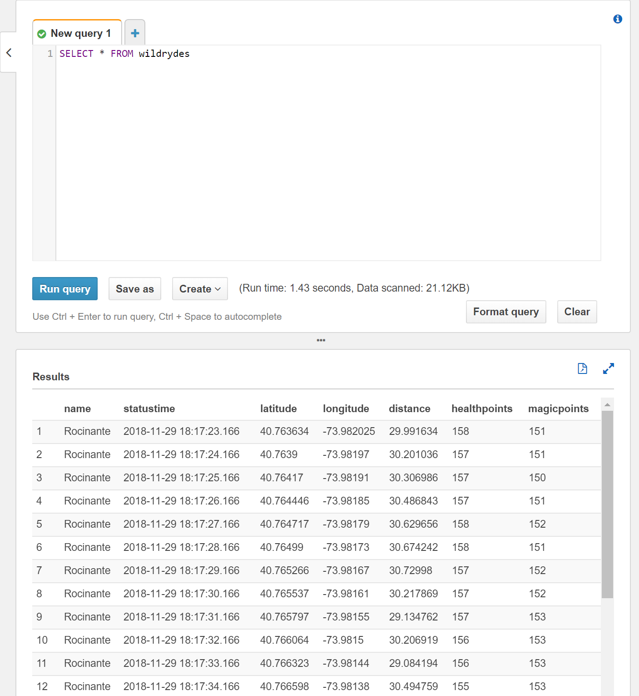

# Distributed Systems Practice
Notes from learning about distributed systems in [GW CS 6421](https://gwdistsys18.github.io/) with [Prof. Wood](https://faculty.cs.gwu.edu/timwood/)

## Topics:

* 1. Docker and Containers

* 2. Big Data and Machine Learning

* 3. Cloud Web Applications

## Tech report:

* ```./Tech-report Jialiang Jiang.docx```

## Round 1
## Docker and Containers
> **why docker**

* Host to container (serverless)

* Migrating is the key and hard part focused on Docker

* Containers are the "Fastest Growing Cloud Enabling Tecnology"

* All about speed

* Reduce complexity

> **DevOps Docker Beginners Guide**

* Basic docker CLI syntax

    -```pull``` fetches a conainer image from the registry and saves it on your system.
    
    -```docker image``` interact with images loaded on the system. 
    
    -```docker container run``` run an application within a specific container. Once the application has run, the                                                       container shuts down.
    
    -```docker container run -it``` keep a container alive in an interactive envornment.
    
    -```docker container ls``` list all running containers.
    
    -```docker container start <container_id>``` start a specific container.
    
    -```docker container execute <container_id>``` interact with a running container.

* Concepts

    -Container is application abstraction, where as virtual machines are hardware abstraction

    -The Docker Registry is the location Docker looks to pull containers. In the default case, it is the Docker Store.
    
> **What are containers**

* A sandboxed process with its own environment
    
* An image in a tree
    
* A dockerfile
    
* Dockerfile is basically an environment in a text file. It is a recipe for building a container image. Each line can be considered a     layer in the container image hierarchy

* Container is packaged with all of it's dependencies with no software actually installed on the host operating system

* Docker host can pull & push images from the Registry

* Docker clients manage container lifecycles, container storage, and container networking via API calls to the Docker host

> **VMs Versus Containers**

* Seems similar but for different purposes

    -The API level of the virtual machine is below the client OS. The virtual machine hypervisor provides an abstraction for the devices      and hardware of the machine.

    -The API between the VM and the hypervisor is very simple because it will just provide a generic driver for each of the devices, but      the API between the hypervisor and the real hardware is very complicated because it must deal with any host hardware.

    -Containers take a different tradeoff. The applications are written to be linked with their own dependencies into one container
     image. This means that the host operating system does not need to multiplex the hardware among multiple VMs that each think that
     they are running on hardware. 
    
    -The docker engine allows the application to run in the same way as a normal process.

> **Docker Intro Lab**

* Check the status of container: ```docker container ls --all```

* Run an interactive bash shell: ```docker container run --interactive --tty --rm ubuntu bash```

* Spin up a MySQL container: ```docker container run --datach --name mydb -e MYSQL_ROOT_PASSWORD=<password> mysql:latest```

* Check the logs of mysql container: ```docker container logs mydb```

* Find out processes running in mysql container: ```docker container top mydb```

* Build the corresponding image: ```docker imabe build --tage <name_of_image> <location of dockerfile>```

* Run the container ```docker container run```

* ```stop``` gracefully stops container, ```rm``` permanently removes it, ```--force``` removes forcefully without shutting down

* Push container images to Docker Hub: ```docker image push <<dockerID>/<containerId>```

> **Doing More with Docker Images**

* Covered the CLI syntax for committing changes to a container, writing a docker file from scratch, and creating a new docker image from  an existing one with changes.

    -show modifications made to a container: ```docker container diff <container_id>```
    
    -create a new container image based on the container_id: ```docker container commit <container_id>```
    
    -tag the image with <IMAGE_NAME>: ```docker image tag <IMAGE_ID> <IMAGE_NAME>```
    
    -see history of an image: ```docker image history <image_id>```
    
    -see detailed information about an image file such as the layers, drivers, archetcture, and other various metadata: ```docker image inspect <image_id>```
    
> **VMs vs Containers Deepdive**

* VMs vs containers in aspects of size, isolation, and boot time

    -Often containers are smaller, for binaries that require very little from the hardware. VM's have everything except physical hardware inside VM image (kernels, efi, OS, etc). Containers may have only application data, or could have entire OS's in them.
    
    -Isolation is generally better on virtual machines, because there are more layers of emulation. Not only will an attacker need to escape the virtual process's sandbox, but also the hypervisor layer which emulates EFI and bios, in order to see other VMs running on the system. Container are only as secure as the kernerl they are running on.
    
    -Using modern tools like EFI and system which begins processes in parallel, starting VMs can be close in startup time to containers. However containers do not need to emulate hardware bootup, so they are slightly faster.
    
> **Docker Networking**

* The bridge network is created by default for all containers, and it allows communication between the host and all of the containers that are created along with the ability to ping the outside world.

* Port mapping: The docker CLI and dockerfiles system make it easy to programmatically connect containers, as well as to map host and container ports.
    
    - ```docker run --name web1 -d -p 8080:80 nginx``` will start an nginx web server, and map docker host port 8080 to container port 80 (default port where nginx will listen for connections)
    
* Docker swarm mode allows you to control many docker instances of the same application programmatically.

    -create a swarm, tell nodes to join The Swarm: ```docker swarm init --advertise-addr $(hostname -i)```
    
    -create an overlay network across the swarm: ```docker network create -d overlay overnet```
    
    -create a service and pass it to the network to be executed by the swarm: ```docker service create --name myservice --network overnet --replicas 2 ubuntu sleep infinity```
    
> **Swarm Mode Introduction**

* Docker Compose is used to control multiple containers on a single system. Swarm Mode tells Docker that you will be running many Docker engines and you want to coordinate operations across all of them.
    
    -Setup swarm in identical manner to last tutorial - ```docker swarm init --advertise-addr $(hostname -i)```. Join swarm from other node with the command in the output of the first node's ```docker swarm init``` command

* A stack is a group of services that are deployed together: multiple containerized components of an application that run in separate instances.

* Each individual service can actually be made up of one or more containers, called tasks and then all the tasks & services together make up a stack.

> **Kubernetes vs. Swarm**

* Swarm and kubernetes are orchestration tools.

* Swarm is a bit simpler and is built into docker.

* Kubernetes is built by Google, and can be used for docker as well as other virtualization container tools.

* Kubernetes is much more widely used and has many more features.

> **Kubernetes in 5 minutes**

* Kubernetes enforces desired state management

* Workers have kubelet processes which communicate with cluster services

* specify desired application state with a .yml file

* Pod configuration specifies container images, and service info

* Specify number of replicas for each pod type

* Cluster services is in charge of scheduling and allocating resources to meet the desired state

* When things go wrong cluster services is in charge of rearranging to reattain desired state

> **Break a Monolith Application into Microservices**

* Containerize the Monolith

    - set up. Install application: Docker, AWS CLI, Atom. Clone repo from https://github.com/awslabs/amazon-ecs-nodejs-microservices. 
    
    - set up a container on ECR.
    
    - build and push the docker image to ECR: ```docker build -t api .```
    
      ```docker push [account-id].dkr.ecr.[region].amazonaws.com/api:latest```

* Deploy the Monolith

    - Create a ECS cluster
    
    - Check task table and instance table
    
    - Configure the Application Load Balancer: Target Group
    
    - Configure the Application Load Balancer: Listener 

    - Used CFTs to setup a resource stack and used this to create / update the template

    - setup the monolith service and tested the load balancer / request rotation
    
    - ```aws cloudformation deploy \
        —template-file infrastructure/ecs.yml \
        —region <region> \
        —stack-name BreakTheMonolith-Demo \
        —capabilities CAPABILITY_NAMED_IAM```

* Break the Monolith

    - Breaking the monolith into multiple microservices is beneficial because of isolation of crashes (only one part will break at a           time), isolation for security (breach of one service hopefully won't impact others), independent scaling (no need to scale whole         app if only one part needs scaled), and development velocity
      
        - Create three different repositories under ECS repositories.

        - Under local environment (where git repo is cloned), run three command that create 3 different images.

        - Tag images that just build.

        - Push them to the corresponding repository.
    
* Deploy Microservices

    - Write task definition for each post, users, threads service.

    - Configure the four application balance load as previous section. Same setting during the configuration process.

    - Edit listener using “Insert Rule”. Insert rules for each service.

    - Deploy each service on Amazon ECS console.

    * Deploy Monolith application and break it into microservices shows how Docker images can be built and deploy services onto a cloud platform. It is very fast, duplicable, and efficient. The convenience is quietly needed when there is a large amount of servers are required to deploy same services. 


****


## Cloud Web Applications

> **AWS Tutorial: Launch a VM**

* Launch an Amazon EC2 Instance.

    -Open the Amazon EC2 console and then click Launch Instance.

    -Select Amazon Linux AMI.

    -Select default option of t2.micro and click Review and Launch.

    -Click Launch in the review page.

    -Generate a key pair, download the key pair, then launch the instance finally.

* Configure Instance. A key pair is used to securely access Linux instance using SSH. AWS stores the public part of the key pair which is just like a house lock.

* Use SSH to connect to instance.

* Terminate the instance from the EC2 console.

> **QwikLab: Intro to S3**

* Create an Amazon S3 bucket.

* Upload an object to the bucket.

* Make object public.

* Create a bucket policy. A bucket policy is a set of permission associated with Amazon S3 bucket. It can be used to control access to a whole bucket or to specific directories within a bucket.

* Explore versioning. Versioning is a means of keeping multiple variants of an object in the same bucket. Can be used to preserve, retrieve, and restore every version of every object stored in Amazon S3 bucket.


## Round 2

## Big Data and Machine Learning

> **Video: Hadoop Intro**



* Distributed systems : used to deal with the data explosion

* Hadoop is a framework that allows for distributed processing of large dataset across clusters of commodity computers using simple programming models

* Economical, reliable, scalable, and flexible

* Traditional systems have data going to a program, while with Hadoop the program goes to the data

* Hadoop has 12 components:

    - HDFS (Hadoop Distirbuted File System) : a storage layer for Hadoop
    
    - HBase : a NoSQL database that stores data in HDFS
    
    - Sqoop : transfers data between Hadoop and relational database servers
    
    - Flume : ingests streaming data
    
    - Spark : a cluster computing framework
    
    - Hadoop MapReduce : the original processing engine but is losing ground to Spark
    
    - Pig : a dataflow system primarily used for analytics that converts pig script to Map-Reduce code
    
    - Impala : a high-performance SQL engine with low latency
    
    - Hive : similar to Impala but is good for data processing
    
    - Cloudera Search : enables non-technical users to search and explore data
    
    - Oozie : a workflow or coodination system used to manage Hadoop jobs
    
    - Hue (Hadoop User Experience) : a web interface for Hadoop
    
* These components help with the four stages of big data processing: ingest, processing, analyze, and access



> **QwikLab: Analyze Big Data with Hadoop**

* Applications installed by default on **EMR** cluster
    
    - EMR ： a managed service that makes Apache Hadoop and Sparkit process vast amounts of data fast, easy, and cost-effective. Supports powerful and proven Hadoop tools such as Presto, Hive, Pig, HBase, and more.

* The default EMR cluster configuration includes 

    - Apache Hadoop 
    
    - Ganglia : performance monitor
    
    - Apache Tez : framework for creating a complex directied acyclic graph of tasks 
    
    - Hive : data warehouse and analytics package
    
    - Hue : GUI
    
    - Pig : converts Pig Latin to Tez jobs
    
* Amazon CloudFront : speeds up web content distribution through worldwide network of edge location data centers

> **QwikLab: Intro to S3(5 min)**

* Done before.

* Add-on : Objects in S3 are private by default. 

> **QwikLab: Intro to Amazon Redshift(30 min)**

* Amazon Redshift : a fast, fully managed data warehouse that makes it simple and cost-effective to analyze data using standard SQL and existing Business Intelligence (BI) tools.

* pgweb : a web-based utility for connecting to SQL databases and running quries.

* Important steps :

    -  1. Lanuch an Amazon Redshift Cluster
    
        - !  Cluster Database Properties: Contains information on the Endpoint, which is the DNS address of the cluster, and the port number on which the database accepts connections. These are required when you want to create SQL connections. It also lets you know whether the cluster has a public IP address that can be accessed from the public internet. The JDBC URL and ODBC URL contain the URLs to connect to the cluster via a java database connection or an Oracle database connection client.
    
    - 2. Launch Pgweb to Communicate with Redshift Cluster
    
    - 3. Create a Table
    
    - 4. Load Sample Data from Amazon S3
    
    - 5. Query data
    
> **Video: Short AWS Machine Learning Overview (5 min)**

* Machine learning stack:
    
    - Framework and Interfaces: used by companies with experts who build and train ML models

    - ML Platforms: make it easy to build, train, tune, and deploy models without expertise

    - Application Services: APIs for computer vision, speech processing, etc.
    
> **AWS Tutorial: Analyze Big Data with Hadoop (60 min)**

* Important steps (can be submitted to a cluster when it is set up, or run on the command line after connecting to the master node) :

    - Created an S3 bucket and an EC2 key pair

    - Launched an EMR cluster

    - Allowed SSH connections to cluster
    
* **cluster** : a collection of Amazon Elastic Compute Cloud (Amazon EC2) instances. Each instance in the cluster is called a node. Each node has a role within the cluster, referred to as the node type. 

* Master node: A node that manages the cluster by running software components to coordinate the distribution of data and tasks among other nodes for processing. The master node tracks the status of tasks and monitors the health of the cluster. Every cluster has a master node, and it's possible to create a single-node cluster with only the master node.

* Core node: A node with software components that run tasks and store data in the Hadoop Distributed File System (HDFS) on your cluster. Multi-node clusters have at least one core node.

* Task node: A node with software components that only runs tasks and does not store data in HDFS. Task nodes are optional.

* **Benefits**

    - Cost Savings

    - AWS Integration

    - Deployment
    
    - Flexibility

    - Reliability

    - Security 

    - Monitoring



> **QwikLab: Intro to Amazon Machine Learning (45 min)**

* Amazon Machine Learning (Amazon ML) : a platform which specializes in the training and storage of ML models in their cloud infrastructure.
    
    - A datasource contains metadata about input data but not the data itself
    
    - An ML model generates predictions

    - An evaluation measures ML model quality

    - Batch predictions generate predictions for a set of observations
    
    - Real-time predictions generate predictions for single input observations with low latency

* Keys :

    - Upload Training Data by adding data to an S3 bucket
    
        - by default reserves 70% of data for training and 30% for evaluation
    
    - Create a Datasource
    
    - Create an ML Model from the Datasource
    
    - Evaluate an ML Model
    
    - Generate Predictions From Your ML Model
        
        - Real-time predictions can be done without submitting all of the input data values
        
        - Real-time predictions show predicted scores (adding up to 1) for each category

> **AWS Tutorial: Build a Machine Learning Model (30 min)**

* Proceed with different data compared to prior lab

* AUC (Area Under a Curve) : a quality metric for ML models

* The score threshold can be adjusted to choose a balance of false positives and false negatives

* Batch predictions can be done by linking to a new spreadsheet of input data

* The results spreadsheet gives the best answer and the score 

* The score threshold determines the best answer based on the score

> **Video Tutorial: Overview of AWS SageMaker (30 min)**

* SageMaker is a machine learning service consisting of four parts: 

    - notebook instances, jobs, models, and endpoints

* It provides an integrated Jupyter authoring notebook instance for easy access to your data sources for exploration and analysis, so you don't have to manage servers. 

* It also provides common machine learning algorithms that are optimized to run efficiently against extremely large data in a distributed environment.

* keys :

    - use the shelf model
    
    - use library (e.g., tensorflow, mxnet) and your own custom model creation and trainings cript 
    
    - bring your own pretrained model and simply deploy it and create an endpoint

    - or create your own docker container containing your model and access it from within sagemaker 

* workflow : 1.Generate example data 2.Train a model 3.Deploy the model


> **AWS Tutorial: AWS SageMaker (60 min)**

* Keys :

    - Sagemaker is a fully maanged ML platform that provides an interface to load data, train a model, and make it accessible to other applications
    
    - AWS Sagemaker algorithms prefer data in RecordIO Protobuf format. They provide some useful libraries to make this conversion seamless from something like a Numpy nd array.

    - Just follow the steps.
    
> **Build a Serverless Real-Time Data Processing App (2 hour)**

* Overview :

    - First, the producer sent its data to an Amazon Kinesis stream, which could be directly accessed by a dashboard for viewing on a map. 
    
    - After that, a SQL query in Kinesis Data Analytics analyzed the data and sent aggregate statistics out another Kinesis stream every minute. 
    
    - A Lambda function was then used to take the data from this stream and save it in a DynamoDB table as it arrived via an S3 bucket. 
    
    - Meanwhile, a Kinesis Data Firehose was used to put the stream data into an S3 bucket which was then queried to be put into an Athena table.



* Build a data stream
    
    -Create a stream in Kinesis and write to and read from the stream to track Wild Rydes unicorns on the live map. In this module you'll also create an Amazon Cognito identity pool to grant live map access to your stream.
    

    
* Aggregate data

    - Build a Kinesis Data Analytics application to read from the stream and aggregate metrics like unicorn health and distance traveled each minute.


    
* Process streaming data
    
    - Persist aggregate data from the application to a backend database stored in DynamoDB and run queries against those data.



* Store & query data

    - Use Kinesis Data Firehose to flush the raw sensor data to an S3 bucket for archival purposes. Using Athena, you'll run SQL queries against the raw data for ad-hoc analyses. 




