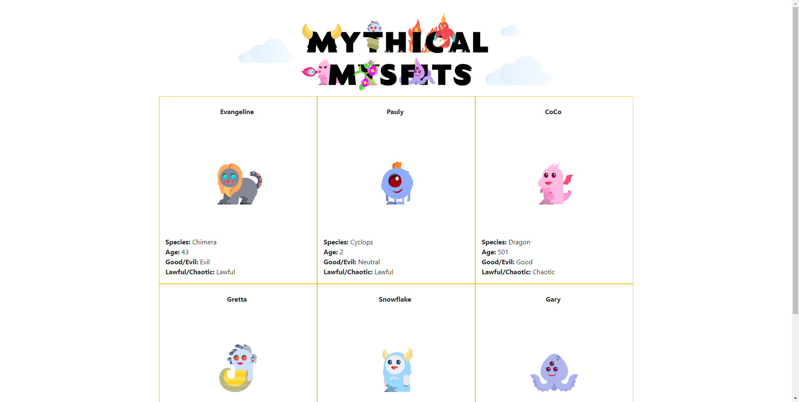
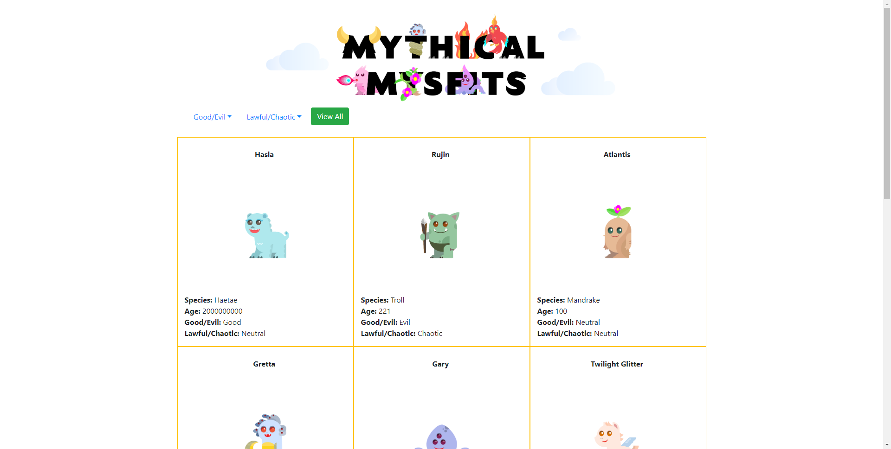
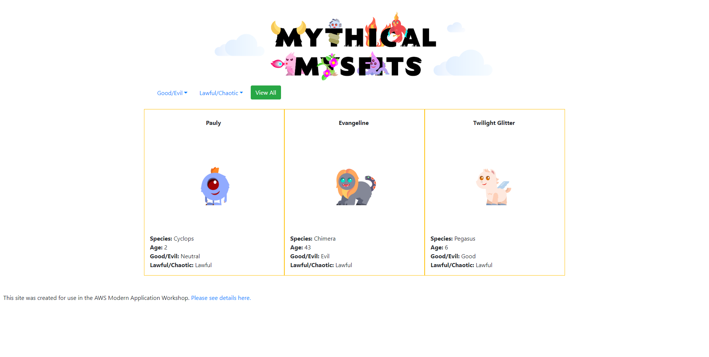
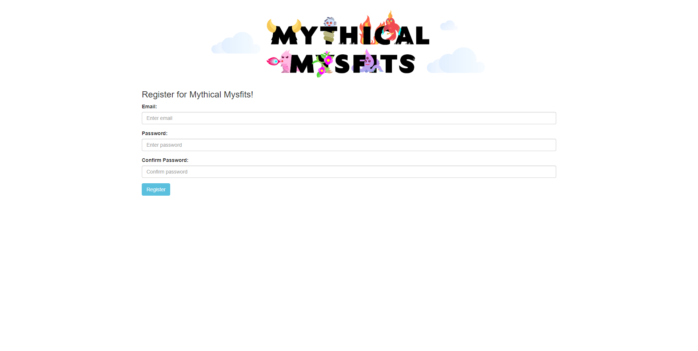
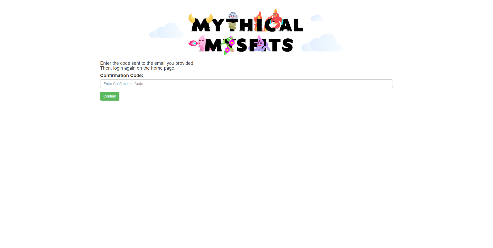
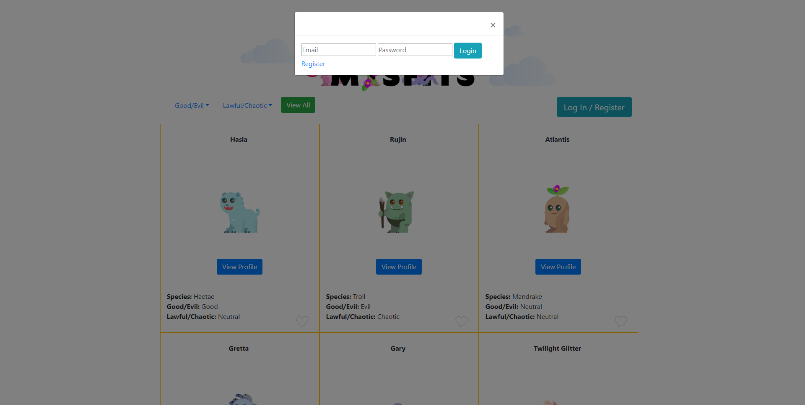
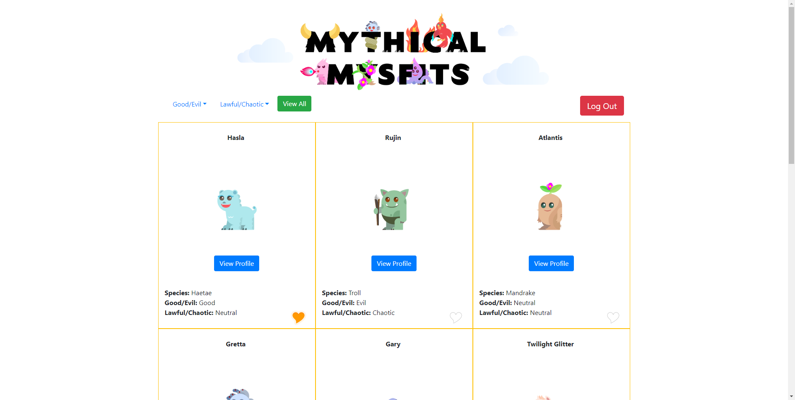
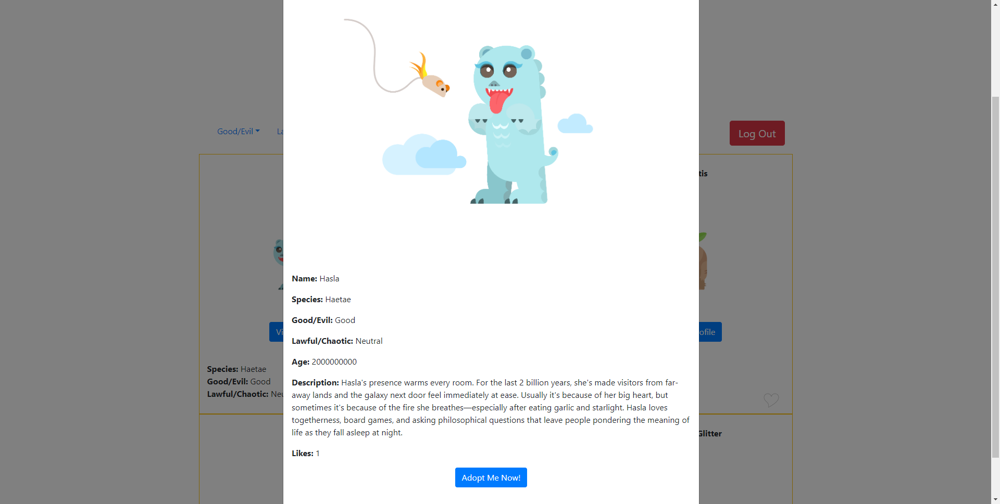

# Distributed Systems Practice
Notes from learning about distributed systems in [GW CS 6421](https://gwdistsys18.github.io/) with [Prof. Wood](https://faculty.cs.gwu.edu/timwood/)

---

# Cloud Web Apps

## Beginner Level

### AWS Tutorial: Launch a VM

__Time: 15min__

* Launch and configure an Amazon EC2 instance

    * Open the Amazon EC2 console and then click __Launch Instance__.

    * Select __Amazon Linux AMI__.

    * Select default option of __t2.micro__ and click __Review and Launch__.

    * Click __Launch__ in the review page.

    * Generate a key pair, download the key pair, then launch the instance finally.

* Connect to instance

    * For me, I use putty as my SSH client. After configuration of the private key, establish SSH connection.

* Terminate instance

    * Click the __actions__ button, navigate to __Instance State__, then click __Terminate__.

    * Confirm in the popped-up dialogue.

### QwikLab: Intro to S3

__Time: 18min__

* Create a bucket

    * Click __Create Bucket__ button.

    * Follow instructions to create a S3 bucket, for Versioning option, select __Keep all versions of an object in the same bucket__.

* Upload an object to the bucket

    * Download image file [Sheep.jpg](https://us-west-2-aws-training.s3.amazonaws.com/awsu-spl/spl-65/scripts/Sheep.jpg) from the lab page.

    * Select the created bucket, follow instructions to upload the file to bucket.

* Set public access to the file

    * Without setting public access to the file, an __Access Denied__ error will occur when try requesting the file from the URL.

    * Click __Permissions__ tab, then:
        1. Under __Public access__ selection, select __Everyone__,
        2. Check __Read object__.
        3. Then click __Save__.

    * Request the file from the given URL. The browser should be showing the image now.

* Policy

    * Download file [Eiffel.jpg](https://us-west-2-aws-training.s3.amazonaws.com/awsu-spl/spl-65/scripts/Eiffel.jpg) from the lab page and upload the file to bucket.

    * __Access Denied__ error will occur when try requesting the new file from the given URL by now.

    * Click __Permission__ then click __Bucket Policy__.

    * Click __Policy Generator__, then configure as:
        * __Select Type of Policy__: S3 Bucket Policy
        * __Principal__: *
        * __Actions__: GetObject
        * __Amazon Resource Name (ARN)__: the ARN of bucket followed by /*

    * Click __Add Statement__ then click __Generate Policy__.

    * A JSON will be generated, copy the JSON to clipboard.

    * In __Bucket Policy Editor__, paste the JSON then click __Save__.

    * Now the image should be accessible with URL.

* Versioning

    * Download another version of [Eiffel.jpg](https://us-west-2-aws-training.s3.amazonaws.com/awsu-spl/spl-65/scripts/version2/Eiffel.jpg) from the lab page and upload the file to bucket.

    * Now the file requested from the given URL should be the new one.

    * In the Amazon S3 Management Console, click __Eiffel.jpg__, then click __Latest version__ and select the previous version.

    * Add __"s3:GetObjectVersion"__ to the __Action__ field of bucket policy JSON, then the previous version of the file will be allowed to be accessed by URL.

## Intermediate Level

### Video: Virtualization

* VMWare:

    * Privileges of software:
        * Kernel mode
        * User mode
        * X86: ring0 for kernel mode and ring3 for user mode, ring1 and ring2 are not commonly used
    
    * Virtual machine OS runs in user mode, need VM support.

* XEN:

    * Hypervisor: a layer in ring0, gives hardware access to guested virtual machine OS

    * Guest OS "trapped" in each domain.

* Today:

    * Run different OS in VM.

    * Run legacy OS on modern hardware, for example, run Windows NT4 in compatibility mode.

    * Make use of multi-core processors.

    * Provide scalable cloud computing services.

### AWS Tutorial: Install a LAMP Web Server on Amazon Linux 2

__Time: 20min__

* Set up environment

    * SSH to the server

    * Update yum:

            [ec2-user ~]$ sudo yum update -y

    * Install lamp-mariadb10.2-php7.2 and php7.2:

            [ec2-user ~]$ sudo amazon-linux-extras install -y lamp-mariadb10.2-php7.2 php7.2

    * Install Apache web server, MariaDB, and PHP software packages:

            [ec2-user ~]$ sudo yum install -y httpd mariadb-server

    * Start the Apache web server:

            [ec2-user ~]$ sudo systemctl start httpd

    * Set Apache server start at system boot:

            [ec2-user ~]$ sudo systemctl enable httpd

    * Add security rule to the server to enable HTTP connections via port 80:
        1. On Amazon EC2 console, select the instance of the server.
        2. Under __Security groups__, choose view __inbound rules__.
        3. Add a new inbound security rule in __Adding Rules to a Security Group__ as:
            * __Type__: HTTP
            * __Protocol__: TCP
            * __Port Range__: 80
            * __Source__: Custom

    * Type the IP address of the server in browser address bar, an Apache test page should be displayed.

    * Add user (ec2-user) to the apache group:

            [ec2-user ~]$ sudo usermod -a -G apache ec2-user

    * Log out and then log back to see changes of user group

    * Change the group ownership of /var/www and its contents to the apache group:

            [ec2-user ~]$ sudo chown -R ec2-user:apache /var/www

    * Change the directory permissions of /var/www and its sub-directories to enable write permission:

            [ec2-user ~]$ sudo chmod 2775 /var/www && find /var/www -type d -exec sudo chmod 2775 {} \;

    * Recursively change the file permissions of /var/www and its sub-directories to enable write permission:

            [ec2-user ~]$ find /var/www -type f -exec sudo chmod 0664 {} \;

* Test LAMP Server

    * Create PHP info file in Apache document root:

            [ec2-user ~]$ echo "<?php phpinfo(); ?>" > /var/www/html/phpinfo.php

    * Type the IP address followed by /phpinfo.php in browser address bar, a PHP information page should be displayed.

    * Delete the phpinfo.php file:

            [ec2-user ~]$ rm /var/www/html/phpinfo.php

* Secure database server:

    * Start MariaDB server:

            [ec2-user ~]$ sudo systemctl start mariadb

    * Run __mysql_secure_installation__ and follow instructions:

            [ec2-user ~]$ sudo mysql_secure_installation

    * Set MariaDB server start at system boot:

            [ec2-user ~]$ sudo systemctl enable mariadb

* Install phpMyAdmin:

    * Install the required dependencie:

            [ec2-user ~]$ sudo yum install php-mbstring -y

    * Restart Apache:

            [ec2-user ~]$ sudo systemctl restart httpd

    * Restart php-fpm:

            [ec2-user ~]$ sudo systemctl restart php-fpm

    * Navigate to Apache document root:

            [ec2-user ~]$ cd /var/www/html

    * Download the latest phpMyAdmin:

            [ec2-user html]$ wget https://www.phpmyadmin.net/downloads/phpMyAdmin-latest-all-languages.tar.gz

    * Create a phpMyAdmin folder and extract the package:

            [ec2-user html]$ mkdir phpMyAdmin && tar -xvzf phpMyAdmin-latest-all-languages.tar.gz -C phpMyAdmin --strip-components 1

    * Type the IP address followed by /phpMyAdmin in browser address bar, a phpMyAdmin log in page should be displayed.

### QwikLab: Intro to DynamoDB

__Time: 10min__

* Create a table

    * Click __Create Table__, follow instructions on the page.
        * __Table Name__: Music
        * __Primary Key__: Artist
        * Select __Add sort key__, then type Song and select __String__.

* Add data

    * Select __Items__ tab and click __Create Item__, follow instructions on the page.
        * __Artist__: Pink Floyd
        * __Song__: Money
        * Click __+__ and select __Append__, then select __String__, enter:
            * __FIELD__: Album
            * __VALUE__: The Dark Side of the Moon
        * Click __+__ and select __Append__, then select __Number__, enter:
            * __FIELD__: Year
            * __VALUE__: 1973

    * Click save to store the new item.

    * Create a second item as:

        | Attribute Name | Attribute Type | Attribute Value |
        |----------------|----------------|-----------------|
        | Artist         | String         | John Lennon     |
        | Song           | String         | Imagine         |
        | Album          | String         | Imagine         |
        | Year           | Number         | 1971            |
        | Genre          | String         | Soft rock       |

    * Create a third item as:

        | Attribute Name | Attribute Type | Attribute Value           |
        |----------------|----------------|---------------------------|
        | Artist         | String         | Psy                       |
        | Song           | String         | Gangnam Style             |
        | Album          | String         | Psy 6 (Six Rules), Part 1 |
        | Year           | Number         | 2011                      |
        | LengthSeconds  | Number         | 219                       |

* Modify an item

    * Click on __Psy__.

    * Change __Year__ from 2011 to 2012.

    * Click __Save__.

* Query the table

    * Click drop down list showing __Scan__ and change it to __Query__.

    * Fill query conditions as:
        * __Partition key__: Psy
        * __Sort key__: Gangnam Style

    * Click __Start search__ and results will quickly appear.

    * Click drop down list showing __Query__ and change it back to __Scan__.

    * Click __Add filter__ and fill:
        * __Enter attribute__: Year
        * Change __String__ to __Number__
        * __Enter value__: 1971

    * Click __Start search__ and songs in 1971 will be displayed.

### AWS Tutorial: Deploy a Scalable Node.js Web App

__Time: 20min__

* Launch and prepare the environment

    * Click the provided [link](console.aws.amazon.com/elasticbeanstalk/home#/newApplication?applicationName=tutorials&environmentType=LoadBalanced&instanceType=t2.micro) to create an Elastic Beanstalk environment for the tutorial. Follow instructions and configure as:
        * __Platform__: Node.js
        * __Application code__: choose __Sample application__.

    * Open __Roles__ page, choose __aws-elasticbeanstalk-ec2-role__, on __Permissions__ tab, under __Managed Policies__, choose __Attach Policy__, select __AmazonSNSFullAccess__ and __AmazonDynamoDBFullAccess__, then click __Attach Policies__ to add permissions to the environment.

* Deploy the sample application

    * Download [source bundle](https://github.com/awslabs/eb-node-express-sample/releases/download/v1.1/eb-node-express-sample-v1.1.zip).

    * In environment __management page__, click __Upload and Deploy__, choose __Choose File__ and select the source bundle, deploy and wait until the deploy process complete.

    * Click the site URL displayed to open the example website in a new tab.

    * Sign up in the example site with a email address, then an item of the sign up information will be created in a generated DynamoDB table.

* Use a table created outside of Elastic Beanstalk

    * Create a table with the following configurations:
        * __Table name__: nodejs-tutorial
        * __Primary key__: email
        * __Primary key type__: String

    * Extract the project files from the source bundle.

    * Delete file .ebextensions/create-dynamodb-table.config.

    * Change file .ebextensions/options.config as the example code:

            option_settings:
              aws:elasticbeanstalk:customoption:
                NewSignupEmail: you@example.com
              aws:elasticbeanstalk:application:environment:
                THEME: "flatly"
                AWS_REGION: '`{"Ref" : "AWS::Region"}`'
                STARTUP_SIGNUP_TABLE: nodejs-tutorial
                NEW_SIGNUP_TOPIC: '`{"Ref" : "NewSignupTopic"}`'
              aws:elasticbeanstalk:container:nodejs:
                ProxyServer: nginx
              aws:elasticbeanstalk:container:nodejs:staticfiles:
                /static: /static
              aws:autoscaling:asg:
                Cooldown: "120"
              aws:autoscaling:trigger:
                Unit: "Percent"
                Period: "1"
                BreachDuration: "2"
                UpperThreshold: "75"
                LowerThreshold: "30"
                MeasureName: "CPUUtilization"

    * Create a source bundle from the modified code and deploy to the environment.

    * Try sign up in the example site, and a new item is expected to be added into the nodejs-tutorial table.

* Configure the environment for high availability

    * In environment __management page__, choose __Configuration__.

    * On the __Capacity__ configuration card, choose __Modify__.

    * In the __Auto Scaling Group__ section, set __Min instances__ to __2__, then apply.

    * Now deploying changes will not taking the site out of service. Also, increasing more minimum instances number gives more failure tolerance to the side.

### QwikLab: Intro to AWS Lambda

__Time: 24min__

* Create Amazon S3 buckets

    * Create an Amazon S3 bucket

    * Create another Amazon S3 bucket whose name is the first one's name followed by -resized.

    * Upload the file [HappyFace.jpg](https://s3-us-west-2.amazonaws.com/us-west-2-aws-training/awsu-spl/spl-88/images/HappyFace.jpg) to the first bucket.

* Create an AWS Lambda function

    * Click __Create a function__, follow instructions, fill as:
        * __Name__: Create-Thumbnail
        * __Runtime__: Python 3.6
        * Existing role: lambda-excecution-role

    * Under __Add triggers__, click __S3__.

    * In __Configure triggers__ section, configure as:
        * __Bucket__: the first created bucket
        * __Event type__: Object Created (All)

    * Click __Add__.

    * Click __Create-Thumbnail__ at the diagram.

    * In __Function code__ section, configure as:
        * __Code entry type__: Upload a file from Amazon s3
        * __Runtime__: Python 3.6
        * __Handler__: CreateThumbnail.handler
        * __Amazon S3 link URL__: fill as:
        * 
                https://s3-us-west-2.amazonaws.com/us-west-2-aws-training/awsu-spl/spl-88/scripts/CreateThumbnail.zip

    * Click __Save__.

* Test the function

    * Click __Test__ and configure:
        * __Event template__: Amazon S3 Put
        * __Event name__: Upload

    * In the JSON editor, replace bucket name as the name of the first created bucket and replace test key as the file name (HappyFace.jpg).

    * Click __Create__ then click __Test__.

    * The test is expected to be success, and a __thumbnail-HappyFace.jpg__ file will be created in the second bucket.

### QwikLab: Intro to Amazon API Gateway

__Time: 6min__

* Create a Lambda Function

    * Click __Create a function__, following the instructions, use __Author from scratch__ and fill as:
        * __Name__: FAQ
        * __Runtime__: Node.js 8.10
        * __Existing role: lambda-basic-excecution

    * In __Function code__ section, fill the code editor with the provided code:

            var json = {
              "service": "lambda",
              "reference": "https://aws.amazon.com/lambda/faqs/",
              "questions": [{
                "q": "What is AWS Lambda?",
                "a": "AWS Lambda lets you run code without provisioning or managing servers. You pay only for the compute time you consume - there is no charge when your code is not running. With Lambda, you can run code for virtually any type of application or backend service - all with zero administration. Just upload your code and Lambda takes care of everything required to run and scale your code with high availability. You can set up your code to automatically trigger from other AWS services or call it directly from any web or mobile app."
              },{
               "q":"What events can trigger an AWS Lambda function?",
               "a":"You can use AWS Lambda to respond to table updates in Amazon DynamoDB, modifications to objects in Amazon S3 buckets, logs arriving in Amazon CloudWatch logs, incoming emails to Amazon Simple Email Service, notifications sent from Amazon SNS, messages arriving in an Amazon Kinesis stream, client data synchronization events in Amazon Cognito, and custom events from mobile applications, web applications, or other web services. You can also invoke a Lambda function on a defined schedule using the AWS Lambda console."
              },{
               "q":"When should I use AWS Lambda versus Amazon EC2?",
               "a":"Amazon Web Services offers a set of compute services to meet a range of needs. Amazon EC2 offers flexibility, with a wide range of instance types and the option to customize the operating system, network and security settings, and the entire software stack, allowing you to easily move existing applications to the cloud. With Amazon EC2 you are responsible for provisioning capacity, monitoring fleet health and performance, and designing for fault tolerance and scalability. AWS Elastic Beanstalk offers an easy-to-use service for deploying and scaling web applications in which you retain ownership and full control over the underlying EC2 instances. Amazon Elastic Container Service is a scalable management service that supports Docker containers and allows you to easily run distributed applications on a managed cluster of Amazon EC2 instances. AWS Lambda makes it easy to execute code in response to events, such as changes to Amazon S3 buckets, updates to an Amazon DynamoDB table, or custom events generated by your applications or devices. With Lambda you do not have to provision your own instances; Lambda performs all the operational and administrative activities on your behalf, including capacity provisioning, monitoring fleet health, applying security patches to the underlying compute resources, deploying your code, running a web service front end, and monitoring and logging your code. AWS Lambda provides easy scaling and high availability to your code without additional effort on your part."
              },{
                "q":"What kind of code can run on AWS Lambda?",
                "a":"AWS Lambda offers an easy way to accomplish many activities in the cloud. For example, you can use AWS Lambda to build mobile back-ends that retrieve and transform data from Amazon DynamoDB, handlers that compress or transform objects as they are uploaded to Amazon S3, auditing and reporting of API calls made to any Amazon Web Service, and server-less processing of streaming data using Amazon Kinesis."
              },{
                "q":"What languages does AWS Lambda support?",
                "a":"AWS Lambda supports code written in Node.js (JavaScript), Python, and Java (Java 8 compatible). Your code can include existing libraries, even native ones. Lambda functions can easily launch processes using languages supported by Amazon Linux, including Bash, Go, and Ruby. Please read our documentation on using Node.js, Python and Java."
              },{
                "q":"Can I access the infrastructure that AWS Lambda runs on?",
                "a":"No. AWS Lambda operates the compute infrastructure on your behalf, allowing it to perform health checks, apply security patches, and do other routine maintenance."
              },{
                "q":"How does AWS Lambda isolate my code?",
                "a":"Each AWS Lambda function runs in its own isolated environment, with its own resources and file system view. AWS Lambda uses the same techniques as Amazon EC2 to provide security and separation at the infrastructure and execution levels."
              },{
                "q":"How does AWS Lambda secure my code?",
                "a":"AWS Lambda stores code in Amazon S3 and encrypts it at rest. AWS Lambda performs additional integrity checks while your code is in use."
              },{
                "q":"What is an AWS Lambda function?",
                "a":"The code you run on AWS Lambda is uploaded as a Lambda function. Each function has associated configuration information, such as its name, description, entry point, and resource requirements. The code must be written in a stateless style i.e. it should assume there is no affinity to the underlying compute infrastructure. Local file system access, child processes, and similar artifacts may not extend beyond the lifetime of the request, and any persistent state should be stored in Amazon S3, Amazon DynamoDB, or another Internet-available storage service. Lambda functions can include libraries, even native ones."
              },{
                "q":"Will AWS Lambda reuse function instances?",
                "a":"To improve performance, AWS Lambda may choose to retain an instance of your function and reuse it to serve a subsequent request, rather than creating a new copy. Your code should not assume that this will always happen."
              },{
                "q":"What if I need scratch space on disk for my AWS Lambda function?",
                "a":"Each Lambda function receives 500MB of non-persistent disk space in its own /tmp directory."
              },{
                "q":"Why must AWS Lambda functions be stateless?",
                "a":"Keeping functions stateless enables AWS Lambda to rapidly launch as many copies of the function as needed to scale to the rate of incoming events. While AWS Lambda's programming model is stateless, your code can access stateful data by calling other web services, such as Amazon S3 or Amazon DynamoDB."
              },{
                "q":"Can I use threads and processes in my AWS Lambda function code?",
                "a":"Yes. AWS Lambda allows you to use normal language and operating system features, such as creating additional threads and processes. Resources allocated to the Lambda function, including memory, execution time, disk, and network use, must be shared among all the threads/processes it uses. You can launch processes using any language supported by Amazon Linux."
              },{
                "q":"What restrictions apply to AWS Lambda function code?",
                "a":"Lambda attempts to impose few restrictions on normal language and operating system activities, but there are a few activities that are disabled: Inbound network connections are managed by AWS Lambda, only TCP/IP sockets are supported, and ptrace (debugging) system calls are restricted. TCP port 25 traffic is also restricted as an anti-spam measure."
              },{
                "q":"How do I create an AWS Lambda function using the Lambda console?",
                "a":"You can author the code for your function using the inline editor in the AWS Lambda console. You can also package the code (and any dependent libraries) as a ZIP and upload it using the AWS Lambda console from your local environment or specify an Amazon S3 location where the ZIP file is located. Uploads must be no larger than 50MB (compressed). You can use the AWS Eclipse plugin to author and deploy Lambda functions in Java and Node.js. If you are using Node.js, you can author the code for your function using the inline editor in the AWS Lambda console. Go to the console to get started."
              },{
                "q":"How do I create an AWS Lambda function using the Lambda CLI?",
                "a":"You can package the code (and any dependent libraries) as a ZIP and upload it using the AWS CLI from your local environment, or specify an Amazon S3 location where the ZIP file is located. Uploads must be no larger than 50MB (compressed). Visit the Lambda Getting Started guide to get started."
              },{
                "q":"Which versions of Python are supported?",
                "a":"Lambda provides a Python 2.7-compatible runtime to execute your Lambda functions. Lambda will include the latest AWS SDK for Python (boto3) by default."
              },{
                "q":"How do I compile my AWS Lambda function Java code?",
                "a":"You can use standard tools like Maven or Gradle to compile your Lambda function. Your build process should mimic the same build process you would use to compile any Java code that depends on the AWS SDK. Run your Java compiler tool on your source files and include the AWS SDK 1.9 or later with transitive dependencies on your classpath. For more details, see our documentation."
              },{
                "q":"What is the JVM environment Lambda uses for execution of my function?",
                "a":"Lambda provides the Amazon Linux build of openjdk 1.8."
              }]
            }

            exports.handler = function(event, context) {
                var rand = Math.floor(Math.random() * json.questions.length);
                console.log("Quote selected: ", rand);
            
                var response = {
                    body: JSON.stringify(json.questions[rand])
                };
                console.log(response);
                context.succeed(response);
            };

    * In __Designer__ section, under __Add triggers__, click __API Gateway__.

    * In __Configure triggers__ section, configure as:
        * __API__: Create a new API
        * __Security__: Open
        * Expand __Additional settings__
        * __API name__: FAQ-API
        * __Deployment stage__: myDeployment

    * Click __Add__ then click __Save__.

* Test the function

    * Under __API Gateway__, click the __right arrow__ to view details of the API.

    * Cpoy the __API endpoint__ to browser address bar, request the URL, a random FAQ entry is expected to be shown.

* Test the function in Lambda Management Console

    * Click __Test__ and configure as:
        * __Event name__: BasicTest
        * Fill an empty JSON in the JSON editor

    * Click __Create__.

    * Click __Test__, then the result is expected to be success.

### AWS Tutorial: Build a Serverless Web Application

__Time: 70min__

* Host a static web site

    * Select a region.

    * Create an S3 bucket.

    * Download an [archive](https://github.com/awslabs/aws-serverless-workshops/archive/master.zip) and unzip it.

    * Upload files in WebApplication/1\_StaticWebHosting/website directory to the container.

    * Choose the __Permissions__ tab, in add bucket policy JSON editor, fill the following JSON (replace [YOUR\_BUCKET\_NAME] with the name of the bucket) and save:

            {
                "Version": "2012-10-17",
                "Statement": [
                    {
                        "Effect": "Allow", 
                        "Principal": "*", 
                        "Action": "s3:GetObject", 
                        "Resource": "arn:aws:s3:::[YOUR_BUCKET_NAME]/*" 
                    } 
                ] 
            }

    * Choose the __Properties__ tab and choose the __Static website hosting__ card, configure as:
        * Select __Use this bucket to host a website__
        * __Index document__: index.html

    * A static web site will be hosted in the URL shown in the __Static website hosting__ card.

* Manage users

    * Create an Amazon Cognito user pool named WildRydes.

    * Choose __App clients__ and click __Add an app client__, follow instructions to create an app client, configure as:
        * Uncheck the __Generate client secret__ option

    * Update config.js file in WebApplication/1\_StaticWebHosting/website/js as the given example (replace [userPoolId], [userPoolClientId], [region] with the created pool ID, user pool client ID and the region code):

            window._config = {
                cognito: {
                    userPoolId: '[userPoolId]', // e.g. us-east-2_uXboG5pAb
                    userPoolClientId: '[userPoolClientId]', // e.g. 25ddkmj4v6hfsfvruhpfi7n4hv
                    region: '[region]' // e.g. us-east-2
                },
                api: {
                    invokeUrl: '' // e.g. https://rc7nyt4tql.execute-api.us-west-2.amazonaws.com/prod',
                }
            };

    * Try register a new user in the web site.

* Server-less back end

    * Create a DynamoDB table, configure as:
        * __Table name__: Rides
        * __Partition key__: RideId, type is __String__

    * Create a __Lambda__ type IAM Role, use __AWSLambdaBasicExecutionRole__ policy, name it __WildRydesLambda__.

    * Add a policy for the created role, configure as followed then name it __DynamoDBWriteAccess__.
        * __Service__: DynamoDB
        * __Actions__: PutItem
        * __Resources__: Specify the ARN of the created DynamoDB table

    * Create a Lambda function, configure as:
        * __Name__: RequestUnicorn
        * __Runtime__: Node.js 6.10
        * __Role__: Choose an existing role
        * __Existing Role__: WildRydesLambda

    * Replace the exiting code in the code editor with the contents of [requestUnicorn.js](https://github.com/aws-samples/aws-serverless-workshops/blob/master/WebApplication/3_ServerlessBackend/requestUnicorn.js).

    * Create a test named __TestRequestEvent__ and fill the JSON editor with given code:

            {
                "path": "/ride",
                "httpMethod": "POST",
                "headers": {
                    "Accept": "*/*",
                    "Authorization": "eyJraWQiOiJLTzRVMWZs",
                    "content-type": "application/json; charset=UTF-8"
                },
                "queryStringParameters": null,
                "pathParameters": null,
                "requestContext": {
                    "authorizer": {
                        "claims": {
                            "cognito:username": "the_username"
                        }
                    }
                },
                "body": "{\"PickupLocation\":{\"Latitude\":47.6174755835663,\"Longitude\":-122.28837066650185}}"
            }

    * Run the test, the test result is expected to be success.

* RESTful APIs

    * Create a new API Gateway:
        * __API Name__: WildRydes
        * __Endpoint Type__: Edge optimized

    * Create a new authorizer for the API:
        * __Name__: WildRydes
        * __Type__: Cognito
        * __Cognito User Pool__: WildRydes
        * __Token Source__: Authorization

    * Create new resource:
        * __Resource Name__: ride
        * Check __Enable API Gateway CORS__

    * Create new __POST__ method for resource ride:
        * __Integration type__: Lambda Function
        * Check __Use Lambda Proxy integration__
        * __Lambda Function__: RequestUnicorn

    * Choose on the __Method Request__ card, edit:
        * __Authorization__: WildRydes

    * Create a new stage named prod, note the Invoke URL.

    * Fill the config.js file __invokeUrl__ field blank with the Invoke URL of the created stage, update the file in S3 bucket.

    * Check /ride.html page of the web site (need to log in with a user account), it is expected to be functioning now.

## Bring It Together

### AWS Tutorial: Deploy a Scalable Node.js Web App

* Build a Static Website

    * Create a new AWS Cloud9 environment, name it MythicalMysfitsIDE.

    * In the bottom panel terminal, run the command to clone the necessary code:

            git clone https://github.com/aws-samples/aws-modern-application-workshop.git

    * Navigate to cloned repository directory:

            cd aws-modern-application-workshop

    * Create an AWS S3 bucket (replace YOUR\_BUCKET\_NAME with a valid S3 bucket name):

            aws s3 mb s3://YOUR_BUCKET_NAME

    * Set the home page of the bucket hosted website (replace YOUR\_BUCKET\_NAME with the name of the created bucket name):

            aws s3 website s3://YOUR_BUCKET_NAME --index-document index.html

    * Replace YOUR\_BUCKET\_NAME in file _~/environment/aws-modern-application-workshop/module-1/aws-cli/website-bucket-policy.json_ with the name of the created bucket name, and run command to update the bucket policy (replace YOUR\_BUCKET\_NAME with the name of the created bucket name):

            aws s3api put-bucket-policy --bucket YOUR_BUCKET_NAME --policy file://~/environment/aws-modern-application-workshop/module-1/aws-cli/website-bucket-policy.json

    * Publish website content to S3 bucket by the command (replace YOUR\_BUCKET\_NAME with the name of the created bucket name):

             aws s3 cp ~/environment/aws-modern-application-workshop/module-1/web/index.html s3://YOUR_BUCKET_NAME/index.html

    * View the published web page by visiting the URL (replace REPLACE\_ME\_BUCKET\_NAME with the name of the created bucket name and replace REPLACE\_ME\_YOUR\_REGION with the region code):

            http://REPLACE_ME_BUCKET_NAME.s3-website-REPLACE_ME_YOUR_REGION.amazonaws.com

        

* Host Application On A Web Server

    * Deploy the given CloudFormation template to create all of the necessary Network and Security resources by:

            aws cloudformation create-stack --stack-name MythicalMysfitsCoreStack --capabilities CAPABILITY_NAMED_IAM --template-body file://~/environment/aws-modern-application-workshop/module-2/cfn/core.yml

    * The process can be checked by the following command, when completed, copy the JSON response for further use.

            aws cloudformation describe-stacks --stack-name MythicalMysfitsCoreStack

    * Navigate to directory:

            cd ~/environment/aws-modern-application-workshop/module-2/app

    * Retrieve the required information about your account and region by:

            aws sts get-caller-identity

    * Build the Docker image (replace REPLACE\_ME\_AWS\_ACCOUNT\_ID with retrieved account ID and replace REPLACE\_ME\_REGION with the region code):

            docker build . -t REPLACE_ME_AWS_ACCOUNT_ID.dkr.ecr.REPLACE_ME_REGION.amazonaws.com/mythicalmysfits/service:latest

    * Then copy the Docker image tag for later reference:

            Successfully built 8bxxxxxxxxab
            Successfully tagged 111111111111.dkr.ecr.us-east-1.amazonaws.com/mythicalmysfits/service:latest

    * Create a container image repository in Amazon Elastic Container (ECR) Registry:

            aws ecr create-repository --repository-name mythicalmysfits/service

    * Run the following command, which will return a log in command to retrieve credentials for the Docker client, and then automatically execute it:

            $(aws ecr get-login --no-include-email)

    * Push the image to the ECR repository (replace REPLACE\_ME\_WITH\_DOCKER\_IMAGE\_TAG with retrieved docker image tag):

            docker push REPLACE_ME_WITH_DOCKER_IMAGE_TAG

    * Create a new cluster in ECS:

            aws ecs create-cluster --cluster-name MythicalMysfits-Cluster

    * Create the new log group in CloudWatch logs:

            aws logs create-log-group --log-group-name mythicalmysfits-logs

    * Replace indicated values in file _~/environment/aws-modern-application-workshop/module-2/aws-cli/task-definition.json_ then run the command:

            aws ecs register-task-definition --cli-input-json file://~/environment/aws-modern-application-workshop/module-2/aws-cli/task-definition.json

    * Run the following command to provision a new Network Load Balancer (NLB) (replace REPLACE\_ME\_PUBLIC\_SUBNET\_ONE and REPLACE\_ME\_PUBLIC\_SUBNET\_TWO with previously retrieved values), and copy the response JSON for later reference:

            aws elbv2 create-load-balancer --name mysfits-nlb --scheme internet-facing --type network --subnets REPLACE_ME_PUBLIC_SUBNET_ONE REPLACE_ME_PUBLIC_SUBNET_TWO

    * Then create an NLB target group (replace REPLACE\_ME with previously retrieved VPC ID value), and copy the response JSON for later reference:

            aws elbv2 create-target-group --name MythicalMysfits-TargetGroup --port 8080 --protocol TCP --target-type ip --vpc-id REPLACE_ME --health-check-interval-seconds 10 --health-check-path / --health-check-protocol HTTP --healthy-threshold-count 3 --unhealthy-threshold-count 3

    * Create a load balancing listener for the NLB (replace REPLACE\_ME with TargetGroupArn and LoadBalancerArn values retrieved in previous steps):

            aws elbv2 create-listener --default-actions TargetGroupArn=REPLACE_ME,Type=forward --load-balancer-arn REPLACE_ME --port 80 --protocol TCP

    * Replace REPLACE\_ME with the DNS name saved when creating the NLB in file _/module-2/web/index.html_.

    * Upload file to S3, then visit the same URL used before for the site which is currently running within a Docker container (replace YOUR\_BUCKET\_NAME with the name of the created bucket name).

            aws s3 cp ~/environment/aws-modern-application-workshop/module-2/web/index.html s3://YOUR_BUCKET_NAME/index.html

        

    * Create another S3 bucket that used to store the temporary artifacts that are created in the middle of CI/CD pipeline executions:

            aws s3 mb s3://ARTIFACTS_BUCKET_NAME

    * Replace indicated values in file _~/environment/aws-modern-application-workshop/module-2/aws-cli/artifacts-bucket-policy.json_ then run the command (replace ARTIFACTS\_BUCKET\_NAME with the name of the created bucket name):

            aws s3api put-bucket-policy --bucket ARTIFACTS_BUCKET_NAME --policy file://~/environment/aws-modern-application-workshop/module-2/aws-cli/artifacts-bucket-policy.json

    * Create an AWS CodeCommit Repository：

            aws codecommit create-repository --repository-name MythicalMysfitsService-Repository

    * Replace indicated values in file _~/environment/aws-modern-application-workshop/module-2/aws-cli/code-build-project.json_ then run the command to create a CodeBuild project:

            aws codebuild create-project --cli-input-json file://~/environment/aws-modern-application-workshop/module-2/aws-cli/code-build-project.json

    * Replace indicated values in file _~/environment/aws-modern-application-workshop/module-2/aws-cli/code-pipeline.json_ then run the command to create a CodePipeline pipeline:

            aws codepipeline create-pipeline --cli-input-json file://~/environment/aws-modern-application-workshop/module-2/aws-cli/code-pipeline.json

    * Replace indicated values in file _~/environment/aws-modern-application-workshop/module-2/aws-cli/ecr-policy.json_ then run the command to create a policy to enable automated access to ECR image repository:

            aws ecr set-repository-policy --repository-name mythicalmysfits/service --policy-text file://~/environment/aws-modern-application-workshop/module-2/aws-cli/ecr-policy.json

    * Configure git to be used with AWS CodeCommit:

            git config --global user.name "REPLACE_ME_WITH_YOUR_NAME"
            git config --global user.email REPLACE_ME_WITH_YOUR_EMAIL@example.com
            git config --global credential.helper '!aws codecommit credential-helper $@'
            git config --global credential.UseHttpPath true

    * Then clone the repository:

            cd ~/environment/
            git clone https://git-codecommit.REPLACE_REGION.amazonaws.com/v1/repos/MythicalMysfitsService-Repository

    * Then copy the application files into the repository directory using the following command:

            cp -r ~/environment/aws-modern-application-workshop/module-2/app/* ~/environment/MythicalMysfitsService-Repository/

    * Push code:

            cd ~/environment/MythicalMysfitsService-Repository/
            git add .
            git commit -m "I changed the age of one of the mysfits."
            git push

    * Wait until the changes to be deployed to live service:

        

* Store Mysfit Information

    * Create a DynamoDB  table:

            aws dynamodb create-table --cli-input-json file://~/environment/aws-modern-application-workshop/module-3/aws-cli/dynamodb-table.json

    * Add items to the DynamoDB table:

            aws dynamodb batch-write-item --request-items file://~/environment/aws-modern-application-workshop/module-3/aws-cli/populate-dynamodb.json

    * Changes in the database can be examined by:

            aws dynamodb scan --table-name MysfitsTable

    * Commit code changes:

            cp ~/environment/aws-modern-application-workshop/module-3/app/service/* ~/environment/MythicalMysfitsService-Repository/service/
            cd ~/environment/MythicalMysfitsService-Repository
            git add .
            git commit -m "Add new integration to DynamoDB."
            git push

    * Replace REPLACE\_ME in file _/module-3/web/index.html_ like did in _/module-2/web/index.html_, then upload new _index.html_ file (replace YOUR\_BUCKET\_NAME with the name of the first created bucket name):

            aws s3 cp --recursive ~/environment/aws-modern-application-workshop/module-3/web/ s3://YOUR_BUCKET_NAME/

    * Now the site can load data form the database and filter results:

        

        

* Setup User Registration

    * Create a Cognito user pool, then copy the response which includes the unique ID for your user pool for further reference.

            aws cognito-idp create-user-pool --pool-name MysfitsUserPool --auto-verified-attributes email

    * Create a Cognito user pool client (replace REPLACE\_ME with the user pool ID value copied above), then copy the response for user pool client ID.

            aws cognito-idp create-user-pool-client --user-pool-id REPLACE_ME --client-name MysfitsUserPoolClient

    * Create a VPC link for upcoming REST API (Replace REPLACE\_ME\_NLB\_ARN with the previously retrieved NLB ARN value) then copy the response for VPC link ID.

            aws apigateway create-vpc-link --name MysfitsApiVpcLink --target-arns REPLACE_ME_NLB_ARN

    * Replace indicated values in file _~/environment/aws-modern-applicaiton-workshop/module-4/aws-cli/api-swagger.json_ and run the command to create a REST API using swagger, then copy the response for API ID.

            aws apigateway import-rest-api --parameters endpointConfigurationTypes=REGIONAL --body file://~/environment/aws-modern-application-workshop/module-4/aws-cli/api-swagger.json --fail-on-warnings

    * Deploy the API (replace REPLACE\_ME\_WITH\_API\_ID with the API ID value copied above):

            aws apigateway create-deployment --rest-api-id REPLACE_ME_WITH_API_ID --stage-name prod

    * The API endpoint will be like:

            https://API_ID.execute-api.REGION.amazonaws.com/prod

    * Commit code changes:

            cd ~/environment/MythicalMysfitsService-Repository/
            cp -r ~/environment/aws-modern-application-workshop/module-4/app/* .
            git add .
            git commit -m "Update service code backend to enable additional website features."
            git push

    * Replace indicated values in file _~/environment/aws-modern-application-workshop/module-4/app/web/index.html_,  _~/environment/aws-modern-application-workshop/module-4/app/web/register.html_, and  _~/environment/aws-modern-application-workshop/module-4/app/web/confirm.html_, then upload new front end files to S3 (replace YOUR\_S3\_BUCKET with the name of the first created bucket name):

            aws s3 cp --recursive ~/environment/aws-modern-application-workshop/module-4/web/ s3://YOUR-S3-BUCKET/

    * Then the site provides user register and other more functionalities:

        

        

        

        

        

* Capture User Behavior

    * Create a new CodeCommit repository and clone (replace REPLACE\_ME\_REGION with the region code):

            aws codecommit create-repository --repository-name MythicalMysfitsStreamingService-Repository
            cd ~/environment/
            git clone https://git-codecommit.REPLACE_ME_REGION.amazonaws.com/v1/repos/MythicalMysfitsStreamingService-Repository

    * Copy the streaming service code base:

            cd ~/environment/MythicalMysfitsStreamingService-Repository/
            cp -r ~/environment/aws-modern-application-workshop/module-5/app/streaming/* .
            cp ~/environment/aws-modern-application-workshop/module-5/cfn/* .

    * Install the requests package:

            pip install requests -t .

    * Replace REPLACE\_ME\_API\_ENDPOINT with the API endpoint in file _streamProcessor.py_ then commit code changes:

            git add .
            git commit -m "New stream processing service."
            git push

    * Create a new S3 bucket.

    * Use SAM CLI to package code for Lambda (replace replace-with-your-bucket-name with the name of the bucket created above):

            sam package --template-file ./real-time-streaming.yml --output-template-file ./transformed-streaming.yml --s3-bucket replace-with-your-bucket-name

    * Deploy the streaming stack:

            aws cloudformation deploy --template-file /home/ec2-user/environment/MythicalMysfitsStreamingService-Repository/transformed-streaming.yml --stack-name MythicalMysfitsStreamingStack --capabilities CAPABILITY_IAM

    * Retrieve the new streaming API Gateway endpoint:

            aws cloudformation describe-stacks --stack-name MythicalMysfitsStreamingStack

    * Replace indicated values in front end files in _~/environment/aws-modern-application-workshop/module-5/app/web_ the upload new front end files to S3 (replace YOUR\_S3\_BUCKET with the name of the first created bucket name):

            aws s3 cp ~/environment/aws-modern-application-workshop/module-5/web/index.html s3://YOUR-S3-BUCKET/

---

# SDN and NFV

## Beginner Level

### Video: Introduction to SDN

* Primary Goal: To make the network open and programmable, where user can develop and install applications to achieve specific network behaviors.

* 3 layers of OS model:
    1. OS: managing access from applications to hardware, with the aid of core services.
    2. Hardware (south side): CPU, storage, memory, network devices.
    3. Applications (north side): make system flexible to be customized to specific needs.

* 3 layers of SDN
    1. Network OS (SDN controller): interfacing with network nodes and providing programmable interface to network applications, with the aid of core services.
    2. Network forwarding devices (south side): receive packets and take actions on packets.
    3. Network applications: (north side): serve purposes, network focused.

* Network OS has global view of all network forwarding devices and can create abstract view of network to network applications.

* More detail of SDN and its components

    * Forwarding devices/ data plane

    * South bound interface
        * Openflow
        * OVSDB
        * NETCONF
        * SNMP

    * SDN controller/ control plane
        * Topology service
        * Inventory service
        * Statistics service
        * Host tracking
        
    * Application interfaces
        * Java API
        * North bound (e.g RESTConf)

    * Network applications
    
* SDN network enables slicing network differently for different workloads, can occur in different layers.

* Fault tolerance and scalability: Clustering or teaming.

* Separate in different regions: with east-west protocol.

* SDN controllers can be designed in hierarchy.

### Tutorial: Using the OpenDaylight SDN Controller with the Mininet Network Emulator

* Setting up OpenDaylight VM

    * Download [Ubuntu Server ISO image](https://www.ubuntu.com/download/server), and installed it in a new VM in VirtualBox, and configure the VM to use two CPUs and 2GB RAM.

    * In network settings of the VM, enable an additional adapter to use the host-only network.

* Configure network of the VM

    * List all the devices using _ip addr show_ command, a network device (usually enp0s8) can be found without IP address assigned, run following command to assign an IP address for it:

            $ sudo dhclient enp0s8

    * Typically it will be assigned IP address __192.168.56.101__.

    * Install Java in the VM.

* Install and start OpenDaylight

    * Download OpenDaylight software:

            $ wget https://nexus.opendaylight.org/content/groups/public/org/opendaylight/integration/distribution-karaf/0.4.0-Beryllium/distribution-karaf-0.4.0-Beryllium.tar.gz

    * Extract the tar file:

            $ tar -xvf distribution-karaf-0.4.0-Beryllium.tar.gz

    * To run OpenDaylight, run the karaf command inside the package distribution folder:

            $ cd distribution-karaf-0.4.0-Beryllium
            $ ./bin/karaf

    * Install the minimum set of features required to test OpenDaylight and the OpenDaylight GUI:

            opendaylight-user@root> feature:install odl-restconf odl-l2switch-switch odl-mdsal-apidocs odl-dlux-all

* Start and connect Mininet VM

    * Download [Mininet virtual machine](https://bitbucket.org/mininet/mininet-vm-images/downloads/mininet-2.1.0-130919-ubuntu-13.04-server-amd64-ovf.zip) and import it into Virtualbox.

    * Configure network, the process is similar to  what was did on OpenDaylight VM. Typically it will be assigned IP address __192.168.56.102__.

* OpenDaylight GUI

    * Access OpenDaylight GUI in browser with URL _http://192.168.56.101:8181/index.html_.

    * Experience features of topology, nodes, and SDN switches.

* Capture OpenFlow messages

    * Set up a SDN network.

    * Connect to Mininet VM, run wireshark and try capture packets.

    * By creating a filter _of_, OpenFlow messages can be observed.
