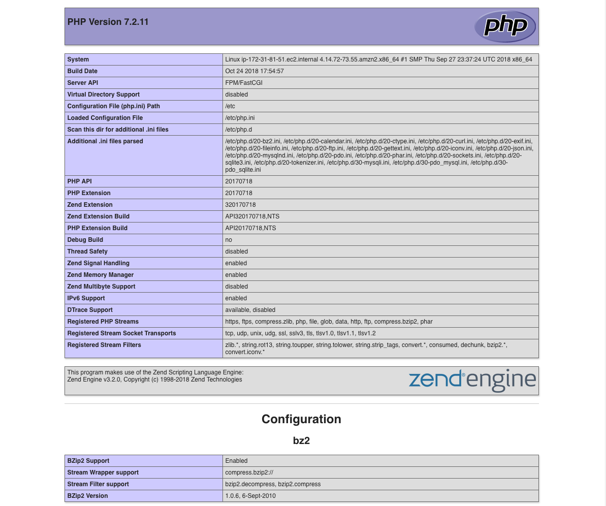

# Distributed Systems Practice
Notes from learning about distributed systems in [GW CS 6421](https://gwdistsys18.github.io/) with [Prof. Wood](https://faculty.cs.gwu.edu/timwood/)

## Docker and Container

Beginner Level:

[Video: Why Docker?](https://www.youtube.com/watch?v=RYDHUTHLf8U&t=0s&list=PLBmVKD7o3L8tQzt8QPCINK9wXmKecTHlM&index=23)

Why now -> New tech: Moving to Serverless ( FAAS : Function as a Service )

All inclusive solution, that is not just a Dev-Ops solution. It reduces the complexity of developing ( 80% Maintenance, 20% Developping ) to a move developping oriented.


[Lab](https://training.play-with-docker.com/ops-s1-hello/)

To download an image, and run a command inside a container run:

``` bash
docker image pull alpine
docker container run alpine ls -l
```

To start/resume a container run `docker container start <ID>`
To execute a command `docker container exec <ID>`
To inspect `docker image inspect <ID / name>`
to ls `docker container ls`

`docker exec -it <CONTAINER ID> /bin/bash`

Images can be the sam ebut execution is isolated, as well as filesystems
and Namespaces. Kernel is shared with other containers, and run as an
isolated process in userspace.

There is the Docker daemon -> Service that manages building, running and
distribution of containers.
The Docker client and the Docker Store.


[Video: What are Containers?](https://www.youtube.com/watch?v=EnJ7qX9fkcU)

It's a runtime sandboxed process with it's own namespace. It's lifecycle
is usually tied to the process lifecycle.

Image layering is the notion of an arraged hierarchy, in a parent-child
fashion. Tree Diagrams are a way to understand (you can make an analogy
to OOP)

A Dockerfile is the environment file that can be used to deploy and
create images using bulding blocs or base images. Containers are
packaged with all dependencies. These are not 'installed' but rather sit
on top of the kernel.

The registry contain the images ( from where you `push` and `pull`)
to the Docker Host. The host runs the image cache as well as the Docker
Daemon, who exposes API's to the client.
The client can `pull` `create` `run`

[Video: VMs Versus Containers](https://www.youtube.com/watch?v=L1ie8negCjc)

VM's interacts with HW through Agents, Kernel Modules, NIC. You can size
it and decide the storage. Containers live under the the application
layer on userspace.
On Vm's dependencies are associated to the OS while container
dependencies are on top of the OS inside the container.

[Lab](https://training.play-with-docker.com/beginner-linux/)

Run a Docker container and access its shell.

``` bash
docker container run --interactive --tty --rm ubuntu bash
```

In this example, we’re giving Docker three parameters:

- --interactive says you want an interactive session.
- --tty allocates a pseudo-tty.
- --rm tells Docker to go ahead and remove the container when it’s done executing.

You can potentionally run with `--detach` `--name` or `-e`

they are self explanatory `-e` inject an environment variable.

`docker container logs <name>` and `docker container top <name>` check the status
inside the container

You can also use `docker container exec` to connect to a new shell
process inside an already-running container: ` docker exec -it <name> sh` 
this will open a shell

Dockerfile:

```bash
FROM nginx:latest

COPY index.html /usr/share/nginx/html
COPY linux.png /usr/share/nginx/html

EXPOSE 80 443

CMD ["nginx", "-g", "daemon off;"]
```

- FROM specifies the base image to use as the starting point for this new image you’re creating. For this example we’re starting from nginx:latest.
- COPY copies files from the Docker host into the image, at a known location. In this example, COPY is used to copy two files into the image: index.html. and a graphic that will be used on our webpage.
- EXPOSE documents which ports the application uses.
- CMD specifies what command to run when a container is started from the image. Notice that we can specify the command, as well as run-time arguments.

`docker image build <name>:<version> <directory>`, which builds the
image

you can use `docker container run` to execute the image

```bash
docker container run \
 --detach \
 --publish 80:80 \
 --name <local name> \
 <name>:<version>
 ```

Important is the use of `--publish` which maps port 80 inside the container onto port 80 on the host

Use `docker container stop` and `docker container rm` to delete a
container

If you want to modify the image on the run which you're executing you
can mount a directry inside the container

```bash
 docker container run \
 --detach \
 --publish 80:80 \
 --name <local_name> \
 --mount type=bind,source="$(pwd)",target=/usr/share/nginx/html \
 <name>:<version
 ```

This changes the local but not the image. You need to build the image
again but this time it will be quicker given the the unchanged layers
have been cached. Only the changed one is build again.

To list images: `docker image ls`

In order to publish an image you need to login using `docker login`

To publish : `docker image push <name>:<version>`

[Video: VMs Versus Containers Deep Dive](https://www.youtube.com/watch?v=PoiXuVnSxfE)

3 Misconceptions:

- Size
- Isolation
- Boot Time

Size:

VM: Everything expect for HW is inside the disk image
Container: App and dependencies

Isolation:

VM: Boundaries outside `x86`: `EFI / BIOS`, `Kernel`, `Init`,... Very
hard to break
Container: The process understand and can brake the container. But the
it's up to the Kernel to protect itself.

Boot time:

VM: Slow but can be optimize with `EFI` and `D-Init`
Container: Time to boot Kernel Sandbox + Application

[Lab](https://training.play-with-docker.com/docker-networking-hol/)

For networking the command to create interfaces is `docker network`
you can `ls`, `inspect`, `create`,...

the brctl command shows the list the Linux bridges on your Docker host

containers connect by defaults to bridges connections.

```bash
docker run --name web1 -d -p 8080:80 nginx
```

run a linux nginx image with port mapping of host 8080 to container 80

`docker network create -d overlay <name>` creates an overlay network
for swarm mode

`docker network inspect <name>`

Swarm mode can run services inside the nodes:

```bash
docker service create --name <name of service> \
--network overnet \
--replicas 2 \
ubuntu sleep infinity
```

`--replicas` tells the number of instamces needed

You can ping from containers to each other and the VIP resolved by the
local DNS. This way you can run `ping -c5 <name of service>` and ping
correctly.

cat /etc/resolv.conf form inside of the container gives the DNS IP

```bash
docker exec -it yourcontainerid /bin/bash
cat /etc/resolv.conf
search ivaf2i2atqouppoxund0tvddsa.jx.internal.cloudapp.net
nameserver 127.0.0.11
options ndots:0
```

The value that we are interested in is the nameserver 127.0.0.11. This value sends all DNS queries from the container to an embedded DNS resolver running inside the container listening on 127.0.0.11:53. All Docker container run an embedded DNS server at this address.

Execute the docker service rm myservice command to remove the service called myservice.

`docker service rm <name of service>`

[Video: Kubernetes vs Swarm](https://www.youtube.com/watch?v=L8xuFG49Fac)

[Video: Kubernetes in 5 Minutes](https://www.youtube.com/watch?v=PH-2FfFD2PU)

Both Kubernetes and Docker Swarm are orquestration tools,

Kubernetes is an open source platform created by Google for container deployment. The idea was to automate deployment operation and scaling factors. It is sold as a production-ready, enterprise-grade, self-healing. This means that the fault-tolenrance of Kubernetes is very high.

Swarm uses a lot of the tools that regular Docker containers use. So that brings a simplicity. But Kubernetes has it's own Command Line Interface (CLI) that is incompatible with Docker.
Kubernetes itself is more complicate to use because the API is more complex. But it's more modular and a more all-in-one solution. Pods provide an easier organization compared to the only service / micro-service based Swarm

Intersting Links:

- [Kubernetes vs. Docker Swarm: What’s the Difference?](https://thenewstack.io/kubernetes-vs-docker-swarm-whats-the-difference/)
- [Kubernetes Tutorial](https://kubernetes.io/docs/tutorials/kubernetes-basics/)

Kubernetes:


Each node has a Kuberlet instance that run in each node to communicate
with the master node


A node is a worker machine in Kubernetes and may be a VM or physical machine, depending on the cluster. Multiple Pods can run on one Node.

To start a `BASH` inside a pod `kubectl exec -ti $POD_NAME bash`.
POD_NAME is the ID of the pod running inside the node

```bash
kubectl get - list resources
kubectl describe - show detailed information about a resource
kubectl logs - print the logs from a container in a pod
kubectl exec - execute a command on a container in a pod
```

A Service routes traffic across a set of Pods. Services are the abstraction that allow pods to die and replicate in Kubernetes without impacting your application. Discovery and routing among dependent Pods (such as the frontend and backend components in an application) is handled by Kubernetes Services.


To create a new service and expose it to external traffic we’ll use the expose command with NodePort as parameter (minikube does not support the LoadBalancer option yet).

```bash
kubectl expose deployment/kubernetes-bootcamp --type="NodePort" --port 8080
```

label creation: `kubectl label pod $POD_NAME app=v1`. `app=v1` is the label.

Using the abstraction of srvices to expose pods to the outside world. We can scale very quickly


To list your deployments use the get deployments command: `kubectl get deployments`

To scale `kubectl scale deployments/<name> --replicas=4`, you use labels to access the desired application

To get info use `kubectl describe <kind>/<name>`

To perform a rolling update use: `kubectl set image deployments/<name> <name>=<url>:<version>`

To rollback: `kubectl rollout undo deployments/<name>`

[AWS Tutorial: Break a Monolith Application into Microservices](https://aws.amazon.com/getting-started/projects/break-monolith-app-microservices-ecs-docker-ec2/?trk=gs_card)

In this tutorial, the idea is to deploy a monolithic node.js application to a Docker container, then decouple the application into microservices without any downtime. The node.js application hosts a simple message board with threads and messages between users.

The tutorial is divided into modules

[Repo](https://github.com/awslabs/amazon-ecs-nodejs-microservices)

1. Monolithic Application


To login use `$(aws ecr get-login --no-include-email --region us-east-1)`

`docker build -t sebas_api .`

But it is advised to tag the image to push it into the ECS instance.

If you cannot login to push use this `eval $(aws ecr get-login --no-include-email | sed 's|https://||')`


## Cloud Web Apps

[AWS LAB](https://aws.amazon.com/getting-started/tutorials/launch-a-virtual-machine/)

This lab is a simple way to access AWS Console and launch a simple Free tier EC2 instance with minimal resources. Remember to save the .perm (certificate) in a secure location. Also rememeber to run `chmod 400 mykey.perm` to change write permission and use the `-i` flag for the ssh

[QwikLab: Intro to S3](https://awseducate.qwiklabs.com/focuses/30?parent=catalog)

Amazon Simple Storage Service (Amazon S3) is storage for the internet. You can use Amazon S3 to store and retrieve any amount of data at any time, from anywhere on the web.

For this you launch a new S3 instance bucket through the AWS console and then create a new bucket. You can upload objects and be able to set permissions for the access of such information. For this "LAB", we uploaded an image with 2 version and designed a `Bucket Policy`

```Javascript
{
    "Version": "2012-10-17",
    "Id": "Policy1540610210977",
    "Statement": [
        {
            "Sid": "Stmt1540610202751",
            "Effect": "Allow",
            "Principal": "*",
            "Action": [
                "s3:GetObject",
                "s3:GetObjectVersion"
            ],
            "Resource": "arn:aws:s3:::mybucket567/*"
        }
    ]
}
```

[Video: Virtualization](https://www.youtube.com/watch?v=GIdVRB5yNsk)

Virtualization is a concept developped by IBM in the 1970's to boost the
IBM 360 sales. VMWARE pionnered the softwared based virtualization.
Intel decided that provided support in their x86 architecture was a good
idea, and so they added this 'Hardware Virtualization" or VT-x to their
architecture. Another open source architecture is XEN based and known as
paravirtualization. CLoud service providers, use this fact to sell you a
part of the computer through virtualization ( AWS, Azure, ... )

[AWS Tutorial: Install a LAMP Web Server on Amazon Linux 2](AWS Tutorial: Install a LAMP Web Server on Amazon Linux 2)


In order to use do this tutorial you require an EC2 Linux 2 instance
that has port 80, port 443 and port 22 open. Open HTTP, HTTPS and SSH. 

To install packages: `sudo amazon-linux-extras install -y
lamp-mariadb10.2-php7.2 php7.2`

use `sudo systemctl start httpd` and `sudo systemctl enable httpd` to
start the apache service. It's important to set the permissions
correctly. To secure server `sudo systemctl start mariadb` and `sudo
mysql_secure_installation`




> Include notes here about each of the links
