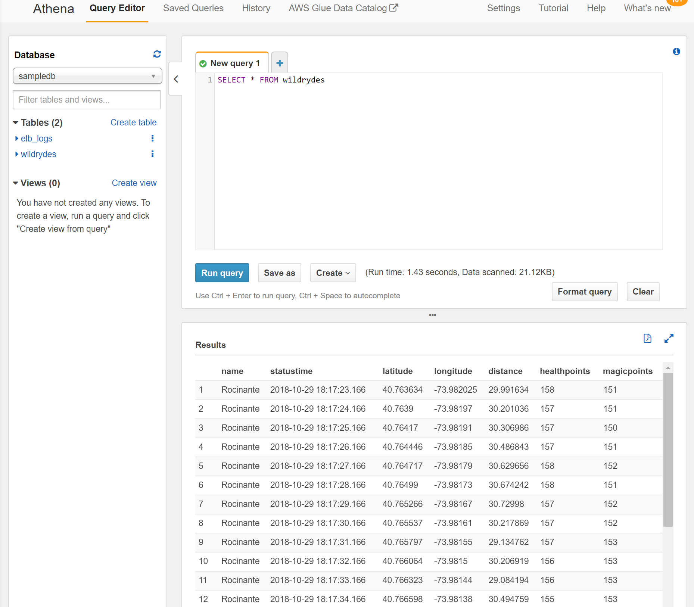

# Distributed Systems Practice
Notes from learning about distributed systems in [GW CS 6421](https://gwdistsys18.github.io/) with [Prof. Wood](https://faculty.cs.gwu.edu/timwood/)

## Area 1: Cloud Web Apps
* AWS Tutorial: Launch a VM (took ~15 minutes)
  * Used the EC2 Console to create an EC2 instance of type t2.micro
  * Used `ssh -i '<path-to-ssh-pem-file>' ec2-user@<ip-address>` to connect
  * After terminating instance, connection timed out when attempting to connect
* QwikLab: Intro to S3 (took ~20 minutes)
  * S3 stands for Simple Storage Service, which allows storage of objects in buckets which include backups and versioning
  * When uploading objects, there are different storage class options based on how long-lived and how freuqently accessed the data will be
  * Public read access can be granted to specific objects
  * ARN is Amazon Resource Name and in this case refers to a bucket
  * The policy generator can be used to create policies to put in the policy editor
  * New versions of a file can be uploaded and will display by default; additional permissions must be given to view old versions
* Video: Virtualization (took ~10 minutes)
  * Virtual machines have been used for a long time; software virtualization is more recent
  * The two (simple) privileged levels on Intel-based systems are ring 0 for the kernel and ring 3 for applications
  * Xen, an open-source VM architecture, has a small hypervisor running in ring 0
  * VMs have allowed old operating systems to run faster
* AWS Tutorial: Install a LAMP Web Server on Amazon Linux 2 (took ~50 minutes)
  * Set up an EC2 instance with security group allowing HTTP and HTTPS connections from anywhere
  * Installed Apache, MariaDB, and PHP
  * Launched the web server and verified that a PHP info page appeared
  * Set up and started MariaDB
  * Set up and logged into phpMyAdmin
  
* S3 vs. EC2 Comparison (took ~20 minutes)
  * Using S3, it's easy to upload static content and make it publicly accessible
  * However, S3 can't run code, but EC2 can
  * Someone [kept track of costs](https://medium.com/@bezdelev/cost-breakdown-for-a-static-website-on-aws-after-18-months-in-production-d97a932d2d25) for a static website using S3, CloudFront, and Lambda, and it was less than a dollar per month after the first month
  * An EC2 t2.micro instance costs $0.0116 per hour, which would be around $8 to $9 per month. There are also charges for sending out more than 1 GB of data per month
  * EC2 servers must be set up with the correct amount of memory and storage for the website and may need to be adjusted to improve performance, while S3 optimizes performance automatically
* QwikLab: Intro to DynamoDB (took ~15 minutes)
  * DynamoDB is a NoSQL DB service with single-digit millisecond latency at any scale
  * It supports document and key-value data models
  * The default settings have "provisioned capacity set to 5 reads and 5 writes"
  * Items are like rows, and attributes are like columns; however, items can have different attributes
  * The Console GUI supports creating tables and adding items
  * A query uses the partition key and sort key and is the most efficient way to retrieve data
  * A scan involves looking through every item in a table but does not require a partition key
* AWS Tutorial: Deploy a Scalable Node.js Web App (took ~45 minutes)
  * Elastic Beanstalk automatically handles deployment, load balancing, auto-scaling, etc. after the user uploads code
  * An Elastic Beanstalk environment includes an EC2 instance, a load balancer with a security group, an auto scaling group, and an S3 bucket
  * The sample app writes to a DynamoDB table when the user submits the form
  * The sample app creates the DynamoDB table using configuration files, but in a production environment the table should be created outside the environment; this can be done by creating the table; adding the name to the configuration file, and redeploying
  * Configuring the auto scaling group with a higher minimum instance count helps with availability
  
* QwikLab: Intro to AWS Lambda (took ~20 minutes)
  * Created S3 buckets for source and target
  * Lambda functions can be from scratch, using blueprints, or from the AWS Serverless Application Repository
  * The example code gets the bucket and key from the record for the event, downloads the file, resizes the image, and uploads it to the target bucket
  * The test took 891.68 ms and used up to 50 MB
  * Monitoring shows the invocations count, duration, errors, throttles, and more
  * The CloudWatch Logs can be used to view print statements from the functions
* QwikLab: Intro to Amazon API Gateway (took ~15 minutes)
  * Amazon API Gateway and AWS Lambda help with implementing a microservice architecture
  * Many organizations have an API-first strategy where they provide a standardized API for every service with the assumption that there is a potential of other applications using it
  * A resource is a URL endpoint and path
  * A backend target points to where the code for the API runs
  * A method consists of a resource path and an HTTP verb
  * Created a Lambda function and created an API Gateway as a trigger
  * Tested the API using built-in testing feature and a web page that automatically displays result of a request
* AWS Tutorial: Build a Serverless Web Application (took ~80 minutes)
  * The first step is to host a static website using S3
  * Next, used Cognito to create a user pool for user sign-up and authentication
    * This includes email verification by sending a code
  * The Lambda function used node.js code to take input, add to a DynamoDB table, and return data
    * An IAM role had to be created to allow access to the table
  * The Amazon API Gateway allows exposing a Lambda function as a RESTful API
    * The endpoints can be regional or edge optimized using CloudFront
  * Created an authorizer that uses JWT tokens from Cognito User Pools
  * Created a resource with a POST method that uses a Lambda function
  * Deployed the API and got a URL
  * Added the URL to the config file
  * Confirmed that the web page could use the API
  

## Area 2: Big Data and Machine Learning
* Video: Hadoop Intro (took ~15 minutes)
  * Distributed systems are used to deal with the data explosion
  * Hadoop is a framework inspired by a Google technical document to make distributed data processing easier
  * Hadoop is economical, reliable, scalable, and flexible
  * Traditional systems have data going to a program, while with Hadoop the program goes to the data
  * Hadoop has 12 components:
    * HDFS (Hadoop Distirbuted File System) is a storage layer for Hadoop
    * HBase is a NoSQL database that stores data in HDFS
    * Sqoop transfers data between Hadoop and relational database servers
    * Flume ingests streaming data
    * Spark is a cluster computing framework
    * Hadoop MapReduce is the original processing engine but is losing ground to Spark
    * Pig is a dataflow system primarily used for analytics that converts pig script to Map-Reduce code
    * Impala is a high-performance SQL engine with low latency
    * Hive is similar to Impala but is good for data processing
    * Cloudera Search enables non-technical users to search and explore data
    * Oozie is a workflow or coodination system used to manage Hadoop jobs
    * Hue (Hadoop User Experience) is a web interface for Hadoop
  * These components help with the four stages of big data processing: ingest, processing, analyze, and access
* QwikLab: Analyze Big Data with Hadoop (took ~20 minutes)
  * Set up an EMR cluster and an S3 bucket for output
  * The default EMR cluster configuration includes Apache Hadoop, Ganglia (performance monitor), Apache Tez (framework for creating a complex directied acyclic graph of tasks), Hive (data warehouse and analytics package), Hue (GUI), and Pig (converts Pig Latin to Tez jobs)
  * Amazon CloudFront speeds up web content distribution through worldwide network of edge location data centers
  * A step is a unit of work with one or more Hadoop jobs
  * Created a step with a Hive script that reads and parses CloudFront log files and then submits a HiveQL query to analyze requests per OS
  * Script took about a minute to process 5,000 rows
* QwikLab: Intro to S3 - already completed in Area 1
* QwikLab: Intro to Amazon Redshift (took ~20 minutes)
  * Amazon Redshift is a data warehouse allowing data analysis using SQL
  * Pgweb is a web application for SQL based on PostreSQL
  * Created a users table, then copied 49,990 rows from an S3 text file
  * Queried the data using SQL
* Video: Short AWS Machine Learning Overview (took ~3 minutes)
  * There are three layers of the machine learning stack:
    * Framework and Interfaces: used by companies with experts who build and train ML models
    * ML Platforms: make it easy to build, train, tune, and deploy models without expertise
    * Application Services: APIs for computer vision, speech processing, etc.
* AWS Tutorial: Analyze Big Data with Hadoop (took ~25 minutes)
  * Created an S3 bucket and an EC2 key pair
  * Launched an EMR cluster
  * Allowed SSH connections to cluster
  * Steps can be submitted to a cluster, configured when it is set up, or run on the command line after connecting to the master node
  * The script also analyzes CloudFront log files and determines the number of requests for each OS
* QwikLab: Intro to Amazon Machine Learning (took ~35 minutes)
  * Amazon ML allows software developers to build predictive models from supervised data sets
  * Docs: AWS Machine Learning
    * A datasource contains metadata about input data but not the data itself
    * An ML model generates predictions
    * An evaluation measures ML model quality
    * Batch predictions generate predictions for a set of observations
    * Real-time predictions generate predictions for single input observations with low latency
  * Started by adding data to an S3 bucket
  * Inputted the data into Amazon ML and identified the target variable
  * Amazon ML by default reserves 70% of data for training and 30% for evaluation
  * The confusion matrix shows a matrix of the true values and predicted values and the frequencies
  * Real-time predictions show predicted scores (adding up to 1) for each category
  * Real-time predictions can be done without submitting all of the input data values
* AWS Tutorial: Build a Machine Learning Model (took ~35 minutes)
  * The ML model creation roughly follows the previous tutorial except with different data
  * AUC (Area Under a Curve) is a quality metric for ML models
  * The score threshold can be adjusted to choose a balance of false positives and false negatives
  * Batch predictions can be done by linking to a new spreadsheet of input data; they cost $0.10 per 1,000 predictions
  * The results spreadsheet gives the best answer and the score; the score threshold determines the best answer based on the score
* Video Tutorial: Overview of AWS SageMaker (took ~30 minutes)
  * SageMaker is a machine learning service with four parts: notebook instances, jobs, models, and endpoints
  * The parts can be used independently or together 
  * The notebook instances run Jupyter notebooks
  * SageMaker has implementations of algorithms
  * In the xgboost_mnist notebook shown, the steps included configuration, data ingestion, data conversion before training
  * The algorithms are hosted in Docker containers; the user defines the parameters
  * Training can be done on a single instance or on multiple instances to speed it up; training is done as jobs
  * After training the model, it is hosted in a container so it can be used for predicting
  * SageMaker allows multiple models behind the same endpoint, which allows AB testing
  * After setting up the endpoint, predictions can be done and a confusion matrix can be generated
  * A user-generated algorithm in a separate Python file can also be used
  * SageMaker can also host already trained models, but they may need to be converted
  * You can also build your own algorithm Docker container
* AWS Tutorial: AWS SageMaker (took ~45 minutes)
  * Started by creating S3 bucket and SageMaker notebook instance
  * In the notebook, loaded the dataset, which is images of handwritten numbers
  * Configured the built-in k-means algorithm with data and output locations, etc.
  * Used `fit` method to begin training
  * Used `deploy` to create a model, an endpoint configuration, and an endpoint
  * Used `predict` to get inferences for 100 images; they were mostly accurate
* Build a Serverless Real-Time Data Processing App (took ~90 minutes)
  * Intro
    * Set up AWS Cloud9 IDE which runs in browser
  * Module 1: Build a data stream (Kinesis, Cognito)
    * Created a Kinesis stream with 1 shard (unit of throughput capacity)
    * Started the producer and consumer in separate terminals
    * Used Cognito to create an identity pool to grant unauthenticated users access to stream
    * Opened a web app that showed a live map of the coordinates being transmitted in the stream
    
  * Module 2: Aggregate data (Kinesis Data Analytics)
    * Created another stream with 1 shard for aggregated statistics
    * Started the producer so that Kinesis Data Analytics would automatically detect the schema
    * Created a Kinesis Analytics application and added a SQL query to aggregate stream data
    * A table with data from the SQL query updated every minute automatically
    * Connected the application to an output Kinesis stream
    * Used a consumer to view the aggregate stream in a terminal
    
  * Module 3: Process streaming data (DynamoDB, Lambda)
    * Created a DynamoDB table and configured a role for Lambda to access it
    * Set up a Lambda function running Node.js 6.10 and configured the Kinesis stream as a trigger
    * The function started saving the aggreagate data stream to the DyanmoDB table
    
  * Module 4: Store & query data (Kinesis Data Firehose, Athena)
    * Created a Kinesis Data Firehose delivery stream to put stream data into an S3 bucket
    * Created an Amazon Athena table with a query to use a JSON SerDe to get the data from the S3 bucket
    * The data then appeared in Athena
    
### Project Summary

This application processed data generated by a producer simulating unicorns travelling across New York City in a few different ways. First, the producer sent its data to an Amazon Kinesis stream, which could be directly accessed by a dashboard for viewing on a map. From there, a SQL query in Kinesis Data Analytics analyzed the data and sent aggregate statistics out another Kinesis stream every minute. A Lambda function was then used to take the data from this stream and save it in a DynamoDB table as it arrived via an S3 bucket. Meanwhile, a Kinesis Data Firehose was used to put the stream data into an S3 bucket which was then queried to be put into an Athena table.

## Area 3: Docker and Containers
* Video: Why Docker? (took ~10 minutes)
  * Docker started as an open-source project and is now a company
  * Major infrastructure shifts:
    * 90s: mainframe to PC
	* 00s: baremetal to virtual
	* 10s: datacenter to cloud
	* now: host to containers (serverless)
  * Docker is all about speed (of developing, building, testing, etc.)
  * Containers reduce complexity for heterogeneous systems
  * To migrate to Docker you don't need to rewrite your app, it's just a different way of packaging your app
* Lab: DevOps Docker Beginners Guide (took ~30 minutes)
  * `docker container run <container ID>` first checks for local images with the container ID and, if there are none, checks the Docker registry (the Docker Store by default)
  * A VM is a hardware abstraction, while a container is an application abstraction
  * Alpine is a lightweight Linux distribution so it is popular for many images
  * `docker image pull <image name>` fetches the image from the Docker registry and saves it in the system
  * `docker image ls` shows all images on system
  * `docker container run alpine ls -l` started a container based on the alpine image, ran `ls -l` inside, and then shut down
  * `docker container run -it alpine /bin/sh` starts an interactive terminal on a Docker container based on the alpine image
  * `docker container ls -a` shows containers running or that were run (without `-a` shows just the running ones)
  * Containers even from the same image are isolated with separate file systems by default
  * `docker container exec <container ID> <command>` sends a command to a running container
  * The Docker daemon runs on the host and the Docker client is the command line tool for the daemon
