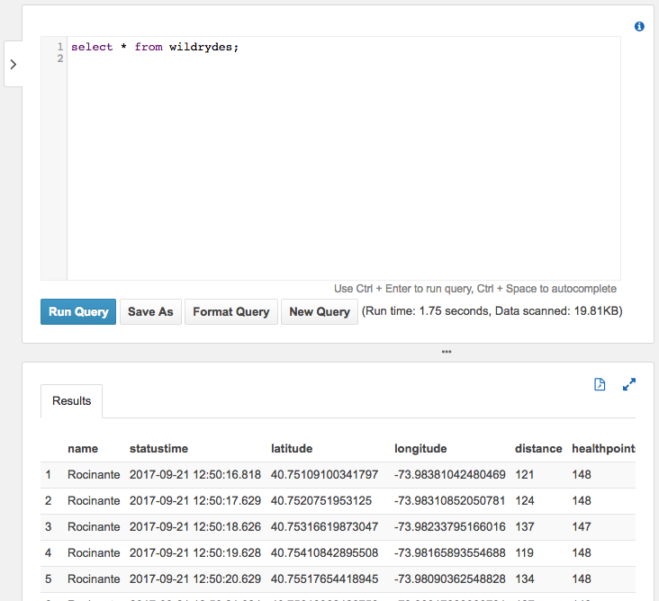

# Distributed Systems Practice
Notes from learning about distributed systems in [GW CS 6421](https://gwdistsys18.github.io/) with [Prof. Wood](https://faculty.cs.gwu.edu/timwood/)

Name: Qi Bao <br>
Github Name: [C91CBQ](https://github.com/C91CBQ)

Round 2 Blog: [Introduction to MapReduce](https://c91cbq.blogspot.com/2018/12/introduction-to-mapreduce.html)

## Check List
##### Docker and Containers
- [x] Beginner Level
- [ ] Intermediate Level

##### Big Data and Machine Learning
- [x] Beginner Level
- [x] Intermediate Level

##### Cloud Web Applications
- [x] Beginner Level
- [x] Intermediate Level

##### SDN and NFV
- [x] Beginner Level
- [ ] Intermediate Level


## [Cloud Web Apps](https://gwdistsys18.github.io/learn/web/)
### Beginner Level
#### [AWS Tutorial: Launch a VM](https://aws.amazon.com/getting-started/tutorials/launch-a-virtual-machine/)  
1. Amazon Elastic Compute Cloud (EC2) is the Amazon Web Service you use to create and run virtual machines in the cloud. AWS calls these virtual machines 'instances'.
1. Launch a VM:
    * Click **EC2** console.
    * Select an instance and launch.
    * Create a key pair and download it.
    * Move key pair into .ssh subdirectory and set restrict permissions.
    ```
    mv ~/Downloads/MyKeyPair.pem ~/.ssh/MyKeyPair.pem
    chmod 400 ~/.ssh/mykeypair.pem
    ```
    * Use ssh to connect the instance.
    ```
    ssh -i ~/.ssh/MyKeyPair.pem ec2-user@{IP_Address}
    ```
    * Terminate the instance in console.
    * Example:
    

*Cost 15 minutes, finished on Oct 13th, 2018.*
____
#### [QwikLab: Intro to S3](https://awseducate.qwiklabs.com/focuses/30?parent=catalog)
1. Amazon Simple Storage Service (Amazon S3) is storage for the Internet. Amazon S3 is used to store and retrieve any amount of data at any time, from anywhere on the web.
1. Create a S3 Bucket and Upload Image
    * Click **Create Bucket** and Input a bucket name.
    * Check config options, select versioning.
    * Exam the permissions.
    * Click Create Bucket.
    * In S3 console, click upload image.
1. Set Object Permissions:
    * Public Permission:
        * In S3 console, click **Permission Tab**.
        * Under the **Public Access** section, select **Everyone**.
        * Select **Read Object** and Save.
    * Bucket Policy:
        * Bucket Policy is a set of permissions associated with an Amazon S3 bucket. It can be used to control access to a whole bucket or to specific directories within a bucket.
        * Create a **Bucket Policy** with example as following:
        ```
        {
            "Version": "2012-10-17",
            "Id": "Policy1539460848531",
            "Statement": [
                {   
                    "Sid": "Stmt1539460847088",
                    "Effect": "Allow",
                    "Principal": "*",
                    "Action": "s3:GetObject",
                    "Resource": "arn:aws:s3:::mybucket10132018/*"
                }
            ]
        }
        ```
1. Versioning:
    *  Versioning is a means of keeping multiple variants of an object in the same bucket. You can use versioning to preserve, retrieve, and restore every version of every object stored in your Amazon S3 bucket. With versioning you can easily recover from both unintended user actions and application failures.
    * Click **Latest Version** tab to change version.
    * Also change **Bucket Policy**'s Action for old version permissions.
    ```
    {
        "Version": "2012-10-17",
        "Id": "Policy1539460848531",
        "Statement": [
            {   
                "Sid": "Stmt1539460847088",
                "Effect": "Allow",
                "Principal": "*",
                "Action": [
                    "s3:GetObject",
                    "s3:GetObjectVersion"
                ]
                "Resource": "arn:aws:s3:::mybucket10132018/*"
            }
        ]
    }
    ```

*Cost 30 minutes, finished on Oct 13th, 2018.*
____

### Intermediate Level
#### *Virtual Machines, Websites, and Databases:*

#### [Video: Virtualization](https://www.youtube.com/watch?v=GIdVRB5yNsk)
1. History: Virtualization first brought up in 1970s. IBM build the virtual machine on the top of physical computer and then realize multiple virtual machines can be run at the same time.

1. Hypervisor: A hypervisor or virtual machine monitor (VMM) is computer software, firmware or hardware that creates and runs virtual machines. A computer on which a hypervisor runs one or more virtual machines is called a host machine, and each virtual machine is called a guest machine. The hypervisor presents the guest operating systems with a virtual operating platform and manages the execution of the guest operating systems. Multiple instances of a variety of operating systems may share the virtualized hardware resources: for example, Linux, Windows, and macOS instances can all run on a single physical x86 machine. This contrasts with operating-system-level virtualization, where all instances (usually called containers) must share a single kernel, though the guest operating systems can differ in user space, such as different Linux distributions with the same kernel.

*Cost 20 minutes, finished on Oct 26th, 2018.*
____
#### [AWS Tutorial: Install a LAMP Web Server on Amazon Linux 2](https://docs.aws.amazon.com/AWSEC2/latest/UserGuide/ec2-lamp-amazon-linux-2.html)
1. Prepare the LAMP Server
 * Connect to instance
 * Ensure all software packages are up to date
 ```
 sudo yum update -y
 ```
 * Install the lamp-mariadb10.2-php7.2 and php7.2 Amazon Linux Extras repositories to get the latest versions of the LAMP MariaDB and PHP packages for Amazon Linux 2.
 ```
 sudo amazon-linux-extras install -y lamp-mariadb10.2-php7.2 php7.2
 ```
 * Install the Apache web server, MariaDB, and PHP software packages.
 ```
 sudo yum install -y httpd mariadb-server
 ```
 * Start the Apache web server.
 ```
 sudo systemctl start httpd
 ```
 * Use the systemctl command to configure the Apache web server to start at each system boot.
 ```
 sudo systemctl enable httpd
 ```
 * Add a security rule to allow inbound HTTP (port 80) connections to instance
    * Open the Amazon EC2 console at https://console.aws.amazon.com/ec2/.
    * Choose **Instances** and select your instance.
    * Under **Security groups**, choose **view inbound rules**.
    * Using the procedures in Adding Rules to a Security Group, add a new inbound security rule with the following values:
    ```
    Type: HTTP
    Protocol: TCP
    Port Range: 80
    Source: Custom
    ```

 * Test web server
    * Access Apache test page
    

 * Set file permissions
    * Add user to Apache group
    ```
    sudo usermod -a -G apache qibao
    ```
    * Log out and then log back in again to pick up the new group, and then verify membership
    ```
    exit
    groups
    qibao adm wheel apache systemd-journal
    ```
    * Change the group ownership of /var/www and its contents to the apache group.
    ```
    sudo chown -R qibao:apache /var/www
    ```
    * To add group write permissions and to set the group ID on future subdirectories, change the directory permissions of /var/www and its subdirectories.
    ```
    sudo chmod 2775 /var/www && find /var/www -type d -exec sudo chmod 2775 {} \;
    ```
    * To add group write permissions, recursively change the file permissions of /var/www and its subdirectories:
    ```
    find /var/www -type f -exec sudo chmod 0664 {} \;
    ```
1. Test LAMP Server
    * Create a PHP file in the Apache document root.
    ```
    echo "<?php phpinfo(); ?>" > /var/www/html/phpinfo.php
    ```
    * Verify all of the required packages were installed.
    ```
    sudo yum list installed httpd mariadb-server php-mysqlnd
    ```
    * Delete the phpinfo.php file.
    ```
    rm /var/www/html/phpinfo.php
    ```
1. Secure the Database Server
    * Start the MariaDB server
    ```
    sudo systemctl start mariadb
    ```
    * Run mysql_secure_installation
    ```
    sudo mysql_secure_installation
    ```
    * Stop MariaDB server
    ```
    sudo systemctl stop mariadb
    ```
    * Configure MariaDB to start at every system boot
    ```
    sudo systemctl enable mariadb
    ```
1. Install phpMyAdmin
    * Install the required dependencies.
    ```
    sudo yum install php-mbstring -y
    ```
    * Restart Apache.
    ```
    sudo systemctl restart httpd
    ```
    * Restart php-fpm.
    ```
    sudo systemctl restart php-fpm
    ```
    * Navigate to the Apache document root at /var/www/html.
    ```
    cd /var/www/html
    ```
    * Select a source package for the latest phpMyAdmin release from https://www.phpmyadmin.net/downloads.
    ```
    wget https://www.phpmyadmin.net/downloads/phpMyAdmin-latest-all-languages.tar.gz
    ```
    * Create a phpMyAdmin folder and extract the package into it with the following command.
    ```
    mkdir phpMyAdmin && tar -xvzf phpMyAdmin-latest-all-languages.tar.gz -C phpMyAdmin --strip-components 1
    ```
    * Delete the phpMyAdmin-latest-all-languages.tar.gz tarball.
    ```
    rm phpMyAdmin-latest-all-languages.tar.gz
    ```
    * If the MariaDB server is not running, start it now.
    ```
    sudo systemctl start mariadb
    ```
    * phpMyAdmin Login Page
    

*Cost 60 minutes, finished on Oct 26th, 2018.*
____
#### Compare the performance, functionality, and price when serving web content from S3 versus an EC2 VM

| S3 | EC2 |
---|---|---
performance | Highly scalable, reliable, fast, and durable. | Highly load balance performance.
functionality | Hosted static web content and assets like videos, photos, text file and any other format file. | Hosted dynamic content or running service.
price | Pay-As-You-Go (Only pay for the storage consumed, with different options depending upon how often/fast you wish to retrieve the objects.) | Long-term pricing available for discounts. But expensive upfront payment if not using server for entire purchase length.

*Cost 20 minutes, finished on Oct 26th, 2018.*
____
#### [QwikLab: Intro to DynamoDB](https://awseducate.qwiklabs.com/focuses/23?parent=catalog)
* Introduction: Amazon DynamoDB is a fast and flexible NoSQL database service for all applications that need consistent, single-digit millisecond latency at any scale. It is a <strong>fully managed database</strong> and supports both document and key-value data models. Its flexible data model and reliable performance make it a great fit for mobile, web, gaming, ad-tech, IoT, and many other applications.
* Create a New Table
    * In the AWS Management Console, click <strong>Services</strong>,  then click <strong>DynamoDB</strong>.
    * Click <strong>Create table</strong>.
    *  For <strong>Table name</strong>, type: <input readonly class="copyable-inline-input" size="5" type="text" value="Music">
    * For <strong>Primary key</strong>, type <input readonly class="copyable-inline-input" size="6" type="text" value="Artist"> and leave <strong>String</strong> selected.
    * Select <i class="far fa-check-square"></i> <strong>Add sort key</strong>, then in the new field type <input readonly class="copyable-inline-input" size="4" type="text" value="Song"> and leave <strong>String</strong> selected.
    * Click <strong>Create</strong>.
* Add Data
    * Each table contains multiple items. An item is a group of attributes that is uniquely identifiable among all of the other items. Items in DynamoDB are similar in many ways to rows in other database systems. In DynamoDB, there is no limit to the number of items you can store in a table.

    * Each item is composed of one or more attributes. An attribute is a fundamental data element, something that does not need to be broken down any further.

    * When you write an item to a DynamoDB table, only the Primary Key and Sort Key (if used) are required. Other than these fields, the table does not require a schema. This means that you can add attributes to one item that may be different to the attributes on other items.

    * Each item is capable of having different attributes without having to pre-define a table schema, which demonstrates the flexibility of a NoSQL database.

* Query the Table (Query and Scan)
    * A <strong>query</strong> operation finds items based on Primary Key and optionally Sort Key. It is fully indexed, so it runs very fast. A query is the most efficient way to retrieve data from a DynamoDB table.
    * Another way is to **scan** for an item. This involves looking through **every item in a table**, so it is less efficient and can take significant time for larger tables.
* Delete the Table
    * Click <strong>Delete table</strong>. On the confirmation panel, click <strong>Delete</strong>.

*Cost 30 minutes, finished on Oct 27th, 2018.*
____
#### [AWS Tutorial: Deploy a Scalable Node.js Web App](https://aws.amazon.com/getting-started/projects/deploy-nodejs-web-app/?trk=gs_card)
* Architecture:

* Launch an Elastic Beanstalk Environment
    * Open the Elastic Beanstalk console using this preconfigured link: console.aws.amazon.com/elasticbeanstalk/home#/newApplication?applicationName=tutorials&environmentType=LoadBalanced&instanceType=t2.micro
    * For **Platform**, choose Node.js
    * For **Application code**, choose **Sample application**.
    * **Review and launch**, then **Create app**.
    
    * Elastic Beanstalk takes about five minutes to create the environment with the following resources:
        * EC2 instance
        * Instance security group
        * Load balancer
        * Load balancer security group
        * Auto Scaling group
        * Amazon S3 bucket
        * Amazon CloudWatch alarms
        * AWS CloudFormation stack
        * Domain name
* Add Permissions to Environment’s Instances
    * Open the **Roles page** in the IAM console.
    * Choose **aws-elasticbeanstalk-ec2-role**
    * On the **Permissions** tab, under **Managed Policies**, choose **Attach Policy**.
        * AmazonSNSFullAccess
        * AmazonDynamoDBFullAccess
        
* Deploy the Sample Application
    * Open the Elastic Beanstalk console.
    * Navigate to the management page for your environment.
    * Upload file and Deploy.
    
* Create a DynamoDB Table
    * Open the Tables page in the DynamoDB management console.
    * Choose Create table with following settings, then Create:
        * Table name – nodejs-tutorial
        * Primary key – email
        * Primary key type – String

* Update the Application's Configuration Files
    * Extract the project files from the source bundle
    ```
    mkdir nodejs-tutorial
    cd nodejs-tutorial
    unzip ~/Downloads/eb-node-express-sample-v1.0.zip
    ```
    * Open .ebextensions/options.config and change the values of the following settings:
        * NewSignupEmail – Your email address.
        * STARTUP_SIGNUP_TABLE – nodejs-tutorial
        This configures the application to use the nodejs-tutorial table instead of the one created by .ebextensions/create-dynamodb-table.config, and sets the email address that the Amazon SNS topic uses for notifications.
    * Remove .ebextensions/create-dynamodb-table.config.
    ```
    rm .ebextensions/create-dynamodb-table.config
    ```
    * Create a source bundle from the modified code.
    ```
    zip nodejs-tutorial.zip -r * .[^.]*
    ```
* Configure Your Environment for High Availability
    * Navigate to **the management page**.
    * Choose **Configuration**.
    * On the **Capacity** configuration card, choose **Modify**.
    * In the **Auto Scaling Group** section, set **Min instances** to 2, then **Apply**.
    

* Cleanup
    * **Terminate** Elastic Beanstalk environment
    * **Delete** a DynamoDB table

*Cost 60 minutes, finished on Oct 27th, 2018.*
____

#### *Serverless and Edge Computing:*
#### [QwikLab: Intro to AWS Lambda](https://awseducate.qwiklabs.com/focuses/36?parent=catalog)
* Scenario
    * AWS Lambda Application Flow:
    
* Create Amazon S3 Buckets
    * On the **Services** menu, select **S3**
    * **Create bucket**, with name images-1234, as the source bucket for original uploads
    * Create another bucket, with name images-1234-resized, as the output bucket for thumbnails
    * Upload the HappyFace.jpg to source bucket
* Create an AWS Lambda Function
    * On the **Services** menu, select **Lambda**
    * In the create function to configure:
    This role grants permission to the Lambda function to read and write images in S3
        ```
        Name: Create-Thumbnail
        Runtime: Python 3.6
        Existing role: lambda-execution-role
        ```
    * **Add triggers** and **Configure triggers**:
    ```
    Bucket: image-bucket
    Event type: Object Created (All)
    ```
    * Create-Thumbnail
    
    * Configure in **Function Code**
    ```
    Code entry type: Upload a file from Amazon S3
    Runtime: Python 3.6
    Handler: CreateThumbnail.handler
    ```
    * Review the **Description** and click **Save**
* Test Lambda Function
    * Click **Test** then configure:
    ```
    Event template: Amazon S3 put
    Event name: Upload
    ```
    * Replace the **example-bucket** and **test/key** with test file.
    * Save and Test
    * Click **Details** to expand it and show more infomations.
* Monitoring and Logging
    * Monitoring tab displays graphs showing:
        * **Invocations:** The number of times the function has been invoked.
        * **Duration:** How long the function took to execute (in milliseconds).
        * **Errors:** How many times the function failed.
        * **Throttles:** When too many functions are invoked simultaneously, they will be throttled. The default is 1000 concurrent executions.
        * **Iterator Age:** Measures the age of the last record processed from streaming triggers (Amazon Kinesis and Amazon DynamoDB Streams).
        * **Dead Letter Errors:** Failures when sending messages to the Dead Letter Queue.
        * Log messages from Lambda functions are retained in <strong>Amazon CloudWatch Logs</strong>
    * Logging:
        * Click the **log stream**
        * **Expand** > each message to view the log message details:
            The Event Data includes the Request Id, the duration (in milliseconds), the billed duration (rounded up to the nearest 100 ms, the Memory Size of the function and the Maximum Memory that the function used. In addition, any logging messages or print statements from the functions are displayed in the logs. This assists in debugging Lambda functions.

*Cost 60 minutes, finished on Oct 27th, 2018.*
____
#### [QwikLab: Intro to Amazon API Gateway](https://awseducate.qwiklabs.com/focuses/21?parent=catalog)
* Technical Concepts
    * Microservice Architecture: A microservice is a software development technique—a variant of the service-oriented architecture (SOA) architectural style that structures an application as a collection of loosely coupled services. The idea of a microservices architecture is to take a large, complex system and break it down into <strong>independent, decoupled services that are easy to manage and extend</strong>.
    * Application Programming Interface (API): API is a set of instructions that defines how developers interface with an application. The idea behind an API is to create a <strong>standardized approach</strong> to interfacing the various services provided by an application. An API is designed to be used with a <strong>Software Development Kit (SDKs)</strong>, which is a collection of tools that allows developers to easily create downstream applications based on the API.
    * API-First Strategy: each service within their stack is first and always released as an API.
    * RESTful API: Representational state transfer (REST) refers to architectures that follow six constraints:
        * Separation of concerns via a client-server model.
        * <strong>State</strong> is stored entirely on the client and the communication between the client and server is <strong>stateless</strong>.
        * The client will <strong>cache</strong> data to improve network efficiency.
        * There is a uniform interface (in the form of an <strong>API</strong>) between the server and client.
        * As complexity is added into the system, <strong>layers</strong> are introduced. There may be multiple layers of RESTful components.
        * Follows a <strong>code-on-demand</strong> pattern, where code can be downloaded on the fly (in our case implemented in Lambda) and changed without having to update clients.
* Amazon API Gateway features:
    * Transform the body and headers of incoming API requests to match backend systems
    * Transform the body and headers of the outgoing API responses to match API requirements
    * Control API access via Amazon Identity and Access Management
    * Create and apply API keys for third-party development
    * Enable Amazon CloudWatch integration for API monitoring
    * Cache API responses via Amazon CloudFront for faster response times
    * Deploy an API to multiple stages, allowing easy differentiation between development, test, production as well as versioning
    * Connect custom domains to an API
    * Define models to help standardize your API request and response transformations
* Amazon API Gateway and AWS Lambda Terminology
    * **Resource:** Represented as a URL endpoint and path. For example, api.mysite.com/questions. You can associate HTTP methods with resources and define different backend targets for each method. In a microservices architecture, a resource would represent a single microservice within your system.
    * **Method:** In API Gateway, a method is identified by the combination of a resource path and an HTTP verb, such as GET, POST, and DELETE.
    * **Method Request:** The method request settings in API gateway store the methods authorization settings and define the URL Query String parameters and HTTP Request Headers that are received from the client.
    * **Integration Request:** The integration request settings define the backend target used with the method. It is also where you can define mapping templates, to transform the incoming request to match what the backend target is expecting.
    * **Integration Response:** The integration response settings is where the mappings are defined between the response from the backend target and the method response in API Gateway. You can also transform the data that is returned from your backend target to fit what your end users and applications are expecting.
    * **Method Response:** The method response settings define the method response types, their headers and content types.
    * **Model:** In API Gateway, a model defines the format, also known as the schema or shape, of some data. You create and use models to make it easier to create mapping templates. Because API Gateway is designed to work primarily with JavaScript Object Notation (JSON)-formatted data, API Gateway uses JSON Schema to define the expected schema of the data.
    * **Stage:** In API Gateway, a stage defines the path through which an API deployment is accessible. This is commonly used to deviate between versions, as well as development vs production endpoints, etc.
    * **Blueprint:** A Lambda blueprint is an example lambda function that can be used as a base to build out new Lambda functions.

*Cost 30 minutes, finished on Oct 27th, 2018.*
____
#### [AWS Tutorial: Build a Serverless Web Application](https://aws.amazon.com/getting-started/projects/build-serverless-web-app-lambda-apigateway-s3-dynamodb-cognito/?trk=gs_card)
* Application Architecture

* Static Web Hosting
    * Architecture
    
    * Create a S3 bucket as we do in previous tutorial.
    * Upload static web content like HTML, CSS, JavaScript and Media Types.
    * Configure **Bucket Policy** as following:
    ```
    {
        "Version": "2018-10-27",
        "Statement": [
            {
                "Effect": "Allow",
                "Principal": "*",
                "Action": "s3:GetObject",
                "Resource": "arn:aws:s3:::[YOUR_BUCKET_NAME]/*"
            }
            ]
    }
    ```
    * Save and enable Web Hosting.
* User Management
    * Architecture
    
    * Create an Amazon Cognito User Pool, get the Pool Id
    
    * Add an App to User Pool
        * Choose **Add an app client**.
        * **Uncheck** the Generate client secret option.
        * Choose **Create app** client.
        * Note **App client id**
        
    * Update the config.js File in Website Bucket
    ```
    window._config = {
        cognito: {
            userPoolId: 'us-west-2_uXboG5pAb', // e.g. us-east-2_uXboG5pAb
            userPoolClientId: '25ddkmj4v6hfsfvruhpfi7n4hv', // e.g. 25ddkmj4v6hfsfvruhpfi7n4hv
            region: 'us-west-2' // e.g. us-east-2
            },
            api: {
                invokeUrl: '' // e.g. https://rc7nyt4tql.execute-api.us-west-2.amazonaws.com/prod',
            }
        };
    ```
    * Test
    
* Serverless Backend
    * Architecture
    
    * Create an Amazon DynamoDB Table as we do in previous tutorial.
    
    * Create an IAM Role for Your Lambda function
        * Every Lambda function has an IAM role associated with it. This role defines what other AWS services the function is allowed to interact with.
        * Use the IAM console to create a new role. Name it WildRydesLambda and select AWS Lambda for the role type. You'll need to attach policies that grant your function permissions to write to Amazon CloudWatch Logs and put items to your DynamoDB table.
        * Attach the managed policy called AWSLambdaBasicExecutionRole to this role to grant the necessary CloudWatch Logs permissions. Also, create a custom inline policy for your role that allows the ddb:PutItem action for the table you created in the previous section.
        

    * Create a Lambda Function for Handling Requests as we do in previous tutorial.
    
    * Test the Implementation
    
* RESTful APIs
    * Architecture
    
    * Create a New REST API
        * In the AWS Management Console, click **Services** then select **API Gateway** under **Application Services**.
        * Choose **Create API**.
        * Select **New API** and enter WildRydes for the **API Name**.
        * Keep **Edge optimized** selected in the **Endpoint Type dropdown**.
        
    * Create a Cognito User Pools Authorizer as we do previously
    
    * Create a new resource called /ride within your API. Then create a **POST** method for that resource and configure it to use a Lambda proxy integration backed by the RequestUnicorn function you created in the first step of this module.

    * Deploy API in stage prod
        * In the **Actions** drop-down list select **Deploy API**.
        * Select **[New Stage]** in the **Deployment stage** drop-down list.
        * Enter **prod** for the Stage Name.
        * Choose **Deploy**.
        
    * Update the Website Config config.js as following:
    ```
    window._config = {
        cognito: {
            userPoolId: 'us-west-2_uXboG5pAb',
            userPoolClientId: '25ddkmj4v6hfsfvruhpfi7n4hv',
            region: 'us-west-2'
            },
        api: {
        invokeUrl: 'https://rc7nyt4tql.execute-api.us-west-2.amazonaws.com/prod'
        }
    };
    ```
    * Test the Implementation
    

*Cost 120 minutes, finished on Oct 27th, 2018.*
____
#### *Bring it together:*
#### [AWS Tutorial: Build a Modern Web Application](https://aws.amazon.com/getting-started/projects/build-modern-app-fargate-lambda-dynamodb-python/?trk=gs_card)
* Application Architecture

* Modules:
    * Create Static Website: Build a static website, using **Amazon Simple Storage Service (S3)** that serves static content (images, static text, etc.)
    * Build Dynamic Website: Host the application logic on a web server, using an **API** backend microservice deployed as a container through **AWS Fargate**.
    * Store Mysfit Data: Externalize all of the mysfit data and persist it with a managed NoSQL database provided by **Amazon DynamoDB**.
    * Add User Registration: Enable users to registration, authentication, and authorization so that Mythical Mysfits visitors can like and adopt myfits, enabled through **AWS API Gateway** and its integration with **Amazon Cognito**.
    * Capture User Clicks: Capture user behavior with a clickstream analysis microservice that will record and analyze clicks on the website using **AWS Lambda** and **Amazon Kinesis Firehose**.
* Module 1: Create Static Website
    * AWS Cloud9: Cloud9 is a cloud-based integrated development environment (IDE) that lets you write, run, and debug your code with just a browser.  
    * Setup Cloud9
    
    * Create An S3 Bucket And Configure It For Website Hosting
    ```
    aws s3 mb s3://qibao
    aws s3 website s3://qibao --index-document index.html
    ```
    * Update The S3 Bucket Policy
    ```
    aws s3api put-bucket-policy --bucket qibao --policy file://~/environment/aws-modern-application-workshop/module-1/aws-cli/website-bucket-policy.json
    ```
    * Publish The Website Content To S3
    ```
    aws s3 cp ~/environment/aws-modern-application-workshop/module-1/web/index.html s3://qibao/index.html
    ```
    * Test
    Visit: http://qibao.s3-website.us-west-2.amazonaws.com
    (This may be down because of charging money!)
    
* Module 2: Build Dynamic Website
    * Why Fargate?
        * It's a great choice for building long-running processes such as microservices backends for web and mobile and PaaS platforms.
        * Users get the control of containers and the flexibility to choose when they run without worrying about provisioning or scaling servers.
        * It offers full control of networking, security, and service to service communication and is natively integrated with AWS services for security, networking, access control, developer tooling, monitoring, and logging.
        * Customers also have the option of using AWS Lambda for their compute needs.
    *  Setup Core Infrastructure
        * CloudFormation template:
            * An Amazon VPC
            * Two NAT Gateways (cost $1 per day)
            * A DynamoDB VPC Endpoint
            * A Security Group
            * IAM Roles
        * Create Resource:
            ```
            aws cloudformation create-stack --stack-name QiBaoStack --capabilities CAPABILITY_NAMED_IAM --template-body file://~/environment/aws-modern-application-workshop/module-2/cfn/core.yml
            ```
        * Check on the status of stack
            ```
            aws cloudformation describe-stacks --stack-name MythicalMysfitsCoreStack
            ```
    * Deploy A Service With AWS Fargate
        * Create A Flask Service
        ```
        docker build . -t REPLACE_ME_AWS_ACCOUNT_ID.dkr.ecr.REPLACE_ME_REGION.amazonaws.com/mythicalmysfits/service:latest
        docker run -p 8080:8080 REPLACE_ME_WITH_DOCKER_IMAGE_TAG
        ```
        
        * Configure The Service Prerequisites In Amazon ECS
        ```
        aws ecs create-cluster --cluster-name MythicalMysfits-Cluster
        aws logs create-log-group --log-group-name mythicalmysfits-logs
        aws ecs register-task-definition --cli-input-json file://~/environment/aws-modern-application-workshop/module-2/aws-cli/task-definition.json
        ```
        * Enable A Load Balanced Fargate Service
        ```
        aws elbv2 create-load-balancer --name mysfits-nlb --scheme internet-facing --type network --subnets subnet-09110b1fd01364bf5 subnet-0b7f7e0739b1ece6e
        aws elbv2 create-target-group --name MythicalMysfits-TargetGroup --port 8080 --protocol TCP --target-type ip --vpc-id vpc-079fc743e080ced55 --health-check-interval-seconds 10 --health-check-path / --health-check-protocol HTTP --healthy-threshold-count 3 --unhealthy-threshold-count 3
        aws elbv2 create-listener --default-actions TargetGroupArn=arn:aws:elasticloadbalancing:us-west-2:045395253222:targetgroup/MythicalMysfits-TargetGroup/8c8b59ccd8aec277,Type=forward --load-balancer-arn arn:aws:elasticloadbalancing:us-west-2:045395253222:loadbalancer/net/mysfits-nlb/21dbd778ee11e221 --port 80 --protocol TCP
        ```
        * Create A Service with Fargate
        ```
        aws iam create-service-linked-role --aws-service-name ecs.amazonaws.com
        aws ecs create-service --cli-input-json file://~/environment/aws-modern-application-workshop/module-2/aws-cli/service-definition.json
        http://mysfits-nlb-123456789-abc123456.elb.us-east-1.amazonaws.com/mysfits

        ```
* Module 3: Store Mysfit Data
    * Create A DynamoDB Table
        ```
        aws dynamodb create-table --cli-input-json file://~/environment/aws-modern-application-workshop/module-3/aws-cli/dynamodb-table.json
        ```
    * Add Items To The DynamoDB Table
        ```
        aws dynamodb batch-write-item --request-items file://~/environment/aws-modern-application-workshop/module-3/aws-cli/populate-dynamodb.json
        ```
    * Copy The Updated Flask Service Code
    ```
    cp ~/environment/aws-modern-application-workshop/module-3/app/service/* ~/environment/MythicalMysfitsService-Repository/service/
    ```
    * Update The Website Content in S3
    Visit: http://qibao.s3-website.us-west-2.amazonaws.com

* Module 4: Add User Registration
    * Create The Cognito User Pool
    ```
    aws cognito-idp create-user-pool --pool-name MysfitsUserPool --auto-verified-attributes email
    ```
    * Create a Cognito User Pool Client
    ```
    aws cognito-idp create-user-pool-client --user-pool-id REPLACE_ME --client-name MysfitsUserPoolClient
    ```
    * Adding a new REST API with Amazon API Gateway
        * Create An API Gateway VPC Link
        ```
        aws apigateway create-vpc-link --name MysfitsApiVpcLink --target-arns REPLACE_ME_NLB_ARN >
~/environment/api-gateway-link-output.json
        ```
        * Create The REST API Using Swagger
        ```
        aws apigateway import-rest-api --parameters endpointConfigurationTypes=REGIONAL --body file://~/environment/aws-modern-application-workshop/module-4/aws-cli/api-swagger.json --fail-on-warnings
        ```
        * Deploy The API
        ```
        aws apigateway create-deployment --rest-api-id REPLACE_ME_WITH_API_ID --stage-name prod
        ```
    * Update the Flask Service Backend
    ```
    aws s3 cp --recursive ~/environment/aws-modern-application-workshop/module-4/web/ s3://YOUR-S3-BUCKET/
    ```

* Module 5: Capture User Clicks
    * Architecture
    
    * Why Choose AWS Lambda: Lambda is great for data-driven applications that need to respond in real-time to changes in data, shifts in system state, or actions by users.
    * Creating the Streaming Service Code
        ```
        aws codecommit create-repository --repository-name MythicalMysfitsStreamingService-Repository
        cd ~/environment/
        git clone {insert the copied cloneValueUrl from above}
        cd ~/environment/MythicalMysfitsStreamingService-Repository/
        cp -r ~/environment/aws-modern-application-workshop/module-5/app/streaming/* .
        cp ~/environment/aws-modern-application-workshop/module-5/cfn/* .
        ```
    * Update The Lambda Function Package And Code
    * Creating the Streaming Service Stack
        * Create An S3 Bucket For Lambda Function Code Packages
        * Use The SAM CLI To Package Your Code For Lambda
        ```
        sam package --template-file ./real-time-streaming.yml --output-template-file ./transformed-streaming.yml --s3-bucket qibao
        ```
        * Deploy The Stack Using AWS CloudFormation
        ```
        aws cloudformation deploy --template-file /home/ec2-user/environment/MythicalMysfitsStreamingService-Repository/cfn/transformed-streaming.yml --stack-name MythicalMysfitsStreamingStack --capabilities CAPABILITY_IAM
        ```
        * Sending Mysfit Profile Clicks to the Service
        ```
        aws cloudformation describe-stacks --stack-name MythicalMysfitsStreamingStack

        aws s3 cp ~/environment/aws-modern-application-workshop/module-5/web/index.html s3://qibao/
        ```

*Cost 180 minutes, finished on Oct 27th, 2018.*
____


## [SDN and NFV](https://gwdistsys18.github.io/learn/sdnfv/)
### Beginner Level
#### [Video: Introduction to SDN](https://www.youtube.com/watch?v=DiChnu_PAzA)

1. Definition:
    * Software-defined networking (SDN) technology is an approach to cloud computing that facilitates network management and enables programmatically efficient network configuration in order to improve network performance and monitoring.

1. Main Goal of SDN
    * Make network to be open and programmable.

1. 3 layer model of Operating System (analogy for an SDN model)
    * Application Layer
    * Operating System with Core Service as middleware.
    * Hardware Layer with CPU, storage, memory and network as infrastructure.

1. 3 layer model of SDN
    * Network Application Layer.
    * Network Operating System with Core Service or called as SDN Controller.
    * Network forwarding devices as infrastructure.

1. Layer details
    * Network Applications
    * Application Interfaces:
        * Java API
        * Northbound (e.g. RESTConf)
    * SDN Controller/Control Panel
        * Topology Service
        * Inventory Service
        * Statistic Service
        * Host Tracking
    * SouthBound Interfaces:
        * OpenFlow
        * OVSDB
        * NETCONF
        * SNMP
    * Forwarding Devices/Data Plane

1. Availability and Scalability
    * Logically Centralized rather than Physically Centralized.
    * Cluster Networking Operating System.
    * Separate Networking Operating System into different regions.
    * SDN Controller is designed in hierarchy.

1. SDN vs traditional networks
    * Traditional networks nodes have a data plane and a control plane both contained within a single physic system.
    * Traditional networks nodes are proprietary locked boxes. The control plane is chained to the data plane and both are coupled together in a single networking nodes.
    * In traditional networks, each node is configured individually. These control planes must communicate using distributed protocols. This paradigm is typically complex.

*Cost 30 minutes, finished on Oct 13th, 2018.*
____

#### [Tutorial: Using the OpenDaylight SDN Controller with the Mininet Network Emulator](http://www.brianlinkletter.com/using-the-opendaylight-sdn-controller-with-the-mininet-network-emulator/)
1. OpenDaylight (ODL): is a popular open-source SDN controller framework.  It is a modular open platform for customizing and automating networks of any size and scale. The OpenDaylight Project arose out of the SDN movement, with a clear focus on network programmability. It was designed from the outset as a foundation for commercial solutions that address a variety of use cases in existing network environments.
1. Setup
    * Using Virtual Machines
    * Setting up the OpenDaylight Virtual Machine
        * Configure OpenDaylight VM interfaces
        ```
        ip addr show
        sudo dhclient enp0s8  
        ip addr show enp0s8
        sudo nano /etc/network/interfaces
        ```
        Add the following lines to the end of the file /etc/network/interfaces:
        ```
        # the host-only network interface
        auto enp0s8
        iface enp0s8 inet dhcp
        ```
        * Connect to the OpenDaylight VM using SSH
        ```
        ssh -X qibao@172.31.35.79
        ```
        * Install Java and set JAVA_HOME environment
        ```
        sudo apt-get update
        sudo apt-get install default-jre-headless
        ```
        * Install OpenDaylight
        ```
        wget https://nexus.opendaylight.org/content/groups/public/org/opendaylight/integration/distribution-karaf/0.4.0-Beryllium/distribution-karaf-0.4.0-Beryllium.tar.gz
        tar -xvf distribution-karaf-0.4.0-Beryllium.tar.gz
        ```
        * Start OpenDaylight
        ```
        cd distribution-karaf-0.4.0-Beryllium
        ./bin/karaf
        ```
        * Install OpenDaylight features
        ```
        opendaylight-user@root> feature:install odl-restconf odl-l2switch-switch odl-mdsal-apidocs odl-dlux-all
        ```
        * Stop OpenDaylight
        ```
        <ctrl-d>
        ```
    * Set up the Mininet Virtual Machine
        * Connect to the Mininet VM using SSH
        ```
        ssh -X 172.31.35.79
        ```
        * Start Mininet
        ```
        udo mn --topo linear,3 --mac --controller=remote,ip=192.168.56.101,port=6633 --switch ovs,protocols=OpenFlow13
        ```
        * Test the network
        ```
        mininet> pingall
        *** Ping: testing ping reachability
        h1 -> h2 h3
        h2 -> h1 h3
        h3 -> h1 h2
        *** Results: 0% dropped (6/6 received)
        ```
    * The OpenDaylight Graphical User Interface
        * Topology
        * Nodes
        * YangUI
    * Capturing OpenFlow Messages
    ```
    sudo wireshark &
    ```
    
    * Shut down the project
    ```
    mininet> exit
    mininet@mininet:~$ sudo mn -c
    mininet@mininet:~$ sudo shutdown -h now
    system:shutdown
    sudo shutdown -h now
    ```

*Cost 60 minutes, finished on Oct 20th, 2018.*
____

## [Docker and Containers](https://gwdistsys18.github.io/learn/docker/)
### Beginner Level
#### [Video: Why Docker?](https://www.youtube.com/watch?v=RYDHUTHLf8U&t=0s&list=PLBmVKD7o3L8tQzt8QPCINK9wXmKecTHlM&index=23)

1. Docker Definition: Docker is a computer program that performs operating-system-level virtualization.

1. Docker is focused on the migration experience.

1. Docker is all about speed:
    * Develop faster
    * Build faster
    * Test faster
    * Deploy faster
    * Update faster
    * Recover faster

*Cost 20 minutes, finished on Nov 12th, 2018.*
____

#### [Lab: DevOps Docker Beginners Guide](https://training.play-with-docker.com/ops-s1-hello/)

1. Terminology
    * Images: The file system and configuration of our application which are used to create containers.
    * Containers:  Running instances of Docker images — containers run the actual applications. A container includes an application and all of its dependencies. It shares the kernel with other containers, and runs as an isolated process in user space on the host OS.
    * Docker daemon: The background service running on the host that manages building, running and distributing Docker containers.
    * Docker client: The command line tool that allows the user to interact with the Docker daemon.
    * Docker Store: Store is, among other things, a registry of Docker images.

1. Run Container
```
docker container run hello-world
```

1. Docker Image
```
docker image pull alpine // The pull command fetches the alpine image from the Docker registry
docker container run alpine ls -l
```

1. Container Isolation: a critical security concept in the world of Docker containers. Even though each *docker container run* command used the same alpine image, each execution was a separate, isolated container. Each container has a separate filesystem and runs in a different namespace; by default a container has no way of interacting with other containers, even those from the same image. Let’s try another exercise to learn more about isolation.


*Cost 60 minutes, finished on Nov 12th, 2018.*
____

## [Big Data and Machine Learning](https://gwdistsys18.github.io/learn/bigdata/)
### Beginner Level
#### [Video: Hadoop Intro](https://www.youtube.com/watch?v=jKCj4BxGTi8&feature=youtu.be)

1. Hadoop is a framework that allows for distributed processing of large data sets across clusters of commodity computers using simple programming models.

1. Hadoop Key Characteristics
    * Economical: Ordinary computers can be used for data processing.
    * Reliable: Stores copies of data on different machines and is resistant to hardware failure.
    * Scalable: Can follow both horizontal and vertical scaling.
    * Flexible: Can store as much of the data and decide to use it later.

1. Hadoop Ecosystem:
    1. Hadoop Distributed File System (HDFS):
        * A storage layer for Hadoop.
        * Suitable for the distributed storage and processing.
        * Hadoop provides a command line interface to interact with HDFS.
        * Streaming access to file system data.
        * Provides file permissions and authentication.
    1. HBase:
        * A NoSQL database or non-relational database.
        * Stores data in HDFS
        * Mainly used when you need random, real-time, read/write access to your Big Data.
        * Provides support for high volume of data and high throughput.
        * The table can be thousands of columns.
    1. Sqoop: a tool that transfer data between Hadoop and relational database.
    1. Flume: A distributed service for ingesting streaming data, ideally suited for event data from multiple system.
    1. Spark
        * An open-source cluster computing framework.
        * Provides 100 times faster performance as compared to MapReduce.
        * Supports Machine Learning, Business Intelligence, Streaming, and Batch processing.
    1. Hadoop MapReduce: The original Hadoop processing engine based on map and reduce programming model implemented by Java. It is an extensive and mature fault tolerance framework and commonly used.
    1. Pig: An open-source data-flow system which can transfer script to MapReduce code. It is best for ad-hoc queries like join and filter.
    1. Impala
        * High performance SQL engine which runs on Hadoop cluster.
        * Ideal for interactive analysis.
        * Very low latency - measured in milliseconds.
        * Support a dialect SQL(Impala SQL).
    1. Hive: Executes queries using MapReduce. Best for data processing and ETL. Similar to Impala.
    1. Cloudera Search
        * A fully integrated data processing platform.
        * One of Cloudera near-real-time-access products.
        * Users don't need SQL or programming skills to use Cloudera Search.
        * Enable non-technical users to search are explore data stored in or ingested into Hadoop and HBase.
    1. Oozie: a workflow or coordination system used to manage Hadoop jobs.
    1. Hue
        * An acronym for Hadoop User Experience.
        * An open-source Web-interface for analyzing data with Hadoop.

*Cost 30 minutes, finished on Nov 13th, 2018.*
____

#### [QwikLab: Analyze Big Data with Hadoop](https://awseducate.qwiklabs.com/focuses/19?parent=catalog)

1. **Amazon EMR** is a managed service that makes it fast, easy, and cost-effective to run Apache Hadoop and Spark to process vast amounts of data. Amazon EMR also supports powerful and proven Hadoop tools such as Presto, Hive, Pig, HBase, and more.
1. Launch an Amazon EMR cluster
    * On the <strong>Services</strong> menu, click <strong>EMR</strong>, and click <strong>Create cluster</strong>.
    * In the <strong>General Configuration</strong> section, configure <strong>Cluster name</strong> and <strong>S3 folder</strong>.
    * In the <strong>Hardware configuration</strong> section, configure <strong>Instance type:</strong> and <strong>Number of instances:</strong>
    * In the <strong>Security and access</strong> section, configure <strong>EC2 key pair:</strong> which is used to login to the EMR cluster.
    * Click <strong>Create cluster</strong> to launch the EMR cluster.
1. <strong>Amazon CloudFront</strong> is a web service that speeds up distribution of static and dynamic web content, such as .html, .css, .php, and image files. CloudFront delivers content through a worldwide network of data centers called <em>edge locations</em>. When a user requests content through CloudFront, the user is routed to the edge location that provides the lowest latency (time delay), so that content is delivered with the best possible performance. If the content is already in the edge location with the lowest latency, CloudFront delivers it immediately. If the content is not in that edge location, CloudFront retrieves it from an Amazon S3 bucket or an HTTP server (for example, a web server) that you have identified as the source for the definitive version of your content.</p>
1. Process Data by Running a Hive Script
    * In the <strong>Add step</strong> dialog, configure the following settings:
        * <strong>Step type:</strong> Hive program
        * <strong>Name:</strong> Process log
        * <strong>Script S3 location:</strong> s3://us-west-2.elasticmapreduce.samples/cloudfront/code/Hive_CloudFront.q
        * <strong>Input S3 location:</strong> s3://us-west-2.elasticmapreduce.samples
        * <strong>Output S3 location</strong>
        * <strong>Arguments:</strong> -hiveconf hive.support.sql11.reserved.keywords=false
    * What the script is doing:
        * Creates a <strong>Hive table</strong> named <em>cloudfront_logs</em>.
        * Reads the <strong>CloudFront log files</strong> from Amazon S3 and parses the files using the Regular Expression Serializer/Deserializer (<em>RegEx SerDe</em>).
        * Writes the parsed results to the <em>cloudfront_logs</em> Hive table.
        * Submits a HiveQL query against the data to retrieve the <strong>total requests per operating system for a given time frame</strong>.
        * Writes the query results to your Amazon S3 output bucket.

*Cost 60 minutes, finished on Nov 13th, 2018.*
____

### Intermediate Level
#### *Data Storage*

#### [QwikLab: Intro to S3](https://awseducate.qwiklabs.com/focuses/30?parent=catalog)
This is a duplicated content we have done in Cloud Web Applications

*Cost 0 minutes, finished on Dec 1st, 2018.*
____

#### [QwikLab: Intro to Amazon Redshift](https://awseducate.qwiklabs.com/focuses/28?parent=catalog)

1. Amazon Redshift is a fast, fully managed data warehouse that makes it simple and cost-effective to analyze all your data using standard SQL and your existing Business Intelligence (BI) tools.
1. Lanuch an Amazon Redshift Cluster
    * In the <strong>AWS Management Console</strong>, on the <strong>Services</strong> menu, click <strong>Amazon Redshift</strong>.
    * Click <strong>Launch cluster</strong> to open the Redshift Cluster Creation Wizard.
    * On the <strong>CLUSTER DETAILS</strong> page, configure:
    * Click <strong>Continue</strong> and <strong>Continue</strong>.
    * At the <strong>ADDITIONAL CONFIGURATION</strong> page, configure:
        * <strong>Choose a VPC:</strong> Select the other VPC (<em>not</em> the Default VPC)
        * <strong>VPC security groups:</strong> <em>Redshift Security Group</em>
        * <strong>Available roles:</strong> <em>Redshift-Role</em>
    * Leave all other settings at their default value and click <strong>Continue</strong>.
    * Click <strong>Launch cluster</strong> at the bottom of the screen.
    * Cluster Configuration:
        * <strong>Cluster Properties</strong>: Contains information about the Cluster including: Name, Type, Node Type, number of Nodes, Zone location, Time and version of the creation as well as other information.
        * <strong>Cluster Status</strong>: Allows you to see the current status of the cluster whether it is available or not and also whether it is currently <strong>In Maintenance Mode</strong>.
        * <strong>Cluster Database Properties</strong>: Contains information on the Endpoint, which is the DNS address of the cluster, and the port number on which the database accepts connections. These are required when you want to create SQL connections. It also lets you know whether the cluster has a public IP address that can be accessed from the public internet. The JDBC URL and ODBC URL contain the URLs to connect to the cluster via a java database connection or an Oracle database connection client.
        * <strong>Backup, Audit Logging and Maintenance</strong>: Contains information on how many days the automated snapshots are retained, whether they are automatically copied to another region, and whether logging is enabled on the cluster.
        * <strong>Capacity Details</strong>: Contains information about the data warehouse node type, number of EC2 Compute Units per node, memory, disk storage, I/O performance as well as the processor architecture of the node type.
        * <strong>SSH Ingestion Settings</strong>: Contains information about the Public Key of the cluster as well as the Public and Private IP addresses of the node.
1. Launch Pgweb to Communicate with Redshift Cluster
    * Open a <strong>new tab</strong> in web browser, paste the copied IP Address and hit Enter.
    * Click the <strong>Endpoint</strong> displayed at the top of the window and Copy it to clipboard.
    * Enter the following info in Pgweb:
        * <strong>Host:</strong> Paste the Endpoint copied.
        * <strong>Username</strong>: master
        * <strong>Password</strong>: Redshift123
        * <strong>Database</strong>: labdb
        * <strong>Port</strong>: 5439
    * Click <strong>Connect</strong>.
    
1. Create a Table
    * Copy this SQL command and paste it into Pgweb.
    ```
    CREATE TABLE users (
        userid INTEGER NOT NULL,
        username CHAR(8),
        firstname VARCHAR(30),
        lastname VARCHAR(30),
        city VARCHAR(30),
        state CHAR(2),
        email VARCHAR(100),
        phone CHAR(14),
        likesports BOOLEAN,
        liketheatre BOOLEAN,
        likeconcerts BOOLEAN,
        likejazz BOOLEAN,
        likeclassical BOOLEAN,
        likeopera BOOLEAN,
        likerock BOOLEAN,
        likevegas BOOLEAN,
        likebroadway BOOLEAN,
        likemusicals BOOLEAN
    );
    ```
    * Click the <strong>Run Query</strong> button to execute the SQL script.
    * Click the <strong>users</strong> table, then click the <strong>Structure</strong> tab.
    
1. Load Sample Data from Amazon S3
    * In Pgweb, click the <strong>SQL Query</strong> tab at the top of the window.
    * Delete the existing query, then paste this SQL command into Pgweb:
    ```
    COPY users FROM 's3://awssampledbuswest2/tickit/allusers_pipe.txt'
    CREDENTIALS 'aws_iam_role=YOUR-ROLE'
    DELIMITER '|';
    ```
    * Paste the Role into your Pgweb query, <strong>replacing the text *YOUR-ROLE</strong>*.
    * Click the <strong>Run Query</strong> button to execute the SQL command.
    * Click the <strong>users</strong> table and then click the <strong>Rows</strong> tab.
1. Query Data
    * Return to the <strong>SQL Query</strong> tab.
    * Run this query to count the number of rows in the <em>users</em> table:
    ```
    SELECT COUNT(*) FROM users;
    ```
    * This query displays users in Ohio (OH) who like sports but do not like opera. The list is sorted by their first name.
    ```
    SELECT userid, firstname, lastname, city, state
    FROM users
    WHERE likesports AND NOT likeopera AND state = 'OH'
    ORDER BY firstname;
    ```
    * This query shows the Top 10 cities where Jazz-loving users live.
    ```
    SELECT
        city,
        COUNT(*) AS count
    FROM users
    WHERE likejazz
    GROUP BY city
    ORDER BY count DESC
    LIMIT 10;
    ```

*Cost 60 minutes, finished on Dec 1st, 2018.*
____

#### *Big Data Analytics:*
#### [Video: Short AWS Machine Learning Overview](https://www.youtube.com/watch?v=soG1B4jMl2s)
1. Three Layers of Machine Learning Stack
    * Framework & Interfaces: training and building machine learning models.
    * Machine Learning Platforms: build, train and deploy models.
    * Application Services: developers make calls to API and add machine learning services to applications.

*Cost 5 minutes, finished on Dec 1st, 2018.*
____

#### [AWS Tutorial: Analyze Big Data with Hadoop](https://aws.amazon.com/getting-started/projects/analyze-big-data/?trk=gs_card)

1. Amazon EMR is a managed cluster platform that simplifies running big data frameworks, such as Apache Hadoop and Apache Spark, on AWS to process and analyze vast amounts of data. By using these frameworks and related open-source projects, such as Apache Hive and Apache Pig, you can process data for analytics purposes and business intelligence workloads. Additionally, you can use Amazon EMR to transform and move large amounts of data into and out of other AWS data stores and databases, such as Amazon Simple Storage Service (Amazon S3) and Amazon DynamoDB.

1. The central component of Amazon EMR is the cluster. A cluster is a collection of Amazon Elastic Compute Cloud (Amazon EC2) instances. Each instance in the cluster is called a node. Each node has a role within the cluster, referred to as the node type. Amazon EMR also installs different software components on each node type, giving each node a role in a distributed application like Apache Hadoop.

1. The node types in Amazon EMR
    * **Master node**: A node that manages the cluster by running software components to coordinate the distribution of data and tasks among other nodes for processing. The master node tracks the status of tasks and monitors the health of the cluster. Every cluster has a master node, and it's possible to create a single-node cluster with only the master node.
    * **Core node**: A node with software components that run tasks and store data in the Hadoop Distributed File System (HDFS) on your cluster. Multi-node clusters have at least one core node.
    * **Task node**: A node with software components that only runs tasks and does not store data in HDFS. Task nodes are optional.
    

1. Processing Data
    * Submitting Jobs Directly to Applications
    * Running Steps in Cluster
        * Submit an input dataset for processing.
        * Process the output of the first step by using a Pig program.
        * Process a second input dataset by using a Hive program.
        * Write an output dataset.

1. Cluster Lifecycle
    * Amazon EMR first provisions EC2 instances in the cluster for each instance according to your specifications. For more information, see Configure Cluster Hardware and Networking. For all instances, Amazon EMR uses the default AMI for Amazon EMR or a custom Amazon Linux AMI that you specify. For more information, see Using a Custom AMI. During this phase, the cluster state is *STARTING*.
    * Amazon EMR runs bootstrap actions that you specify on each instance. You can use bootstrap actions to install custom applications and perform customizations that you require. For more information, see Create Bootstrap Actions to Install Additional Software. During this phase, the cluster state is *BOOTSTRAPPING*.
    * Amazon EMR installs the native applications that you specify when you create the cluster, such as Hive, Hadoop, Spark, and so on.
    * After bootstrap actions are successfully completed and native applications are installed, the cluster state is *RUNNING*. At this point, you can connect to cluster instances, and the cluster sequentially runs any steps that you specified when you created the cluster. You can submit additional steps, which run after any previous steps complete.
    * After steps run successfully, the cluster goes into a WAITING state. If a cluster is configured to auto-terminate after the last step is complete, it goes into a *SHUTTING_DOWN* state.
    * After all instances are terminated, the cluster goes into the *COMPLETED* state.

1. Benefits of Using Amazon EMR
    * **Cost Savings**: pricing depends on the instance type and number of EC2 instances that you deploy and the region in which you launch your cluster.
    * **AWS Integration**: integrates with other AWS services to provide capabilities and functionality related to networking, storage, security, and so on, for your cluster.
    * **Deployment**: cluster consists of EC2 instances, which perform the work that you submit to your cluster.
    * **Scalability and Flexibility**: provides flexibility to scale your cluster up or down as your computing needs change.
    * **Reliability**: monitors nodes in your cluster and automatically terminates and replaces an instance in case of failure.
    * **Security**: leverages other AWS services, such as IAM and Amazon VPC, and features such as Amazon EC2 key pairs, to help you secure your clusters and data.
    * **Monitoring**: use the Amazon EMR management interfaces and log files to troubleshoot cluster issues.
    * **Management Interfaces**
        * Console
        * AWS Command Line Interface (AWS CLI)
        * Software Development Kit (SDK)
        * Web Service API

1. Amazon EMR Architecture
    * Storage: The storage layer includes the different file systems that are used with your cluster.
        * **Hadoop Distributed File System (HDFS)**: is a distributed, scalable file system for Hadoop.
        * **EMR File System (EMRFS)**: has ability to directly access data stored in Amazon S3 as if it were a file system like HDFS.
        * **Local File System**: The local file system refers to a locally connected disk.
    * Cluster Resource Management: The resource management layer is responsible for managing cluster resources and scheduling the jobs for processing data.
    * Data Processing Frameworks: The data processing framework layer is the engine used to process and analyze data.
        * **Hadoop MapReduce**: is an open-source programming model for distributed computing.
        * **Apache Spark**: is a cluster framework and programming model for processing big data workloads.
    * Applications and Programs

1. Launch Amazon EMR Cluster
    * Choose **Create cluster**.
    * On the **Create Cluster - Quick Options** page, accept the default values except for the following fields:
        * Enter a **Cluster name** that helps you identify the cluster, for example, My First EMR Cluster.
        * Under **Security and access**, choose the **EC2 key pair** that you created in Create an Amazon EC2 Key Pair.
    * Choose Create cluster.

1. Allow SSH Connections to the Cluster
    * Choose **Clusters**.
    * Choose the **Name** of the cluster.
    * Under **Security and access** choose the **Security groups for Master** link.
    * Choose **ElasticMapReduce-master** from the list.
    * Choose **Inbound, Edit** to add a new inbound rule.
    * Scroll down through the listing of default rules and choose **Add Rule** at the bottom of the list.
    * For **Type**, select **SSH**. For source, select **My IP**.
    * Choose **Save**.
    * Choose **ElasticMapReduce-slave** from the list and repeat the steps above to allow SSH client access to core and task nodes from trusted clients.

1. Amazon EMR Notebooks
    * Create an EMR notebook
        * Choose **Notebooks**, **Create notebook**.
        * Enter a **Notebook name** and an optional **Notebook description**.
        * Select **Choose,** select a cluster from the list, and then **Choose cluster**.
        * For **Security groups**, choose **Use default security groups**.
        * For **AWS Service Role**, leave the **default** or choose a **custom role** from the list.
        * For **Notebook location** choose the location in Amazon S3 where the notebook file is saved, or specify your own location.
        * Optionally, choose **Tags**, and then add any additional key-value tags for the notebook.
    * Status in the Notebooks
        * **Ready**: You can open the notebook using the notebook editor.
        * **Starting**: The notebook is being created and attached to the cluster.
        * **Pending**: The notebook has been created, and is waiting for integration with the cluster to complete.
        * **Stopping**: The notebook is shutting down, or the cluster that the notebook is attached to is terminating.
        * **Stopped**: The notebook has shut down.
        * **Deleting**: The cluster is being removed from the list of available clusters.
    * Changing Clusters
        * If the notebook that you want to change is running, select it from the **Notebooks** list and choose **Stop**.
        * When the notebook status is **Stopped**, select the notebook from the **Notebooks** list, and then choose **View details**.
        * Choose **Change cluster**.
        * Choose Create a cluster and then choose the cluster options.
        * Choose an option for **Security groups**, and then choose **Change cluster and start notebook**.
    * Spark Job Monitoring Widget
        

1. Amazon EMR Security
    * **AWS Identity and Access Management (IAM) policies**: IAM policies allow or deny permissions for IAM users and groups to perform actions. Policies can be combined with tagging to control access on a cluster-by-cluster basis.
    * **IAM roles for EMRFS requests to Amazon S3**: You can control whether cluster users can access files from within Amazon EMR based on user, group, or the location of EMRFS data in Amazon S3.
    * **IAM roles**: The Amazon EMR service role, instance profile, and service-linked role control how Amazon EMR is able to access other AWS services.
    * **Kerberos**: You can set up Kerberos to provide strong authentication through secret-key cryptography.
    * **Secure Socket Shell (SSH)**: SSH provides a secure way for users to connect to the command line on cluster instances. It also provides tunneling to view web interfaces that applications host on the master node. Clients can authenticate using Kerberos or an Amazon EC2 key pair.
    * **Data encryption**: You can implement data encryption to help protect data at rest in Amazon S3 and in cluster instance storage, and data in transit.
    * **Security groups**: Security groups act as a virtual firewall for Amazon EMR cluster instances, limiting inbound and outbound network traffic.
    * **Security configurations**: Security configurations in Amazon EMR are templates for a security setup. You can create a security configuration to conveniently re-use a security setup whenever you create a cluster.

*Cost 60 minutes, finished on Dec 4th, 2018.*
____

#### [QwikLab: Intro to Amazon Machine Learning ](https://awseducate.qwiklabs.com/focuses/27?parent=catalog)

1. **Amazon Machine Learning (Amazon ML)** is a robust machine learning platform that allows software developers to train predictive models and use them to create powerful predictive applications. Amazon ML allows business domain experts and software developers to focus on the problems they are trying to solve using predictive models rather than running and maintaining the compute and storage infrastructure required to train a supervised machine learning model.


1. Amazon Machine Learning Key Concepts
    * **Datasources** contain metadata associated with data inputs to Amazon ML.
    * **ML Models** generate predictions using the patterns extracted from the input data.
    * **Evaluations** measure the quality of ML models.
    * **Batch Predictions** asynchronously generate predictions for multiple input data observations.
    * **Real-time Predictions** synchronously generate predictions for individual data observations.

1. Upload Training Data
    * In the <strong>AWS Management Console</strong>, click <strong>Services</strong> and then click <strong>S3</strong>.
    * Click <strong>Create bucket</strong>, then configure:
        * <strong>Bucket name</strong>
        * Replace <strong>NUMBER</strong> with a random number
        * Copy the name of your bucket to your text editor
        * Click <strong>Create</strong>
    * Upload the <strong>restaurants.data</strong> file into new bucket
        * Click the bucket you created
        * Click <strong>Upload</strong>
        * Click <strong>Add files</strong>
        * Select the <strong>restaurants.data</strong> file downloaded earlier.
        * Click <strong>Open</strong>
        * Click <strong>Upload</strong>

1. Create a Datasource
    * In the <strong>Services</strong> menu, click <strong>Machine Learning</strong>.
    * Click <strong>Get started</strong>.
    * Click <strong>View Dashboard</strong>.
    * Click <strong>Create new… &gt; Datasource and ML model</strong>.
    * In the <strong>S3 location</strong> text box, start typing the name of the bucket created earlier.
    * Click S3 bucket.
    * Click the <strong>restaurants.data</strong> file.
    * Click <strong>Verify</strong>, then click <strong>Yes</strong>.
    * Click <strong>Continue</strong>.
    * For <strong>Does the first line in your CSV contain the column names?</strong>, click <strong>Yes</strong>.
    * Click <strong>Continue</strong>.
    * Select <strong>rating</strong> (in the bottom row).
    * Click <strong>Continue</strong>.
    * For <strong>Row identifier (optional)</strong>, click <strong>Review</strong>.
    * Review the configuration and click <strong>Continue</strong>.

1. Create an ML Model from the Datasource
    * Review the <strong>ML model settings</strong> page.
    * Click <strong>Review</strong>.
    * Click <strong>Create ML model</strong>.
    * In the top-left of the window, click <strong>Amazon Machine Learning</strong> and then click <strong>Dashboard</strong>.

1. Evaluate an ML Model
    * Click Refresh every 60 seconds until the status of the Evaluation row is <strong>Completed</strong>.
    * Click <strong>Evaluation: ML model: Restaurants.data</strong> (the first row of the table).
    * Click <strong>Explore model performance</strong>.
    * Take some time to explore the model performance by mousing over the individual cells in the confusion matrix. Statistics will be displayed by hovering over the matrix.

1. Generate Predictions From Your ML Model
    * In the top-left of the window, click <strong>Amazon Machine Learning</strong> and then click <strong>ML models</strong>.
    * Click the displayed ML model.
    * Under <strong>Predictions</strong> click <strong>Try real-time predictions</strong>.
    * Enter data in the form.
    * Click <strong>Create prediction</strong>.

*Cost 45 minutes, finished on Dec 4th, 2018.*
____

#### [AWS Tutorial: AWS SageMaker](https://docs.aws.amazon.com/sagemaker/latest/dg/whatis.html)

1. **Amazon SageMaker** is a fully managed machine learning service. With Amazon SageMaker, data scientists and developers can quickly and easily build and train machine learning models, and then directly deploy them into a production-ready hosted environment. It provides an integrated Jupyter authoring notebook instance for easy access to your data sources for exploration and analysis, so you don't have to manage servers. It also provides common machine learning algorithms that are optimized to run efficiently against extremely large data in a distributed environment. With native support for bring-your-own-algorithms and frameworks, Amazon SageMaker offers flexible distributed training options that adjust to your specific workflows. Deploy a model into a secure and scalable environment by launching it with a single click from the Amazon SageMaker console. Training and hosting are billed by minutes of usage, with no minimum fees and no upfront commitments.

1. Workflow for creating a machine learning model
    * **Generate** example data—To train a model, you need example data.
        * Fetch the data
        * Clean the data
        * Prepare or transform the data
    * **Train a model** — Model training includes both training and evaluating the model
        * Training the model
        * Evaluating the model
    * **Deploy the model** — traditionally re-engineer a model before you integrate it with your application and deploy it.
    

1. Training a Model with Amazon SageMaker
    * The training job includes the following information:
        * The URL of the Amazon Simple Storage Service (Amazon S3) bucket where you've stored the training data.
        * The compute resources that you want Amazon SageMaker to use for model training. Compute resources are ML compute instances that are managed by Amazon SageMaker.
        * The URL of the S3 bucket where you want to store the output of the job.
        * The Amazon Elastic Container Registry path where the training code is stored.
    * Options for a Training Algorithm
        * Use an algorithm provided by Amazon SageMaker
        * Use Apache Spark with Amazon SageMaker
        * Submit custom code to train with deep learning frameworks
        * Use your own custom algorithms
        * Use an algorithm that you subscribe to from AWS Marketplace
    

1. Incremental Training in Amazon SageMaker
    * To perform incremental training (console)
        * In the navigation pane, choose **Training**, then choose **Training jobs**.
        * Choose **Create training job**.
        * Provide a **name** for the training job.
        * Choose the **algorithm** that you want to use.
        * For **Resource configuration**, either leave the default values or increase the resource consumption to reduce computation time.
        * Provide information about the input data for the training dataset.
        * To use model artifacts in a training job, you need to add a new channel and provide the needed information about the model artifacts.
        * **Output data configuration**
        * For **Tags**, add one or more tags to the training job. A tag is metadata that you can define and assign to AWS resources.
        * Choose **Create training job**. Amazon SageMaker creates and runs training job.
    * Performing Incremental Training (API)
        * Get an AWS Identity and Access Management (IAM) role that grants required permissions and initialize environment variables:
        ```
        import sagemaker
        from sagemaker import get_execution_role

        role = get_execution_role()
        print(role)

        sess = sagemaker.Session()

        bucket=sess.default_bucket()
        print(bucket)
        prefix = 'ic-incr-training'
        ```
        * Get the training image for the image classification algorithm:
        ```
        from sagemaker.amazon.amazon_estimator import get_image_uri

        training_image = get_image_uri(sess.boto_region_name, 'image-classification', repo_version="latest")
        #Display the training image
        print (training_image)
        ```
        * Download the training and validation datasets, then upload them to Amazon Simple Storage Service (Amazon S3):
        ```
        import os
        import urllib.request
        import boto3

        # Define a download function
        def download(url):
            filename = url.split("/")[-1]
            if not os.path.exists(filename):
                urllib.request.urlretrieve(url, filename)

        # Download the caltech-256 training and validation datasets
        download('http://data.mxnet.io/data/caltech-256/caltech-256-60-train.rec')
        download('http://data.mxnet.io/data/caltech-256/caltech-256-60-val.rec')

        # Create fourour channels: train, validation, train_lst, and validation_lst
        s3train = 's3://{}/{}/train/'.format(bucket, prefix)
        s3validation = 's3://{}/{}/validation/'.format(bucket, prefix)

        # Upload the first files to the train and validation channels
        !aws s3 cp caltech-256-60-train.rec $s3train --quiet
        !aws s3 cp caltech-256-60-val.rec $s3validation --quiet
        ```
        * Define the training hyperparameters:
        ```
        # Define hyperparameters for the estimator
        hyperparams = { "num_layers": "18",
            "resize": "32",
            "num_training_samples": "50000",
            "num_classes": "10",
            "image_shape": "3,28,28",
            "mini_batch_size": "128",
            "epochs": "3",
            "learning_rate": "0.1",
            "lr_scheduler_step": "2,3",
            "lr_scheduler_factor": "0.1",
            "augmentation_type": "crop_color",
            "optimizer": "sgd",
            "momentum": "0.9",
            "weight_decay": "0.0001",
            "beta_1": "0.9",
            "beta_2": "0.999",
            "gamma": "0.9",
            "eps": "1e-8",
            "top_k": "5",
            "checkpoint_frequency": "1",
            "use_pretrained_model": "0",
            "model_prefix": ""
        }
        ```
        * Create an estimator object and train the first model using the training and validation datasets:
        ```
        # Fit the base estimator
        s3_output_location = 's3://{}/{}/output'.format(bucket, prefix)
        ic = sagemaker.estimator.Estimator(training_image,
                               role,
                               train_instance_count=1,
                               train_instance_type='ml.p2.xlarge',
                               train_volume_size=50,
                               train_max_run=360000,
                               input_mode='File',
                               output_path=s3_output_location,
                               sagemaker_session=sess,
                               hyperparameters=hyperparams)

        train_data = sagemaker.session.s3_input(s3train, distribution='FullyReplicated', content_type='application/x-recordio', s3_data_type='S3Prefix')
        validation_data = sagemaker.session.s3_input(s3validation, distribution='FullyReplicated', content_type='application/x-recordio', s3_data_type='S3Prefix')

        data_channels = {'train': train_data, 'validation': validation_data}

        ic.fit(inputs=data_channels, logs=True)
        ```
        * To use the model to incrementally train another model, create a new estimator object and use the model artifacts (ic.model_data, in this example) for the model_uri input argument:
        ```
        # Given the base estimator, create a new one for incremental training
        incr_ic = sagemaker.estimator.Estimator(training_image,
                                        role,
                                        train_instance_count=1,
                                        train_instance_type='ml.p2.xlarge',
                                        train_volume_size=50,
                                        train_max_run=360000,
                                        input_mode='File',
                                        output_path=s3_output_location,
                                        sagemaker_session=sess,
                                        hyperparameters=hyperparams,
                                        model_uri=ic.model_data) # This parameter will ingest the previous job's model as a new channel
                                        incr_ic.fit(inputs=data_channels, logs=True)
        ```
1. Monitor and Analyze Training Jobs Using Metrics
    * Define Training Metrics
        * Define Training Metrics (Low-level Amazon SageMaker API)
        ```
        "AlgorithmSpecification": {
        "TrainingImage": ContainerName,
        "TrainingInputMode": "File",
        "MetricDefinitions" : [
            {
            "Name": "train:error",
            "Regex": ".*\\[[0-9]+\\]#011train-error:(\\S+).*"
        },
             {
            "Name": "validation:error",
            "Regex": ".*\\[[0-9]+\\]#011validation-error:(\\S+).*"
        }

        ]}
        ```
        * Define Training Metrics (Amazon SageMaker Python SDK)
        ```
        estimator =
                Estimator(image_name=ImageName,
                role='SageMakerRole', train_instance_count=1,
                train_instance_type='ml.c4.xlarge',
                train_instance_type='ml.c4.xlarge',
                k=10,
                sagemaker_session=sagemaker_session,
                metric_definitions=[
                   {'Name': 'train:error', 'Regex': '.*\\[[0-9]+\\]#011train-error:(\\S+).*'},
                   {'Name': 'validation:error, 'Regex': '.*\\[[0-9]+\\]#011validation-error:(\\S+).*'
                ]
            )
        ```
        * Define Metrics (Console)
        * Define Regular Expressions for Metrics
    * Monitor Training Job Metrics in CloudWatch
        * Choose **Metrics**, then choose **/aws/sagemaker/TrainingJobs**.
        * Choose **TrainingJobName**.
        * On the **All metrics** tab, choose the names of the training metrics that you want to monitor.
        * On the **Graphed metrics** tab, configure the graph options.

1. Model Deployment
    * Deploying a model using Amazon SageMaker hosting services
        * **Create a model in Amazon SageMaker**—By creating a model, you tell Amazon SageMaker where it can find the model components. This includes the S3 path where the model artifacts are stored and the Docker registry path for the image that contains the inference code. In subsequent deployment steps, you specify the model by name.
        * **Create an endpoint configuration for an HTTPS endpoint**—You specify the name of one or more models in production variants and the ML compute instances that you want Amazon SageMaker to launch to host them.
        * **Create an HTTPS endpoint**—Provide the endpoint configuration to Amazon SageMaker. The service launches the ML compute instances and deploys the model or models as specified in the configuration.
    * Batch Transform
        * To Create a transform job includes the following information:
            * The path to the S3 bucket where you've stored the data to transform.
            * The compute resources that you want Amazon SageMaker to use for the transform job. Compute resources are ML compute instances that are managed by Amazon SageMaker.
            * The path to the S3 bucket where you want to store the output of the job.
            * The name of the model that you want to use in the transform job.
        * The workflow of a batch transform job
        

1. Validating Machine Learning Models
    * **Offline testing**: Use historical, not live, data to send requests to the model for inferences.
        * **Validating using a "holdout set"**—Machine learning practitioners often set aside a part of the data as a "holdout set."
        * **k-fold validation**—In this validation approach, you split the example dataset into k parts. You treat each of these parts as a holdout set for k training runs, and use the other k-1 parts as the training set for that run. You produce k models using a similar process, and aggregate the models to generate your final model. The value k is typically in the range of 5-10.
    * **Online testing with live data**: Amazon SageMaker supports deploying multiple models (called production variants) to a single Amazon SageMaker endpoint. You configure the production variants so that a small portion of the live traffic goes to the model that you want to validate. For example, you might choose to send 10% of the traffic to a model variant for evaluation. After you are satisfied with the model's performance, you can route 100% traffic to the updated model.

1. The Amazon SageMaker Programming Model
    * **Use the Amazon SageMaker console**—With the console, you don't write any code. You use the console UI to start model training or deploy a model. The console works well for simple jobs, where you use a built-in training algorithm and you don't need to preprocess training data.
    * **Modify the example Jupyter notebooks**—Amazon SageMaker provides several Jupyter notebooks that train and deploy models using specific algorithms and datasets. Start with a notebook that has a suitable algorithm and modify it to accommodate your data source and specific needs.
    * **Write model training and inference code from scratch**—Amazon SageMaker provides both an AWS SDK and a high-level Python library that you can use in your code to start model training jobs and deploy the resulting models.
        * **The high-level Python library**—The Python library simplifies model training and deployment. In addition to authenticating your requests, the library abstracts platform specifics by providing simple methods and default parameters.
        * **The AWS SDK**—The SDKs provide methods that correspond to the Amazon SageMaker API (see Actions). Use the SDKs to programmatically start a model training job and host the model in Amazon SageMaker. SDK clients authenticate your requests by using your access keys, so you don't need to write authentication code. They are available in multiple languages and platforms.
    * **Integrate Amazon SageMaker into your Apache Spark workflow**—Amazon SageMaker provides a library for calling its APIs from Apache Spark. With it, you can use Amazon SageMaker-based estimators in an Apache Spark pipeline.

*Cost 60 minutes, finished on Dec 4th, 2018.*
____

#### [Build a Serverless Real-Time Data Processing App](https://aws.amazon.com/getting-started/projects/build-serverless-real-time-data-processing-app-lambda-kinesis-s3-dynamodb-cognito-athena/?trk=gs_card)

1. Overview
    * **Build a data stream**: Create a stream in Kinesis and write to and read from the stream to track Wild Rydes unicorns on the live map. In this module you'll also create an Amazon Cognito identity pool to grant live map access to your stream.
    * **Aggregate data**: Build a Kinesis Data Analytics application to read from the stream and aggregate metrics like unicorn health and distance traveled each minute.
    * **Process streaming data**: Persist aggregate data from the application to a backend database stored in DynamoDB and run queries against those data.
    * **Store & query data**: Use Kinesis Data Firehose to flush the raw sensor data to an S3 bucket for archival purposes. Using Athena, you'll run SQL queries against the raw data for ad-hoc analyses.
    

1. Real-time Streaming Data
    
    * Create an Amazon Kinesis stream
        * Go to the AWS Management Console, select **Services** then select **Kinesis** under Analytics.
        * Select **Get started** if prompted with an introductory screen
        * Select **Create data stream**.
        * Enter  wildrydes  into Kinesis stream name and 1 into **Number of shards**, then select **Create Kinesis stream**.
        * Within 60 seconds, your Kinesis stream will be **ACTIVE** and ready to store real-time streaming data.
    * Produce messages into the stream
        * Switch to the tab where you have your Cloud9 environment opened.
        * In the terminal, run the producer to start emiting sensor data to the stream.
        ```
        ./producer
        ```
        * The producer emits a message a second to the stream and prints a period to the screen.
        * In the Amazon Kinesis Streams console, click on **wildrydes** and click on the **Monitoring** tab.
        * After several minutes, you will see the **Put Record (success count)** graph begin to record a single put a second.
    * Read messages from the stream
        * Switch to the tab where you have your Cloud9 environment opened.
        * Hit the (+) button and click New Terminal to open a new terminal tab.
        * Run the consumer to start reading sensor data from the stream:
        ```
        ./consumer
        ```
        * The consumer will print the messages being sent by the producer:
        ```
        {
            "Name": "Shadowfax",
            "StatusTime": "2017-06-05 09:17:08.189",
            "Latitude": 42.264444250051326,
            "Longitude": -71.97582884770408,
            "Distance": 175,
            "MagicPoints": 110,
            "HealthPoints": 150
        }
        {
            "Name": "Shadowfax",
            "StatusTime": "2017-06-05 09:17:09.191",
            "Latitude": 42.265486935100476,
            "Longitude": -71.97442977859625,
            "Distance": 163,
            "MagicPoints": 110,
            "HealthPoints": 151
        }
        ```
    * Create an identity pool for the unicorn dashboard
        * Go to the AWS Management Console, services **Services** then select **Cognito** under Security, Identity & Compliance.
        * Select **Manage Identity Pools**.
        * Select **Create new identity pool**.
        * Enter wildrydes  into **Identity pool name**.
        * Tick the **Enable access to unauthenticated identities** checkbox.
        * Click **Create Pool**.
        * Click **Allow** which will create authenticated and unauthenticated roles for your identity pool.
        * Select **o to Dashboard**.
        * Select **Edit identity** pool in the upper right hand corner.
        * Note the **Identity pool ID** for use in a later step.
    * Grant the unauthenticated role access to the stream
        * Go to the AWS Management Console, services **Services** then select **IAM** under Security, Identity & Compliance.
        * Select **Roles** in the left-hand navigation.
        * Select the **Cognito_wildrydesUnauth_Role**.
        * Select **Add inline policy**.
        * Select **Choose a service** and select **Kinesis**.
        * Tick the **Read** and **List** permissions checkboxes in the **Actions** section.
        * Select **Resources** to limit the role to the wildrydes stream.
        * Select **Add ARN** next to stream.
        * Enter the region you're using in **Region** (e.g. us-east-1), your Account ID in **Account**, and wildrydes in **Stream name**.
        * Select **Add**.
        
        * Select **Review policy**.
        * Enter wildrydesDashboardPolicy in **Name**.
        * Select **Create policy**.
    * View unicorn status on the dashboard
        * Open the **Unicorn Dashboard**.
        * Enter the **Cognito Identity Pool ID** you noted in step 4 and select **Start**.
        * Validate that you can see the unicorn on the map.
        * Click on the unicorn to see more details from the stream.
            
    * Experiment with the producer
        * Stop the producer by pressing Control + C and notice the messages stop and the unicorn disappear after 30 seconds.
        * Start the producer again and notice the messages resume and the unicorn reappear.
        * Hit the (+) button and click **New Terminal** to open a new terminal tab.
        * Start another instance of the producer in the new tab. Provide a specific unicorn name and notice data points for both unicorns in consumer’s output:
        ```
        ./producer -name Bucephalus
        ```
        * Check the dashboard and verify you see multiple unicorns.

1. Aggregate data
    
    * Create an Amazon Kinesis stream
        * Go to the AWS Management Console, click **Services** then select **Kinesis** under Analytics.
        * Select **Get started** if prompted with an introductory screen.
        * Select **Create data stream**.
        * Enter wildrydes-summary into **Kinesis stream name** and 1 into **Number of shards**, then select **Create Kinesis stream**.
        * Whithin 60 seconds, your Kinesis stream will be **ACTIVE** and ready to store the real-time streaming data.
    * Create an Amazon Kinesis Data Analytics application
        * Switch to the tab where you have your Cloud9 environment open.
        * Run the producer to start emiting sensor data to the stream.
        ```
        ./producer
        ```
        * Go to the AWS Management Console, click **Services** then select **Kinesis** under Analytics.
        * Select **Create analytics application**.
        * Enter wildrydes into the **Application name** and then select **Create application.**
        * Select **Connect streaming data**.
        * Select wildrydes from **Kinesis stream**.
        * Scroll down and click **Discover schema**, wait a moment, and ensure that schema was properly auto-discovered.
        * Select **Save and continue**.
        * Select **Go to SQL editor**.
        * Select **Yes, start application**.
        * Copy and pase the following SQL query into the SQL editor:
        ```
        CREATE OR REPLACE STREAM "DESTINATION_SQL_STREAM" (
            "Name"                VARCHAR(16),
            "StatusTime"          TIMESTAMP,
            "Distance"            SMALLINT,
            "MinMagicPoints"      SMALLINT,
            "MaxMagicPoints"      SMALLINT,
            "MinHealthPoints"     SMALLINT,
            "MaxHealthPoints"     SMALLINT
        );

        CREATE OR REPLACE PUMP "STREAM_PUMP" AS
        INSERT INTO "DESTINATION_SQL_STREAM"
        SELECT STREAM "Name", "ROWTIME", SUM("Distance"), MIN("MagicPoints"),
              MAX("MagicPoints"), MIN("HealthPoints"), MAX("HealthPoints")
              FROM "SOURCE_SQL_STREAM_001"
              GROUP BY FLOOR("SOURCE_SQL_STREAM_001"."ROWTIME" TO MINUTE), "Name";
        ```
        * Select **Save and run SQL**.
        * Click the **Console link**.
        * Select **Connect to a destination**.
        * Select wildrydes-summary from **Kinesis stream**.
        * Select **DESTINATION_SQL_STREAM** from **In-application stream name**.
        * Select **Save and continue**.
        
    * Read messages from the stream (same with Real-time Streaming Data)
    * Experiment with the producer (same with Real-time Streaming Data)

1. Process streaming data
    
    * Create an Amazon DynamoDB tables
        * Go to the AWS Management Console, choose **Services** then select **DynamoDB** under Database.
        * Click **Create table**.
        * Enter UnicornSensorData for the **Table name**.
        * Enter Name  for the **Partition key** and select **String** for the key type.
        * Tick the **Add sort key** checkbox. Enter StatusTime for the **Sort key** and select **String** for the key type.
        * Leave the **Use default settings** box checked and choose **Create**.
        * Scroll to the **Table details** section of your new table's properties and note the **Amazon Resource Name (ARN)**. You will use this in the next step.
        
    * Create an IAM role for your Lambda function
        * From the AWS Console, click on **Services** and then select **IAM** in the Securit, Identiy & Compliance section.
        * Select **Policies** from the left navigation and then click **Create policy**.
        * Using the **Visual editor**, we're going to create an IAM policy to allow our Lambda function access to the DynamoDB table created in the last section. To begin, select **Service**, begin typing DynamoDB in **Find a service**, and click **DynamoDB**.
        * Select **Action**, begin typing BatchWriteItem in Filter actions, and tick the BatchWriteItem checkbox.
        * Select **Resources**, select **Add ARN** in table, and construct the ARN of the DynamoDB table you created in the previous section by specifying the **Region**, **Account**, and **Table Name**.
        * In **Region**, enter the AWS Region in which you created the DynamoDB table in the previous section, e.g.: us-east-1.
        * In **Account**, enter your AWS Account ID which is a twelve digit number, e.g.: 123456789012. To find your AWS account ID number in the AWS Management Console, click on **Support** in the navigation bar in the upper-right, and then click **Support Center**. Your currently signed ID appears in the upper-right corner below the Support menu.
        * In **Table Name**, enter UnicornSensorData.
        * Select **Add**.
        * Select **Review policy**.
        * Enter WildRydesDynamoDBWritePolicy in the **Name** field.
        * Select **Create policy**.
        * Select **Roles** from the left navigation and then select **Create role**.
        * Select **Lambda** for the role type from the **AWS service** section.
        * Select **Next: Permissions**.
        * Begin typing AWSLambdaKinesisExecutionRole in the **Filter** text box and check the box next to that role.
        * Begin typing WildRydesDynamoDBWritePolicy in the **Filter** text box and check the box next to that role.
        * Clikc **Next: Review**.
        * Enter WildRydesStreamProcessorRole for the **Role name**.
        * Click **Create role**.
    * Create a Lambda function to process the stream
        * Go to the AWS Management Console, choose **Service** then select **Lambda** under Compute.
        * Select **Create a function**.
        * Enter WildRydesStreamProcessor in the **Name** field.
        * Select **Node.js 6.10** from **Runtime**.
        * Select WildRydesStreamProcessorRole from the **Existing role** dropdown.
        * Select **Create function**.
        * Scroll down to the **Function code** section.
        * Copy and paste the JavaScript code below into the code editor.
        ```
        'use strict';

        const AWS = require('aws-sdk');
        const dynamoDB = new AWS.DynamoDB.DocumentClient();
        const tableName = process.env.TABLE_NAME;

        exports.handler = function(event, context, callback) {
            const requestItems = buildRequestItems(event.Records);
            const requests = buildRequests(requestItems);

            Promise.all(requests)
            .then(() => callback(null, `Delivered ${event.Records.length} records`))
            .catch(callback);
        };

        function buildRequestItems(records) {
            return records.map((record) => {
                const json = Buffer.from(record.kinesis.data, 'base64').toString('ascii');
                const item = JSON.parse(json);

                return {
                    PutRequest: {
                        Item: item,
                        },
                };
            });
        }

        function buildRequests(requestItems) {
            const requests = [];

            while (requestItems.length > 0) {
                const request = batchWrite(requestItems.splice(0, 25));

                requests.push(request);
            }

            return requests;
        }

        function batchWrite(requestItems, attempt = 0) {
            const params = {
                RequestItems: {
                    [tableName]: requestItems,
                },
            };

            let delay = 0;

            if (attempt > 0) {
                delay = 50 * Math.pow(2, attempt);
            }

            return new Promise(function(resolve, reject) {
                setTimeout(function() {
                    dynamoDB.batchWrite(params).promise()
                    .then(function(data) {
                        if (data.UnprocessedItems.hasOwnProperty(tableName)) {
                            return batchWrite(data.UnprocessedItems[tableName], attempt + 1);
                        }
                    })
                    .then(resolve)
                    .catch(reject);
                }, delay);
            });
        }
        ```
        * In the **Environment variable** section, enter an environment variable with **Key** TABLE_NAME and **Value** UnicornSensorData.
        * In the **Basic settings** section. Set the **Timeout** to **1** minute.
        * Scroll up and select **Kinesis** from the **Designer** section
        * In the **Configure triggers** section, select wildrydes-summary from Kinesis Stream.
        * Leave **Batch size** set to 100 and **Starting position** set to **Latest**.
        * Select **Enable trigger**.
        * Select **Add**.
        * Select **Save**.
    * Monitor the Lambda function
        * Run the producer to start emiting sensor data to the stream with a unicorn name.
        ```
        ./producer -name Rocinante
        ```
        * Select the **Monitor** tab and eplore the metrics available to monitor the function. Select **Jump to Logs** to explore the function's log output.
    * Query the DynamoDB table
        * Select **Services** then select **DynamoDB** in the Database section.
        * Select **Tables** from the left-hand navigation.
        * Select **UnicornSensorData**.
        * Select the **Items** tab. Here you should see each per-minute data point for each Univorn for which you're running a producer.

1. Store & query Data
    
    * Create an Amazon S3 bucket (Same as previous practice.)
    * Create an Amazon Kinesis Data Firehose delivery stream
        * From the AWS Management Console select **Services** then select **Kinesis** under Analytics.
        * Select **Create delivery stream**.
        * Enter wildrydes into **Delivery stream name**.
        * Select **Kinesis stream** as **Source** and select wildrydes as the source stream.
        * Select **Next**.
        * Leave **Record transformation** and **Record format conversation** disabled and select **Next**.
        * Select **Amazon S3** from **Desitation**.
        * Choose the bucket you crerated in the previous section (i.e. wildrydes-data-johndoe) from **S3 bucket**.
        * Select **Next**.
        * Enter 60 into **Buffer interval** under **S3 Buffer** to set the frequency of S3 deliveries once per minute.
        * Scroll down to the bottom of the page and select **Create new or Choose** from **IAM role**. In the new tab, click **Allow**.
        * Select **Next**. Review the delivery stream details and select **Create delivery stream**.
    * Create an Amazon Athena table
        * Select **Services** then select **Athena** in the Analytics section.
        * If prompted, select **Get started** and exit the first-run tutorial by hitting the x in the upper right hand corner of the modal dialog.
        * Copy and paste the following SQL statement to create the table. Replace the **YOUR_BUCKET_NAME_HERE** placeholder with your bucket name (e.g. wildrydes-data-johndoe) in the LOCATION clause:
        ```
        CREATE EXTERNAL TABLE IF NOT EXISTS wildrydes (
            Name string,
            StatusTime timestamp,
            Latitude float,
            Longitude float,
            Distance float,
            HealthPoints int,
            MagicPoints int
            )
            ROW FORMAT SERDE 'org.apache.hive.hcatalog.data.JsonSerDe'
            LOCATION 's3://YOUR_BUCKET_NAME_HERE/';
        ```
        * Select **Run Query**.
        * Verify the table wildrydes was crerated by ensuring it has been added to the list of tables in the left navigation.
    * Explore the batched data files
        * Select **Services** then select **S3** in the Storage section.
        * Enter the bucket name you created in the first section in the **Search for buckets** text input.
        * Select the bucket and navigate through the year, month, day, and hour folders to ensure that files are being populated in your bucket.
        * Select one of the files and select **Download**. Open the file with a text editor and explore its content.
        ```
        ./producer -name Rocinante
        ```
        * Select the **Monitor** tab and explore the metrics available to monitor the function. Select **Jump to Logs** to explore the function's log output.
    * Query the data files
        * Select **Services** then select **Athena** in the Analytics section.
        * Copy and paste the following SQL query:
        ```
        SELECT * FROM wildrydes
        ```
        * Select **Run Query**.
        

*Cost 120 minutes, finished on Dec 4th, 2018.*
____
