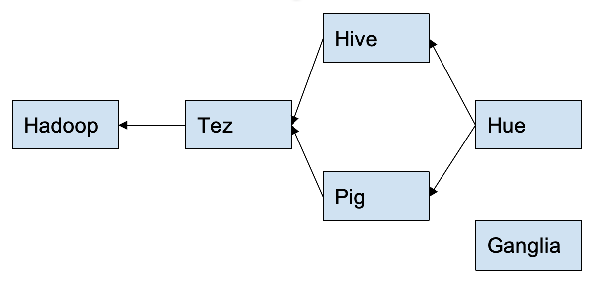
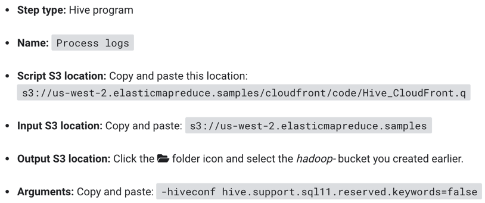
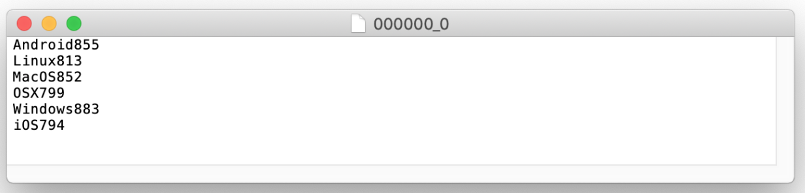

# Analyze Big Data with Hadoop

## 1). Create S3 Bucket
This bucket is used to store input log files and output data

## 2). Create EMR cluster
Will create 2 EC2 instances, one works as a master node, the other works as a slave node.
The default configuration will install:




## 3). Process Sample Data by Running a Hive Script
    Step: a unit of work in Amazon EMR which contains one or more Hadoop jobs.



The step will:
1.	Create a Table
2.	Read data from the input S3 bucket
3.	Parse the date using the Regular Expression Serializer/Deserializer
4.	Write the parsed result to the Table.
5. 	Execute a HiveQL query against the Table.
6.	Write the query results to the output S3 bucket.


```
    Logging initialized using configuration in file:/etc/hive/conf.dist/hive-log4j2.properties Async: false
    OK
    Time taken: 5.747 seconds

    Query ID = hadoop_20181013152626_387a901b-b09b-4b2e-ae71-633fa49ee745
    Total jobs = 1
    Launching Job 1 out of 1
    Status: Running (Executing on YARN cluster with App id application_1539443941672_0001)

    Map 1: -/-	Reducer 2: 0/1
    Map 1: -/-	Reducer 2: 0/1
    Map 1: 0/1	Reducer 2: 0/1
    Map 1: 0/1	Reducer 2: 0/1
    Map 1: 0(+1)/1	Reducer 2: 0/1
    Map 1: 0(+1)/1	Reducer 2: 0/1
    Map 1: 0(+1)/1	Reducer 2: 0/1
    Map 1: 0(+1)/1	Reducer 2: 0/1
    Map 1: 0(+1)/1	Reducer 2: 0/1
    Map 1: 0(+1)/1	Reducer 2: 0/1
    Map 1: 0(+1)/1	Reducer 2: 0/1
    Map 1: 0(+1)/1	Reducer 2: 0/1
    Map 1: 0(+1)/1	Reducer 2: 0/1
    Map 1: 1/1	Reducer 2: 0/1
    Map 1: 1/1	Reducer 2: 0(+1)/1
    Map 1: 1/1	Reducer 2: 1/1
    Moving data to directory s3://hadoop-365/os_requests
    OK
    Time taken: 40.627 seconds
    Command exiting with ret '0'
```
4) View the result in the output S3 bucket



Time used: 60 min

In this module, I have learned how to used Amazon’s EMR and S3 service to create S3 bucket and EMR to process the data and query the results.
