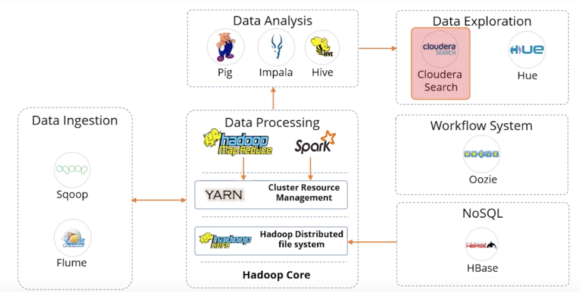
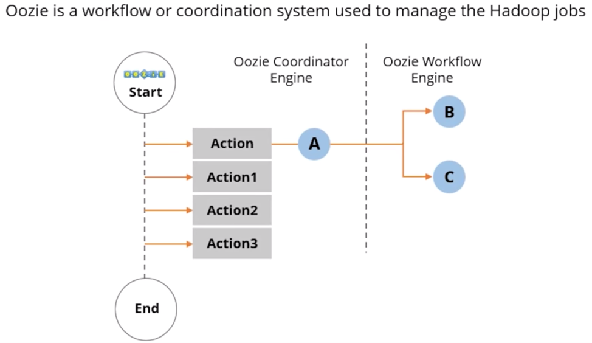
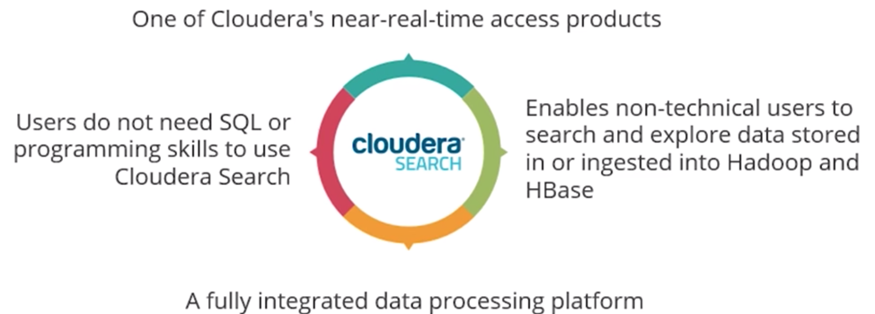

# Hadoop Fundamental

## 1.1 Big Data Processing

1)	Data Ingest
    1.	Flume
    2.	Sqoop
2)	Data Processing
    1.	HDFS
    2.	HBASE
    3.	MapReduce
    4.	Spark
3)	Data Analyze
    1.	Pig
    2.	Impala
    3.	Hive
4)	Data Access
    1.	Hue
    2.	Cloudera

# 1.2 Ingest Components
1.2.1 Flume
1.	A distributed service for ingesting streaming data
2.	Ideally suited for event data from multiple systems

1.2.2 Sqoop
1)	Sqoop is a tool designed to transfer data between Hadoop and relational database servers
2)	It is used to import data from relational databases such as Oracle, MySQL to HDFS and export data for HDFS to a relational database.

# 1.3 Data Processing Components
1.3.1 Hadoop HDFS
1)	A storage layer for Hadoop
2)	Suitable for the distributed storage and processing
3)	Provides a CMD line interface
4)	Streaming access to file system data
5)	Provides file permissions and authentication

1.3.2 Hbase
1)	Stores data in HDFS
2)	A NoSQL database or non-relational database
3)	Mainly used when you need random, real-time, read/write access to your Big Data
4)	Provides support to a high volume of data and high throughput
5)	The table can have thousands of columns.

1.3.3 MapReduce
1)	The original Hadoop processing engine which is primarily Java based
2)	Based on the map and reduce programming model.
3)	An extensive and mature fault tolerance framework.
4)	Is very commonly used

1.3.4 Spark
1)	An open-source cluster computing framework
2)	Provides 100 times faster performance as compared to MapReduce
3)	Supports Machine learning, Business intelligence, Streaming, and Batch processing.

# 1.4 Data Analyze Components
1.4.1 Hive
1)	Executes queries using MapReduce
2)	Best for data processing and ETL
3)	Similar to Impala

1.4.2 Impala
1)	High-performance SQL engine which runs on Hadoop cluster
2)	Ideal for interactive analysis
3)	Very low latency (ms)
4)	Supports a dialect of SQL

1.4.3 Pig
1)	An open-source dataflow system
2)	Converts Pig scripts to MapReduce code
3)	Is a alternate to writing MapReduce code
4)	Best for ad-hoc queries like join and filter

# 1.5 Data Access Components

1.5.1 Oozie

1.5.2 Cloudera

Time spent: 40 min

In this module, I have learning the fundamental modules of big data and also the workflow of bit data processing.

