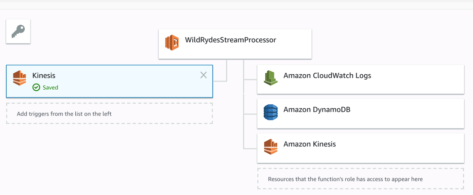

# Build a Serverless Real-Time Data Processing App

We will learne the following services of AWS by this practice.
1.	Lambda:  process real-time streams, without worrying about which server to run.
2.	DynamoDB: persist records in a NoSQL database
3.	Kinesis Data Analytics: a framework which can read streaming data in real-time, call serverless functions to process the data and store it to a database.
4.	Kinesis Data Firehose: archive the streaming raw data to S3
5.	Athena:  run ad-hoc queries against the raw data using standard SQL.

## Real-time Streaming Data

1. Set up your AWS Cloud9 IDE


2. Build a data stream


Step 1. Create an Amazon Kinesis stream


Step 2. Produce messages into the stream

Run command in Cloud9 Console,

```
./producer
```

The producer emits a message a second to the stream and prints a period to the screen.

Step 3. Read messages from the stream

Step 4. Create an identity pool for the unicorn dashboard


Step 5. Grant the unauthenticated role access to the stream

Step 6. View unicorn status on the dashboard


# Aggregate data

In this module, I will create an Amazon Kinesis Data Analytics application to aggregate sensor data from the unicorn fleet in real-time. The architecture for this module involves an Amazon Kinesis Data Analytics application, source and destination Amazon Kinesis streams, and the producer and consumer command-line clients.

Step 1. Create an Amazon Kinesis stream

named wildrydes-summary with 1 shard

Build an Amazon Kinesis Data Analytics application which reads from the wildrydes stream built in the previous module and emits a JSON object with the following attributes each minute:

```
Name			Unicorn name
StatusTime		ROWTIME provided by Amazon Kinesis Data Analytics
Distance		The sum of distance traveled by the unicorn
MinMagicPoints	The maximum data point of the MagicPoints  attribute
MaxMagicPoints	The maximum data point of the MagicPooints  attribute
MinHealthPoints	The minimum data point of the HealthPoints attribute
MaxHealthPoints	The maximum data point of the HealthPoints attribute
```

Step 2. Create an Amazon Kinesis Data Analytics application


(Kinesis stream) Wildrydes  -> Kinesis analytics application -> (Kinesis stream) Wildrydes-summary


So I created a Kinesis Data Analytics application that reads from the Kinesis stream of unicorn data and emits a summary row each minute.

# Process streaming data

Step 1. Create an Amazon DynamoDB tables


Step 2. Create a Lambda function to process the stream




Though this section, I have learned how to create a Lambda function that reads from the Kinesis stream of summary unicorn data and saves each row to DynamoDB.

# Store & query Data

In this module, I will create a Kinesis Data Firehose to deliver data from the Kinesis stream to an Amazon S3 bucket and use Athena to run SQL like queries against this data on S3.

Step 1. Create an Amazon S3 bucket

Step 2. Create an Amazon Kinesis Data Firehose delivery stream


Step 3. Create an Amazon Athena table


Step 4. Explore the batched data files

download the data file from s3


Step 5: Query the data files


Time spent: 120 min


Through this section, I know that Amazon Kinesis Data Firehose can deliver real-time streaming data to storage like S3, and Amazon Athena allows us to run ad-hoc queries against the raw data using standard SQL.


