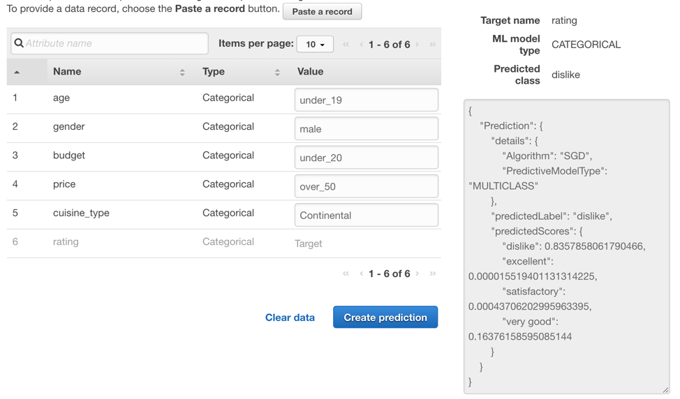

# Develop ML model with Amazon Machine Learning

1) Create S3 Bucket, upload the data files.
2) Create a Training data source.
    1.	After you upload the banking.csv dataset to S3 bucket, you use it to create a training datasource. A datasource is aobject that contains the location of your input data and important metadata about your input data. Amazon ML uses the datasource for operations like ML model training and evaluation.
    2.	Next, you establish a schema. A schema is the information Amazon ML needs to interpret the input data for an ML model, including attribute names and their assigned data types, and the names of special attributes.
    3.	Select a target attribute

3) Create an ML Model

    After you've created the training datasource, you use it to create an ML model, train the model, and then evaluate the results. The ML model is a collection of patterns that Amazon ML finds in your data during training. You use the model to create predictions.

    It splits the training datasource into two sections, one containing 70% of the data and one containing the remaining 30%. Trains the ML model on the section that contains 70% of the input data. Evaluates the model using the remaining 30% of the input data

4) Review the ML Model's Predictive Performance and Set a Score Threshold

    During the evaluation, Amazon ML computed an industry-standard quality metric, called the Area Under a Curve (AUC) metric, that expresses the performance quality of your ML model.

5) Use the ML Model to Generate Predictions

    Amazon Machine Learning can generate two types of predictions—batch and real-time.
    A real-time prediction is a prediction for a single observation that Amazon ML generates on demand.
    A batch prediction is a set of predictions for a group of observations. Amazon ML processes the records in a batch prediction together, so processing can take some time.

Time spent: 60 min

In this module, I have learned how to create a ML model by using Amazon ML, include loading data to S3, preprocessing the data, training the model and deploying the model.

