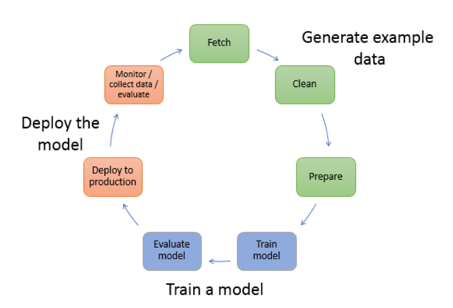
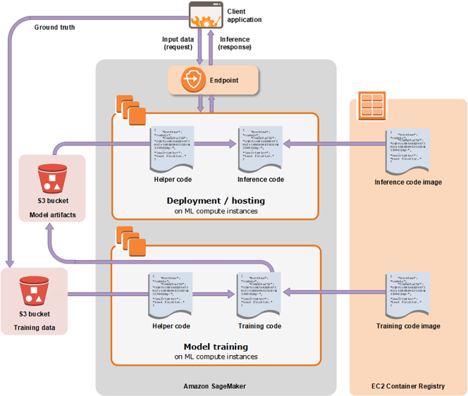
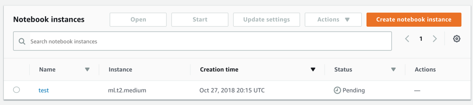

# Intro to Amazon SageMaker  and Develop ML model with it

# 1.	Workflow of ML model development




1.	Generate example data

    1.	Fetch the data that are publicly/privately available.
    2.	Preprocess the data—perform additional data transformations to improve performance.

2.	Train a model
    1.	Training the model— select an algorithm and use computing resources ranging from a single, small general-purpose instance to a distributed cluster of GPU instances.
    2.	Evaluate the model to determine its accuracy.
3.	Deploy the model

    Integrate the model into the application to generate inferences in real time and at scale.

# 2. Amazon SageMaker workflow



1.	Generate data
    1.	Jupyter notebook to preprocess the data
2.	Crate a training job and train the model
    1.	S3 bucket stores the training data;
    2.	The computing resources needed,
    3.	S3 bucket stores the output of the job
    4.	Docker registry path where the training code is stored.
3.	Deploying a Model
    1.	The S3 path where the model artifacts are stored
    2.	Docker registry path where the inference code is stored.
    3.	Create an HTTPS endpoint

# Example

Step 1: Create a Jupyter Notebook and Initialize Variables



Step 2: Download, Explore, and Transform the Training Data

1.	Download the MNIST dataset to your Amazon SageMaker notebook instance

```
%%time
import pickle, gzip, numpy, urllib.request, json

# Load the dataset
urllib.request.urlretrieve("http://deeplearning.net/data/mnist/mnist.pkl.gz", "mnist.pkl.gz")
with gzip.open('mnist.pkl.gz', 'rb') as f:
    train_set, valid_set, test_set = pickle.load(f, encoding='latin1')
```

2.	Transform the Training Dataset and Upload It to S3
```
%%time
from sagemaker.amazon.common import write_numpy_to_dense_tensor
import io
import boto3

bucket = 'sagemaker365'
data_key = 'kmeans_lowlevel_example/data'
data_location = 's3://{}/{}'.format(bucket, data_key)
print('training data will be uploaded to: {}'.format(data_location))

# Convert the training data into the format required by the SageMaker KMeans algorithm
buf = io.BytesIO()
write_numpy_to_dense_tensor(buf, train_set[0], train_set[1])
buf.seek(0)

boto3.resource('s3').Bucket(bucket).Object(data_key).upload_fileobj(buf)
```

Step 3: Train a Model

1.	Choose the Training Algorithm

    * Specify the registry path of the Docker image that contains the training code.
    * Specify algorithm-specific parameters.
    * The input and output S3 bucket.

2.	Create a Training Job

* Option1: Use the high-level Python library provided by Amazon SageMaker

```
from sagemaker import KMeans

data_location = 's3://{}/kmeans_highlevel_example/data'.format(bucket)
output_location = 's3://{}/kmeans_highlevel_example/output'.format(bucket)

print('training data will be uploaded to: {}'.format(data_location))
print('training artifacts will be uploaded to: {}'.format(output_location))

kmeans = KMeans(role=role,
                train_instance_count=2,
                train_instance_type='ml.c4.8xlarge',
                output_path=output_location,
                k=10,
                data_location=data_location)
%%time

kmeans.fit(kmeans.record_set(train_set[0]))
```

* Option2: Use the SDK for Python


Step 4: Deploy the Model to Amazon SageMaker

* Option1: Deploy the Model to Amazon SageMaker Hosting Services
* Option2: Deploy the Model to Amazon SageMaker Batch Transform

Step 5: Validate the Model

* Option1: Use the high-level Python library provided by Amazon SageMaker.
* Option2: Use the SDK for Python.

Time spent: 90 min

