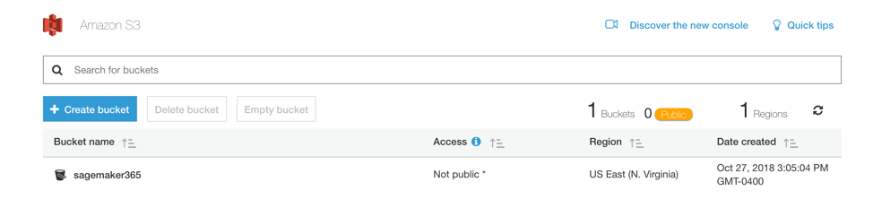

This is a simple introduction about how to use Amazon Simple Storage Service (S3)

1. Create a Bucket
2. Upload an Object to the Bucket
3. Make Your Object Public
4. Create a Bucket Policy. One can manage rights of accessing the objects.
5.  Explore Versioning, S3 stores history version of the object and you can go back at any time.

Time spent: 30 min

