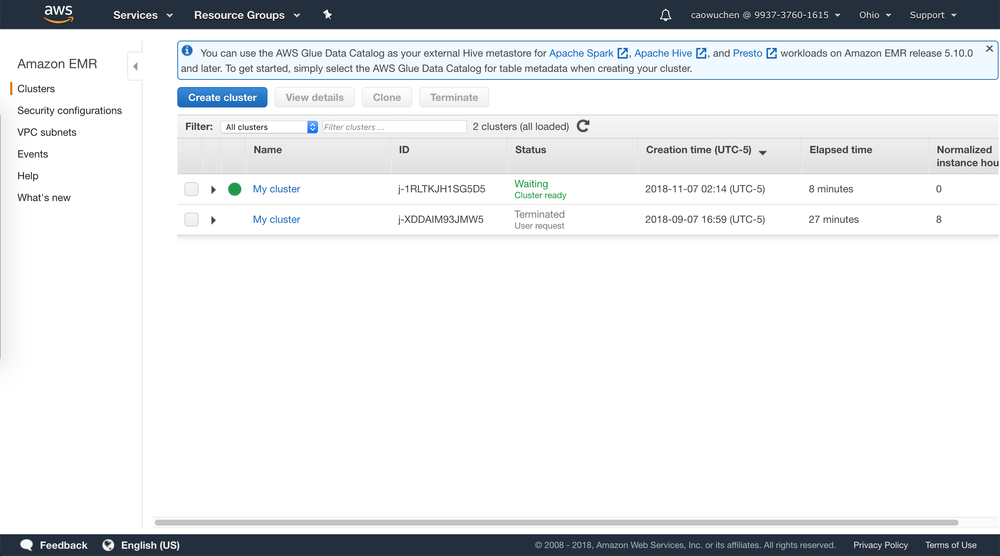

> This lab shows how to use Amazon EMR Hadoop to analyze a provided CloudFront log file,
the provided script creates a Hive table, parses the log file using Regular Expression
Serializer/Deserializer, writes parsed result to table, submits a HiveQL query to retrieve
the total requests per OS for a given time frame, and writes the query result to S3 bucket.

## Learning Outcomes

- How to set up an EMR cluster
- How to use Hive Script to process data

## Official Links

[QwikLab: Analyze Big Data with Hadoop](https://awseducate.qwiklabs.com/focuses/19?parent=catalog)

## Operations

### 0: Create an S3 bucket for Analysis Output

- Set bucket name as _hadoop-1234_
- Leave the rest options as _default_

### 1: Launch an EMR cluster

- Find __EMR__ console
- Click __Create cluster__ button
- In __General Configuration__ section
    - __Cluster name__: _My cluster_
    - __S3 folder__: _hadoop-1234_
- In __Hardware configuration__ section
    - __Instance type__: _m4.large_
    - __Number of instances__: _2_
- In __Security and access__ section:
    - __EC2 key pair__: _Proceed without an EC2 key pair_
    - __Permissions__: _Custom_
    - __EMR role__: *EMR_DefaultRole*
    - __EC2 instance profile__: *EMR_EC2_DefaultRole*
- Create cluster

### 2: Process Log Data by Running a Hive Script

- Wait until cluster is showing _Waiting_ status

- Create a _step_
    - __Step type__: _Hive program_
    - __Name__: _Process logs_
    - __Script S3 location__: *s3://us-west-2.elasticmapreduce.samples/cloudfront/code/Hive_CloudFront.q*
    - __Input S3 location__: *s3://us-west-2.elasticmapreduce.samples*
    - __Output S3 location__: _hadoop-1234_
    - __Arguments__: _-hiveconf hive.support.sql11.reserved.keywords=false_
    - Add step, it takes about 1 minute to run the script

### 3: View the Results

- Download the [000000_0](000000_0) file in __os_requests__ folder of S3 bucket
- Open the file and view result

### 4: Clean up

- Terminate _My cluster_ in EMR console