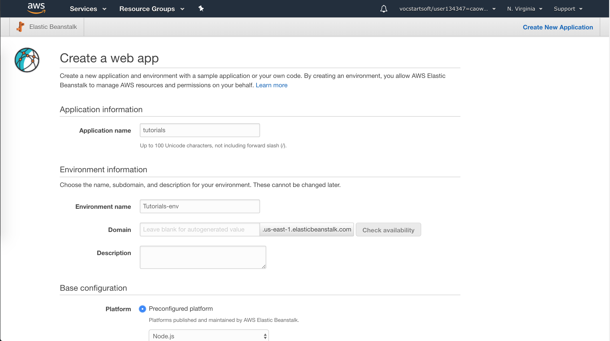
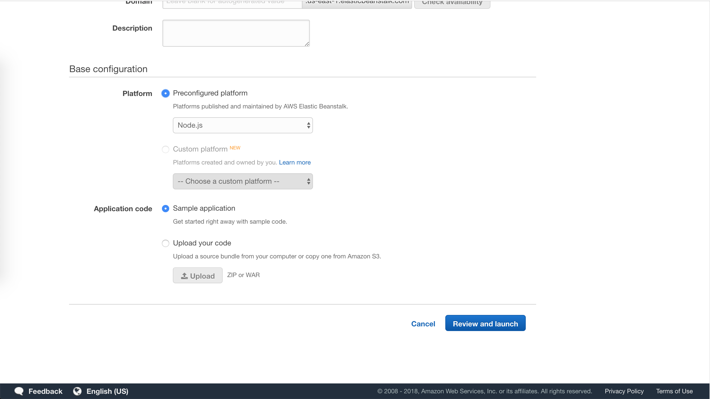
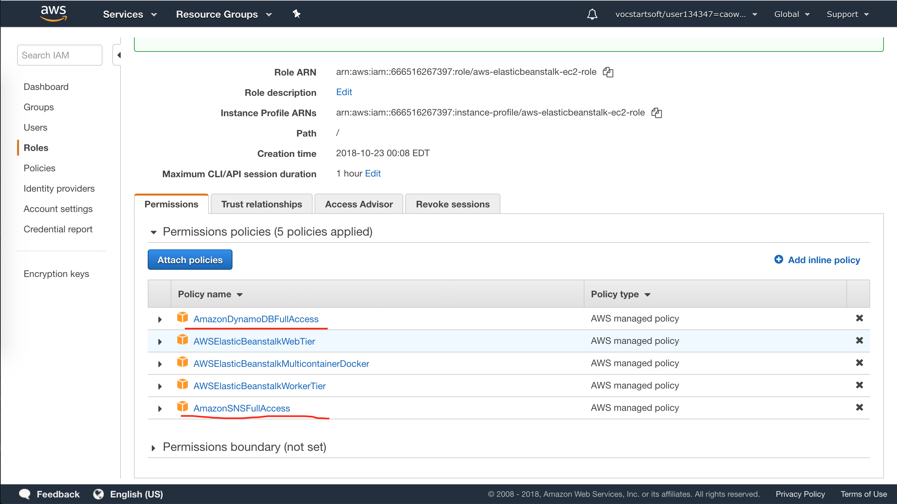
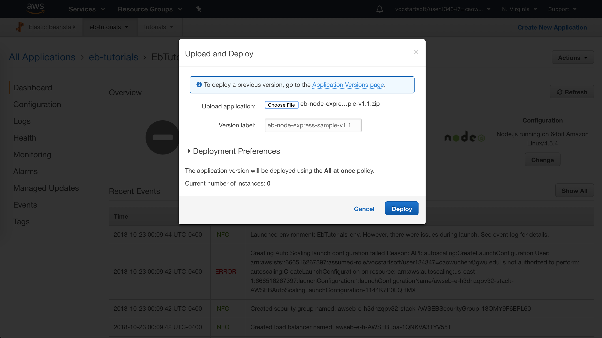
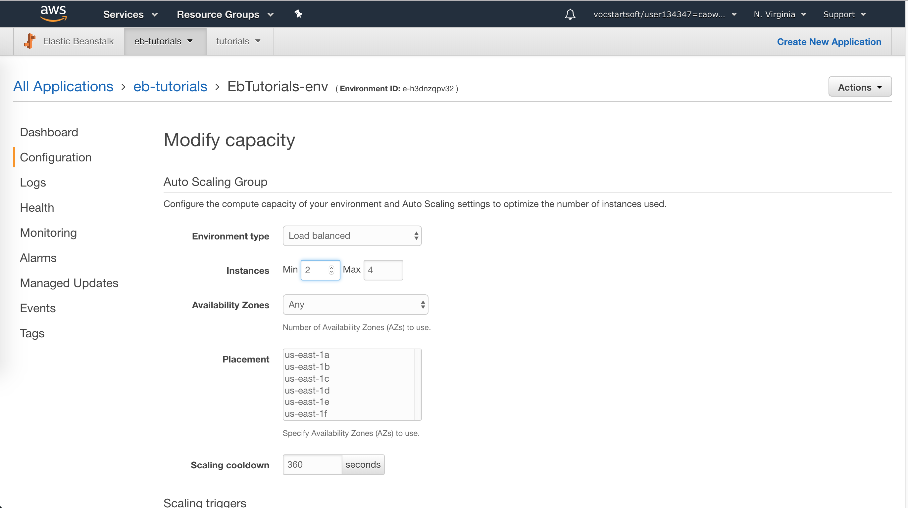

> This tutorial is about how to set up an Elastic Beanstalk environment, and how to deploy a Node.js web
app in that environment. At last, we will try to configure a high availability environment by setting the minimum instance
amount to 2, which is more than easy.


## Prerequisites

Authorization to create elastic beanstalk app, see [Piazza](https://piazza.com/class/jlktpkeilfc7jo?cid=48),
use your own aws console account rather than the education account.

## Official Links

[AWS Tutorial: Deploy a Scalable Node.js Web App](https://aws.amazon.com/getting-started/projects/deploy-nodejs-web-app/?trk=gs_card)

## Operations

### 1. Create Elastic Beanstalk App and Launch

- Choose __Platform__ as _Node.js_

- Choose __Application code__ as _Sample application_
- Create app and Launch, it should look like below,


- In 5 minutes, Elastic Beanstalk creates the environment with the following resources,
    - EC2 instance
    - Instance security group
    - Load balancer
    - Load balancer security group
    - Auto Scaling group
    - Amazon S3 bucket
    - Amazon CloudWatch alarms
    - AWS CloudFormation stack
    - Domain name


### 2. Add Permissions to Your Environment's Instances

- Open the [Roles page](https://console.aws.amazon.com/iam/home#roles) in the IAM console.
- Choose __aws-elasticbeanstalk-ec2-role__
- Attach Policies
    - _AmazonSNSFullAccess_
    - _AmazonDynamoDBFullAccess_
    


### 3. Deploy the Sample Application

- Download the [source bundle](https://github.com/awslabs/eb-node-express-sample/releases/download/v1.1/eb-node-express-sample-v1.1.zip) from Github
- Open the Elastic Beanstalk console
- Choose __Upload and Deploy__, select the source bundle



### 4. Create a DynamoDB Table outside Elastic Beanstalk

- Table name: _nodejs-tutorial_
- Primary key: _email_
- Primary key type: _String_

### 5. Update the Application's Configuration Files

- Unzip the source file bundle
- Open _.ebextensions/options.config_ and change the values of the following settings:
    - NewSignupEmail: _YOUR EMAIL_
    - STARTUP-SIGNUP-TABLE: _nodejs-tutorial_
    
This configures the application to use the __nodejs-tutorial__ table instead of the one created by 
_.ebextensions/create-dynamodb-table.config_, and sets the email address that the Amazon SNS topic uses for notifications.

- Remove _.ebextensions/create-dynamodb-table.config_, so that the next time you deploy the application, 
the table created by this configuration file will be deleted

```bash
~/nodejs-tutorial$ rm .ebextensions/create-dynamodb-table.config
```

- Zip the modified source bundle and deploy again

### 6.Configure Your Environment for High Availability

- Open the Elastic Beanstalk console
- Choose __Configuration__
- On the __Capacity__ configuration card, choose Modify
- In the __Auto Scaling Group__ section, set __Min instances__ to 2.



### 7. Cleanup

- Open the Elastic Beanstalk console
- Choose __Actions__, and then choose __Terminate Environment__
- Delete DynamoDB table __nodejs-tutorial__