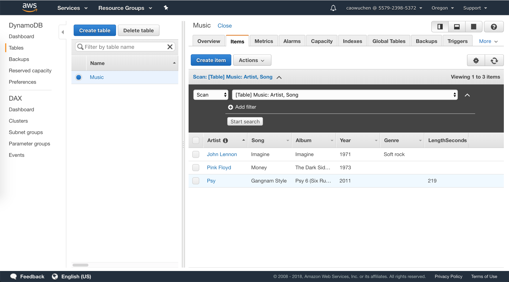

> Amazon DynamoDB is a fast and flexible NoSQL database service for all applications that need consistent, 
single-digit millisecond latency at any scale. 
This lab shows the CRUD of DynamoDB through web console.

## Official Links

[QwikLab: Intro to DynamoDB](https://awseducate.qwiklabs.com/focuses/23?parent=catalog)

## Operations

### Create an Amazon DynamoDB table

DynamoDB is a schema-less database that only requires a table name and primary key. 
The table’s primary key is made up of one or two attributes that uniquely identify items, 
partition the data, and sort data within each partition.

Each table requires a __Primary Key__ that is used to partition data across DynamoDB servers.
A table can also have a __Sort Key__. The combination of __Primary Key__ and __Sort Key__
uniquely identifies each item in a DynamoDB table.

### Enter data into an Amazon DynamoDB table

A __table__ is a collection of data on a particular topic.

Each table contains multiple __items__. 
An item is a group of attributes that is uniquely identifiable among all of the other items. 
Items in DynamoDB are similar in many ways to rows in other database systems. 
In DynamoDB, there is no limit to the number of items you can store in a table.

Each item is composed of one or more __attributes__. 
An attribute is a fundamental data element, something that does not need to be broken down any further. 
For example, an item in a __Music__  table contains attributes such as Song and Artist. 
Attributes in DynamoDB are similar columns in other database systems, but each item (row) can have different attributes (columns).

When you write an item to a DynamoDB table, only the Primary Key and Sort Key (if used) are required. 
Other than these fields, the table does not require a schema. 
This means that you can add attributes to one item that may be different to the attributes on other items.

Each item is capable of having different attributes without having to pre-define a table schema, 
which demonstrates the flexibility of a NoSQL database.

### Query an Amazon DynamoDB table

There are two ways to query a DynamoDB table: __Query__ and __Scan__

A __query__ operation finds items based on Primary Key and optionally Sort Key. It is fully indexed, so it runs very fast.
A __query__ is the most efficient way to retrieve data from a DynamoDB table.

Alternatively, you can __scan__ for an item. This involves looking through __every item in a table__
, so it is less efficient and can take significant time for larger tables.

### Delete an Amazon DynamoDB table

When table is deleted, all data in the table is gone.