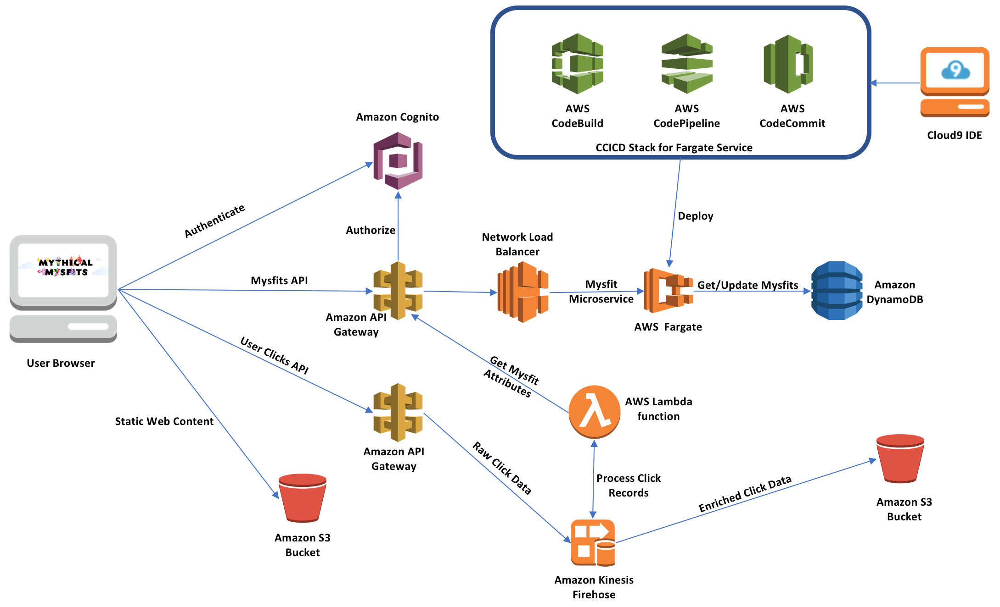
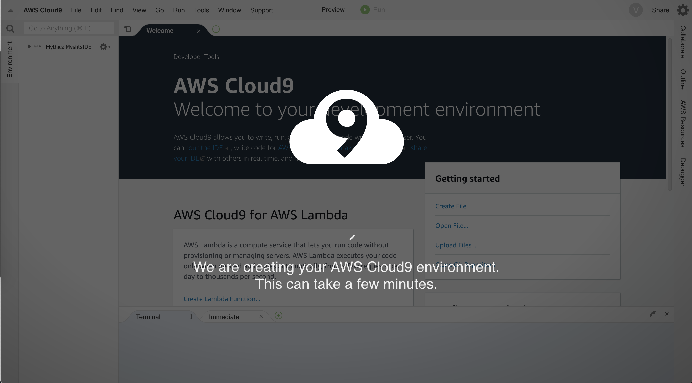
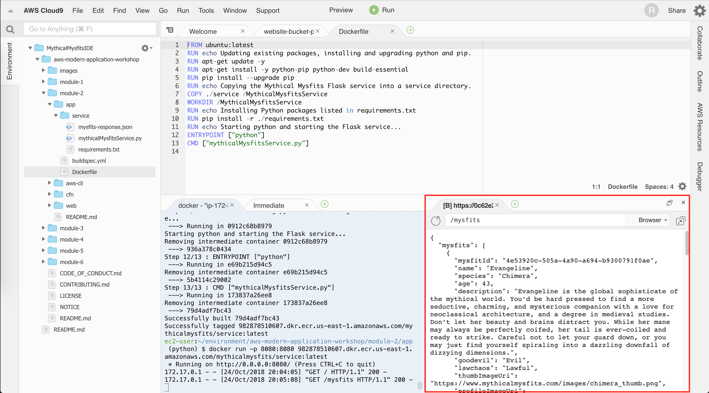
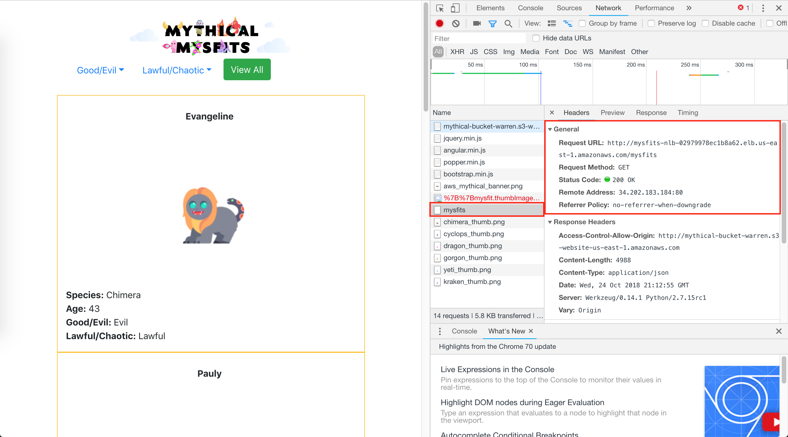
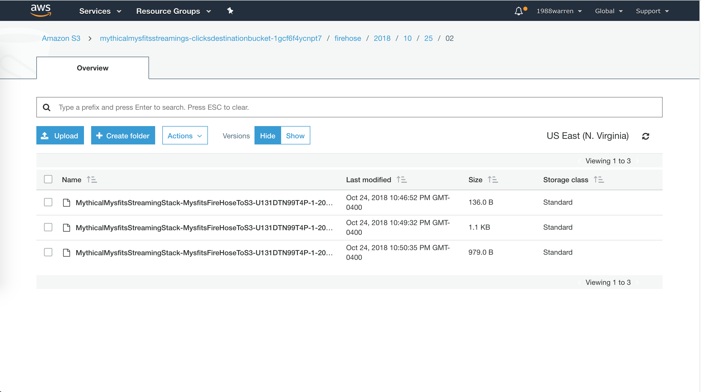

> Due to the web application builds up with a rather complex architecture, the CD/CI configuration
is not included, please refer to Module 2 tutorial. This article mainly focuses on implementing the features of app
with AWS-CLI commands. 

## Official Links

- [~~AWS Tutorial: Build a Modern Web Application~~](https://aws.amazon.com/getting-started/projects/build-modern-app-fargate-lambda-dynamodb-python/?trk=gs_card)
- [Build a Modern Application on AWS (Python)](https://github.com/aws-samples/aws-modern-application-workshop/tree/python)

## Application Architecture



The Mythical Mysfits website serves its static content directly from __Amazon S3__, 
provides a microservice API backend deployed as a container through __AWS Fargate__ on __Amazon ECS__, 
stores data in a managed NoSQL database provided by __Amazon DynamoDB__, 
with authentication and authorization for the application enabled through __AWS API Gateway__ and its integration with __AWS Cognito__. 
The user website clicks will be sent as records to an __Amazon Kinesis Firehose Delivery stream__ 
where those records will be processed by serverless __AWS Lambda__ functions and then stored in __Amazon S3__.

## Operations

### [Module 1: IDE Setup and Static Website Hosting](https://github.com/aws-samples/aws-modern-application-workshop/tree/python/module-1)

- AWS Cloud9 IDE ships with a _t2.micro_ EC2 instance for free tier, the whole environment resembles _CodeAnywhere_ we
have used for project 1 



- Several aws-cli commands
    - Create S3 bucket
    ```bash
    aws s3 mb s3://REPLACE_ME_BUCKET_NAME
    ```
    - Set website homepage in bucket
    ```bash
    aws s3 website s3://REPLACE_ME_BUCKET_NAME --index-document index.html
    ```
    - Set bucket access policy to public
    ```bash
    aws s3api put-bucket-policy 
        --bucket REPLACE_ME_BUCKET_NAME 
        --policy file://~/environment/aws-modern-application-workshop/module-1/aws-cli/website-bucket-policy.json
    ```
    - Publish website on S3
    ```bash
    aws s3 cp 
        ~/environment/aws-modern-application-workshop/module-1/web/index.html 
        s3://REPLACE_ME_BUCKET_NAME/index.html
    ```

- Visit static website [s3 index](http://mythical-bucket-warren.s3-website-us-east-1.amazonaws.com/)

### [Module 2: Creating a Service with AWS Fargate](https://github.com/aws-samples/aws-modern-application-workshop/tree/python/module-2)

AWS Fargate is a deployment option in Amazon ECS that allows you to deploy containers without having to manage any clusters or servers. 
For our Mythical Mysfits backend, we will use Python and create a Flask app in a Docker container behind a Network Load Balancer. 
These will form the microservice backend for the frontend website to integrate with.

- Create the Core Infrastructure stack on cloud using AWS CloudFormation in 10 minutes, including
    - An Amazon VPC
    - Two NAT Gateways (cost $1 per day)
    - A DynamoDB VPC Endpoint
    - A Security Group
    - IAM Roles
    
```bash
aws cloudformation create-stack --stack-name MythicalMysfitsCoreStack --capabilities CAPABILITY_NAMED_IAM 
--template-body file://~/environment/aws-modern-application-workshop/module-2/cfn/core.yml   
```

Stack components are specified in _core.yml_.

- Save stack information when creation completes

```bash
aws cloudformation describe-stacks --stack-name MythicalMysfitsCoreStack > 
~/environment/cloudformation-core-output.json
```

- Dockerize backend Flask webservice
    - Change directory, where _Dockerfile_ that tells Docker all of the instructions 
    that should take place when the build command is executed.
    ```bash
    cd ~/environment/aws-modern-application-workshop/module-2/app
    ```
    - Build Docker image
    ```bash
    docker build . -t REPLACE_ME_ACCOUNT_ID.dkr.ecr.REPLACE_ME_REGION.amazonaws.com/mythicalmysfits/service:latest
    ```
    - Run image locally
    ```bash
    docker run -p 8080:8080 REPLACE_ME_WITH_DOCKER_IMAGE_TAG
    ```
    
    - Push the Docker Image to Amazon ECR (Amazon Elastic Container Registry)
    ```bash
    aws ecr create-repository --repository-name mythicalmysfits/service
    $(aws ecr get-login --no-include-email)
    docker push REPLACE_ME_WITH_DOCKER_IMAGE_TAG
    ```
- Deploy container on Cluster in the Amazon Elastic Container Service (ECS)
    - Create cluster
    ```bash
    aws ecs create-cluster --cluster-name MythicalMysfits-Cluster
    ```
    - Create an AWS CloudWatch Logs Group
    ```bash
    aws logs create-log-group --log-group-name mythicalmysfits-logs
    ```
    
__AWS Fargate__ allows you to specify that your containers be deployed to a cluster without having to actually provision or manage any servers yourself.


    
- Enabling a Load Balanced Fargate Service

    - Create a Network Load Balancer
    ```bash
    aws elbv2 create-load-balancer --name mysfits-nlb --scheme internet-facing --type network 
    --subnets REPLACE_ME_PUBLIC_SUBNET_ONE REPLACE_ME_PUBLIC_SUBNET_TWO > ~/environment/nlb-output.json
    ```
    
    - Create a Load Balancer Target Group
    
    A target group allows AWS resources to register themselves as targets for requests that the load balancer receives to forward.
    
    ```bash
    aws elbv2 create-target-group --name MythicalMysfits-TargetGroup --port 8080 --protocol TCP --target-type ip 
    --vpc-id REPLACE_ME_VPC_ID --health-check-interval-seconds 10 --health-check-path / 
    --health-check-protocol HTTP --healthy-threshold-count 3 --unhealthy-threshold-count 3 > 
    ~/environment/target-group-output.json
    ```
    
    - Create a Load Balancer Listener
    
    This informs that load balancer that for requests received on a specific port, 
    they should be forwarded to targets that have registered to the above target group.
    
    ```bash
    aws elbv2 create-listener --default-actions TargetGroupArn=REPLACE_ME_NLB_TARGET_GROUP_ARN,
    Type=forward --load-balancer-arn REPLACE_ME_NLB_ARN --port 80 --protocol TCP
    ``` 

- Visit website [s3 index](http://mythical-bucket-warren.s3-website-us-east-1.amazonaws.com/) again, website is accessing
load balancer to retrieve data



### [Module 3 - Adding a Data Tier with Amazon DynamoDB](https://github.com/aws-samples/aws-modern-application-workshop/tree/python/module-3)

Rather than have all of the Mysfits be stored in a static JSON file, 
we will store them in a database to make the websites future more extensible and scalable.

- Create a DynamoDB Table

```bash
aws dynamodb create-table --cli-input-json 
file://~/environment/aws-modern-application-workshop/module-3/aws-cli/dynamodb-table.json
```

- Populate the Table

```bash
aws dynamodb batch-write-item 
--request-items file://~/environment/aws-modern-application-workshop/module-3/aws-cli/populate-dynamodb.json
```

- Update Flask code to read data from DynamoDB

- Visit website [s3 index](http://mythical-bucket-warren.s3-website-us-east-1.amazonaws.com/) again, website now displays
data from DynamoDB.

### [Module 4: Adding User and API features with Amazon API Gateway and AWS Cognito](https://github.com/aws-samples/aws-modern-application-workshop/tree/python/module-4)

To make sure that only registered users are authorized to like or adopt mysfits on the website, 
we will deploy an REST API with Amazon API Gateway to sit in front of our NLB. 

- Adding a User Pool for Website Users
    - Create the Cognito User Pool
    ```bash
    aws cognito-idp create-user-pool --pool-name MysfitsUserPool --auto-verified-attributes email
    ```
    - Create a Cognito User Pool Client
    ```bash
    aws cognito-idp create-user-pool-client --user-pool-id REPLACE_ME --client-name MysfitsUserPoolClient
    ```
- Adding a new REST API with Amazon API Gateway
    - Create an API Gateway VPC Link
    ```bash
    aws apigateway create-vpc-link --name MysfitsApiVpcLink --target-arns REPLACE_ME_NLB_ARN > 
    ~/environment/api-gateway-link-output.json
    ```
    In order for API Gateway to privately integrate with our NLB, 
    we will configure an API Gateway VPC Link that enables API Gateway APIs to directly integrate with backend web services 
    that are privately hosted inside a VPC. 
    
    - Create the REST API using Swagger
    REST API and all of its resources, methods, and configuration are defined within a JSON file.
    
    - Deploy the API
    A stage is a named reference to a deployment, which is a snapshot of the API. 
    You can use a Stage to manage and optimize a particular deployment.
    
- Updating the Mythical Mysfits Website
    - Update the Flask Service Backend
    
    Provide new Flask service to keep up with the newly defined API in Gateway
    
    - Update the Mythical Mysfits Website in S3
    
    Switch API endpoint to API Gateway from NLB, see [API gateway health check](https://jigpafa4ti.execute-api.us-east-1.amazonaws.com/prod/mysfits)

### [Module 5: Capturing User Behavior](https://github.com/aws-samples/aws-modern-application-workshop/tree/python/module-5)
To help us gather more insights of user activity, 
we will implement the ability for the website frontend to submit a tiny request, 
each time a mysfit profile is clicked by a user, 
to a new microservice API we'll create. 
Those records will be processed in real-time by a serverless code function, 
aggregated, and stored for any future analysis that you may want to perform.

- Creating the Streaming Service Stack
    - Create an S3 Bucket for Lambda Function Code Packages
    - Use the SAM CLI to Package your Code for Lambda
    - Deploy the Stack using AWS CloudFormation

- Sending Mysfit Profile Clicks to the Service
    - Update the Website Content
    - Push the New Site Version to S3
    
- Login and click on website items, check user behavior data gathered in bucket

    
- Workshop Clean-Up

Clean up the workshop to avoid additional charging

```bash
aws cloudformation delete-stack --stack-name STACK-NAME-HERE
```
