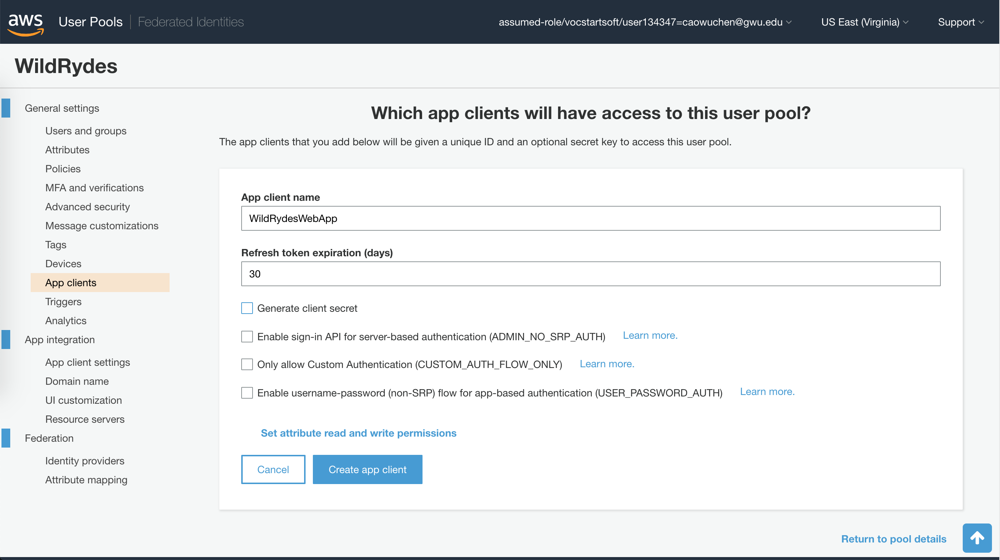
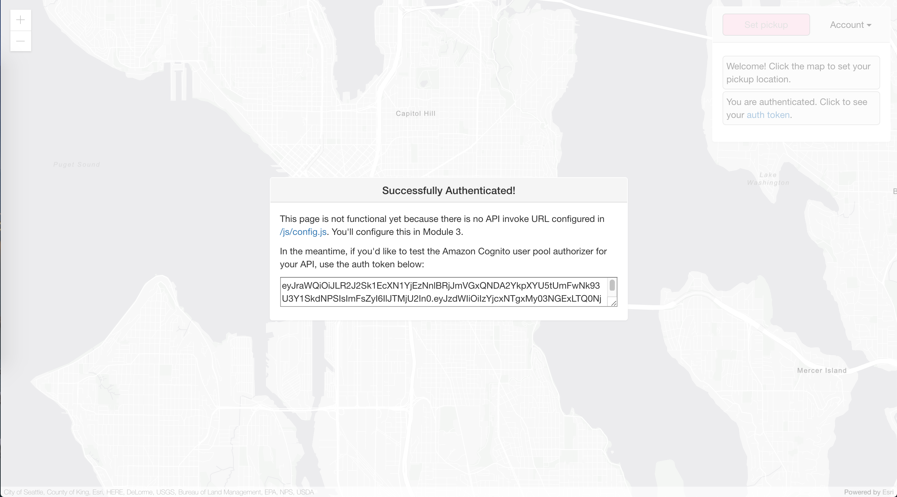
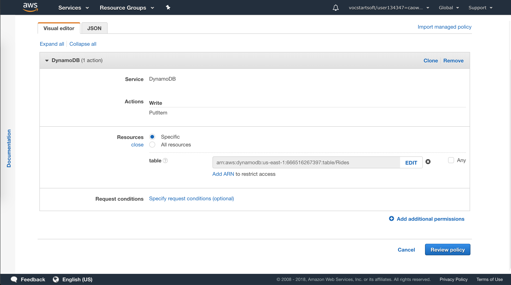
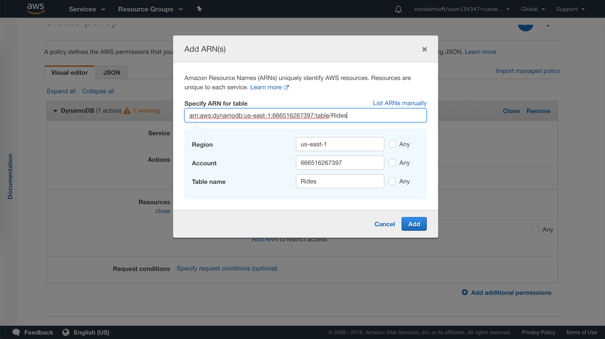
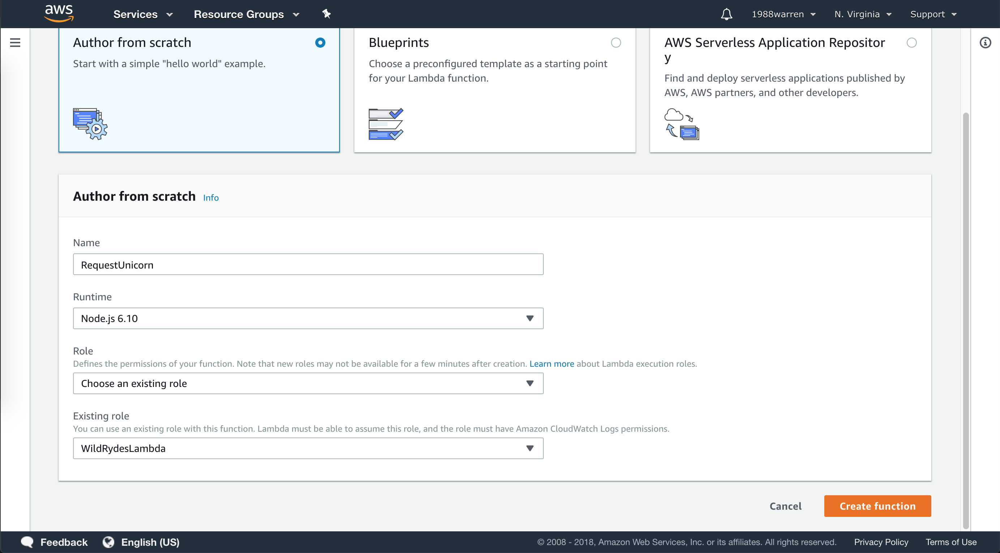
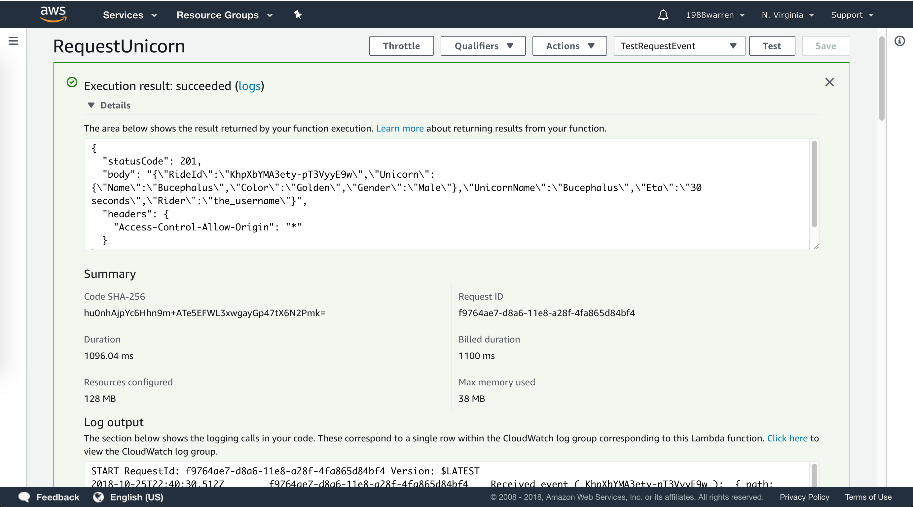
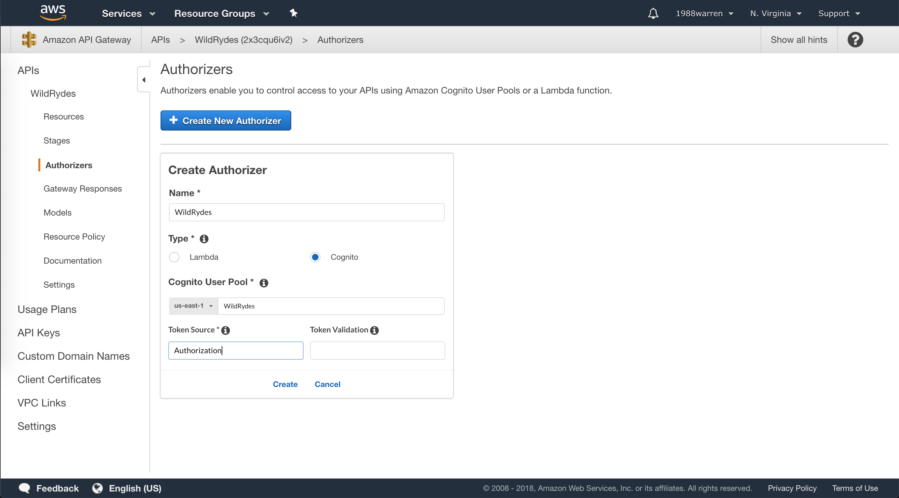
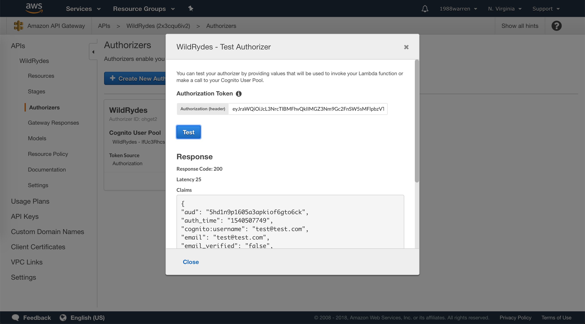
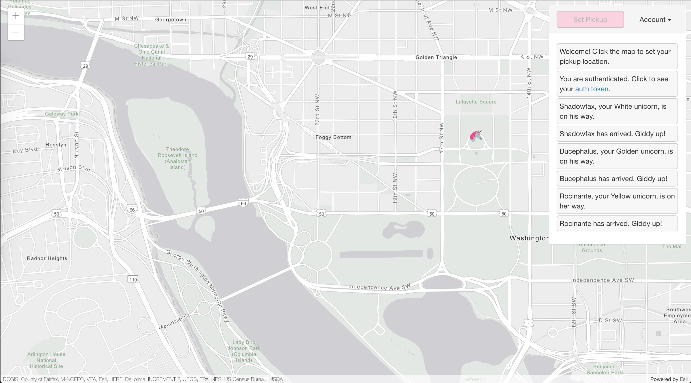

> We will build a simple serverless (AWS Lambda) web application that enables users to request unicorn rides from the Wild Rydes fleet. 
The application will present users with an HTML based user interface for indicating the location 
where they would like to be picked up and will interface on the backend with a RESTful web service 
to submit the request and dispatch a nearby unicorn. 
The application will also provide facilities for users to register with the service and log in before requesting rides.

## Official Links

[AWS Tutorial: Build a Serverless Web Application](https://aws.amazon.com/getting-started/projects/build-serverless-web-app-lambda-apigateway-s3-dynamodb-cognito/?trk=gs_card)

### Static Web Hosting on S3

Amazon S3 hosts static web resources including HTML, CSS, JavaScript, and image files which are loaded in the user's browser.


- [Download the zip that has everything of the static site](https://github.com/awslabs/aws-serverless-workshops/archive/master.zip)
- Create an S3 bucket with name _wildrydes-FIRSTNAME-LASTNAME_ as suggested
- Unzip and upload everything in folder */WebApplication/1_StaticWebHosting/website/*
- Make bucket content public by setting up policy
```json
{
    "Version": "2012-10-17",
    "Statement": [
        {
            "Effect": "Allow",
            "Principal": "*",
            "Action": "s3:GetObject",
            "Resource": "arn:aws:s3:::wildrydes-warren/*"
        }
    ]
}
```
- Enable __Static website hosting__ under __Properties__ tab, and set _index.html_ for the Index document
- Save and [see static website](http://wildrydes-warren.s3-website-us-east-1.amazonaws.com/)

### User Management on Cognito

Amazon Cognito provides user management and authentication functions to secure the backend API.


- Create a Cognito user pool with name _WildRydes_, then get __Pool Id__
- Add app client to pool with name _WildRydesWebApp_, uncheck the __Generate client secret__ option, since client secrets aren't 
currently supported for use with browser-based applications, then get __App client id__



- Modify __/js/config.js__ by filling in __Pool Id__, __App client id__, and region
```javascript
window._config = {
    cognito: {
        userPoolId: 'us-east-1_65cLrZQkK', // e.g. us-east-2_uXboG5pAb
        userPoolClientId: '3m1t3bi2d9p62qa79pj930r65p', // e.g. 25ddkmj4v6hfsfvruhpfi7n4hv
        region: 'us-east-1' // e.g. us-east-2
    },
    api: {
        invokeUrl: '' // e.g. https://rc7nyt4tql.execute-api.us-west-2.amazonaws.com/prod',
    }
};
```

- Visit [register.html](http://wildrydes-warren.s3-website-us-east-1.amazonaws.com/register.html) to create an account,
either with a real mailbox or a dummy one

- Visit [verify.html](http://wildrydes-warren.s3-website-us-east-1.amazonaws.com/verify.html), fill in the verification code
or __confirm__ user in Cognito console (General settings/Users and groups) manually

- Visit [ride.html](http://wildrydes-warren.s3-website-us-east-1.amazonaws.com/ride.html), log in with email and password, 
you should see



### Serverless Backend with AWS Lambda

Amazon DynamoDB provides a persistence layer where data can be stored by the API's Lambda function.


- Create DynamoDB table with name __Rides__, and __RideId__ for partition key
- Create an IAM role for Your Lambda function, name it _WildRydesLambda_

  Every Lambda function has an IAM role associated with it. 
  This role defines what other AWS services the function is allowed to interact with.
  
- Grant IAM role _WildRydesLambda_ to write DynamoDB



- Specify table to the role with table ARN




- Create a Lambda Function for Handling Requests, name it _RequestUnicorn_

- Choose an existing role for function _RequestUnicorn_ as _WildRydesLambda_, so that the function
is able to write DynamoDB



- Test the function



### RESTful APIs with API Gateway

In this module you'll use Amazon API Gateway to expose the Lambda function _RequestUnicorn_ as a RESTful API. 
This API will be accessible on the public Internet. 
It will be secured using the Amazon Cognito user pool you created in the previous module.


- Create a New REST API in API Gateway, name it _WildRydes_
- Create a Cognito User Pools Authorizer, name it _WildRydes_, then test with the __Authorization Token__




- Create a new resource, name it __ride__ and create a _POST_ method for it
- Use Lambda function _RequestUnicorn_ to handle the _POST_ method
- Deploy API in stage _prod_
- Update _config.js_ in S3 with the _invokeUrl_
- Login and request a unicorn pickup on white house south lawn :)

