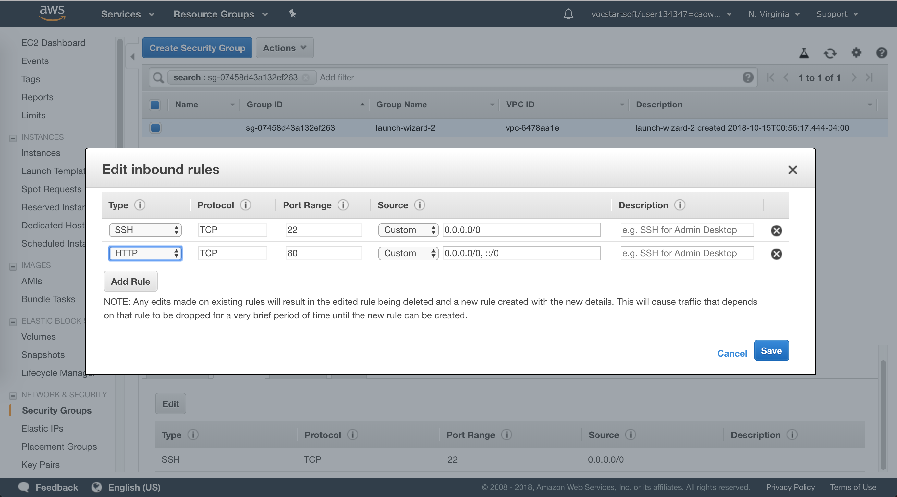
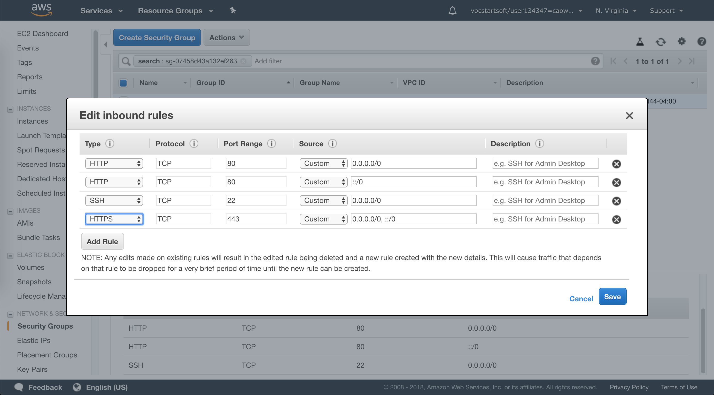
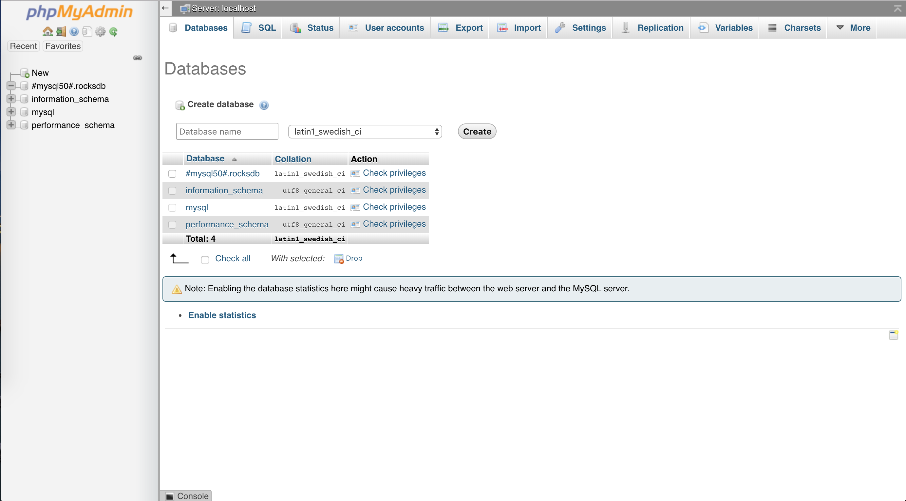

> This tutorial introduces how to set up LAMP stack on Amazon Linux 2 instance via SSH.

## Prerequisites

- Amazon Linux 2 AMI (HVM) instance (ami-0922553b7b0369273)
- Security group to allow inbound SSH (port 22), HTTP (port 80), and HTTPS (port 443) connections.

## Official Links

- [AWS Tutorial: Install a LAMP Web Server on Amazon Linux 2](https://docs.aws.amazon.com/AWSEC2/latest/UserGuide/ec2-lamp-amazon-linux-2.html)
- [Tutorial: Configure Apache Web Server on Amazon Linux to use SSL/TLS.](https://docs.aws.amazon.com/AWSEC2/latest/UserGuide/SSL-on-an-instance.html)

## Operations

### 1. Create Linux 2 instance and connect through SSH

A previous blog about how to set up EC2 virtual machine can be found [here](../cloud-web-apps-launch-ec2-vm).

### 2. Enable inbound HTTP and HTTPS connections in security group





### 3. Update packages through yum

This process may take a few minutes, but it is important to make sure that you have the latest security updates and bug fixes.

```bash
[ec2-user ~]$ sudo yum update -y
```

The -y option installs the updates without asking for confirmation.

### 4. Install LAMP components from Amazon Linux Extras repositories or yum

- __lamp-mariadb10.2-php7.2__ and __php7.2__ 

```bash
[ec2-user ~]$ sudo amazon-linux-extras install -y lamp-mariadb10.2-php7.2 php7.2
```

- __Apache web server__ and __MariaDB__

```bash
[ec2-user ~]$ sudo yum install -y httpd mariadb-server
```

### 5. Apache web server configurations

- Start Apache

```bash
[ec2-user ~]$ sudo systemctl start httpd
```

- Configure to start at each system boot

```bash
[ec2-user ~]$ sudo systemctl enable httpd
```

- Verify that httpd is on

```bash
[ec2-user ~]$ sudo systemctl is-enabled httpd
```

- Access Apache test page

Simply type in the public DNS address (or the public IP address) of your instance
in browser, you should see


If not, go back to step 2 to check security group settings.

- Set file permissions

Apache httpd serves files that are kept in a directory called the Apache document root. 
The Amazon Linux Apache document root is __/var/www/html__, which by default is owned by __root__.

To allow the ec2-user account to manipulate files in this directory, you must modify the ownership and permissions of the directory. 
There are many ways to accomplish this task. In this tutorial, you add __ec2-user__ to the apache group, 
to give the apache group ownership of the __/var/www__ directory and assign write permissions to the group.
    
- Add your user (in this case, ec2-user) to the apache group. 
```bash
[ec2-user ~]$ sudo usermod -a -G apache ec2-user
``` 

- Log out and then log back in again to pick up the new group, and then verify your membership.
```bash
[ec2-user ~]$ groups
ec2-user adm wheel apache systemd-journal
```

- Change the group ownership of /var/www and its contents to the apache group.
```bash
[ec2-user ~]$ sudo chown -R ec2-user:apache /var/www
```

- To add group write permissions and to set the group ID on future subdirectories, 
change the directory permissions of /var/www and its subdirectories.
```bash
[ec2-user ~]$ sudo chmod 2775 /var/www && find /var/www -type d -exec sudo chmod 2775 {} \;
```

- To add group write permissions, recursively change the file permissions of /var/www and its subdirectories:
```bash
[ec2-user ~]$ find /var/www -type f -exec sudo chmod 0664 {} \;
```

Now, ec2-user (and any future members of the apache group) 
can add, delete, and edit files in the Apache document root, 
enabling you to add content, such as a static website or a PHP application.

### 6. Test PHP

- Create a PHP file in the Apache document root.
```bash
[ec2-user ~]$ echo "<?php phpinfo(); ?>" > /var/www/html/phpinfo.php
```

- Simply type url _http://my.public.dns.amazonaws.com/phpinfo.php_ in your browser, you should see


- Delete the phpinfo.php file for security concerns
```bash
[ec2-user ~]$ rm /var/www/html/phpinfo.php
```

### 7. Database Server Configurations

- Start MariaDB server
```bash
[ec2-user ~]$ sudo systemctl start mariadb
```

- Run __mysql_secure_installation__, set password for __root__, provide answer __Y__ to all questions
```bash
[ec2-user ~]$ sudo mysql_secure_installation
```

- Stop MariaDB server
```bash
[ec2-user ~]$ sudo systemctl stop mariadb
```

- Configure MariaDB to start at every system boot
```bash
[ec2-user ~]$ sudo systemctl enable mariadb
```

### 8. Install phpMyAdmin

It is strongly recommended that you have enabled SSL/TLS in Apache, 
otherwise your database administrator password and other data are transmitted insecurely across the internet.

- Install the required dependencies
```bash
[ec2-user ~]$ sudo yum install php-mbstring -y
```

- Restart Apache
```bash
[ec2-user ~]$ sudo systemctl restart httpd
```

- Restart php-fpm
```bash
[ec2-user ~]$ sudo systemctl restart php-fpm
```

- Download, unzip PhpAdmin tarball to the Apache document root at __/var/www/html__
```bash
[ec2-user ~]$ cd /var/www/html
```

```bash
[ec2-user html]$ wget https://www.phpmyadmin.net/downloads/phpMyAdmin-latest-all-languages.tar.gz
```

```bash
[ec2-user html]$ mkdir phpMyAdmin && tar -xvzf phpMyAdmin-latest-all-languages.tar.gz -C phpMyAdmin --strip-components 1
```

```bash
[ec2-user html]$ rm phpMyAdmin-latest-all-languages.tar.gz
```

- If the MariaDB server is not running, start it now

```bash
[ec2-user ~]$ sudo systemctl start mariadb
```

- Login PhpAdmin

Simply type url _http://my.public.dns.amazonaws.com/phpMyAdmin_ in browser, you should see


Login as root and use the __root__ password of MariaDB, you should see the console,


 