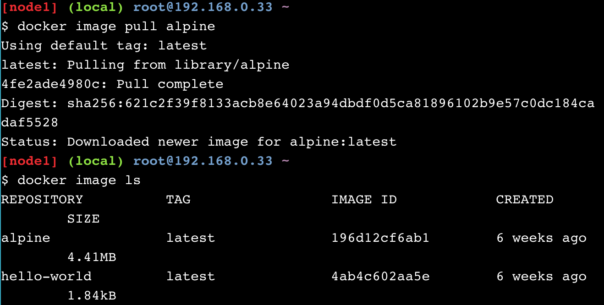

> In this lab you will run a popular, free, lightweight container and explore the basics of how containers work, 
how the Docker Engine executes and isolates containers from each other.

Highlighted Concepts

- Docker engine
- Containers & images
- Image registries and Docker Store (AKA Docker Hub)
- Container isolation

## Official Links

[Lab: DevOps Docker Beginners Guide](https://training.play-with-docker.com/ops-s1-hello/)

## Prerequisites
- Docker Id to access the online classroom

## Operations

### 1. Hello World

- Run in terminal

```bash
docker container run hello-world
```

- First you get an error for there is no image named __hello-world__ on your local machine.
- Then Docker engine looks it up in Docker image registry (Docker Store), downloads and runs it.


### 2. Docker Images

- Run in terminal to __pull__ Alpine Linux image from Docker image registry (Docker Store)

```bash
docker image pull alpine
```

- See a list of images on local host, Alpine Linux is on the list

```bash
docker image ls
```



- Run a container on Alpine image
```bash
docker container run alpine ls -l
```
When you call __run__, the Docker client finds the image (alpine in this case), 
creates the container and then runs a command in that container. 
When you run docker container run alpine, you provided a command (__ls -l__), 
so Docker executed this command inside the container for which you saw the directory listing. 
After the __ls__ command finished, the container shut down.

Then try

```bash
docker container run alpine echo "hello from alpine"
```

and

```bash
docker container run alpine /bin/sh
```

The shell starts and closes in Alpine, to interact with the Alpine shell, run

```bash
docker container run -it alpine /bin/sh
```


- To see the containers that are currently running,

```bash
docker container ls
```

- To see the containers that you have run,

```bash
docker container ls -a
```


### 3. Container Isolation

- Each _docker container run_ command creates an isolated container, which is listed
by command _docker container ls -a_

- For example, create a text file in one container

```bash
docker container run -it alpine /bin/ash
echo "hello world" > hello.txt
ls
```

- Then use command _ls_ to see the file

```bash
docker container run alpine ls
```

- The text file is missing because the command _ls_ is run in another container (isolation),
this feature not only for security, but to test the effects of making application changes. 
Isolation allows users to quickly create separate, isolated test copies of an application or service 
and have them run side-by-side without interfering with one another.

- To get back to the container that has my ‘hello.txt’ file, first get the _Container ID_

```bash
docker container ls -a
```

- Then start the container with the specific id

```bash
docker container start <container ID>
```

- Use _exec_ to run _ls_ command in that container, you will see the text file

```bash
docker container exec <container ID> ls
```

