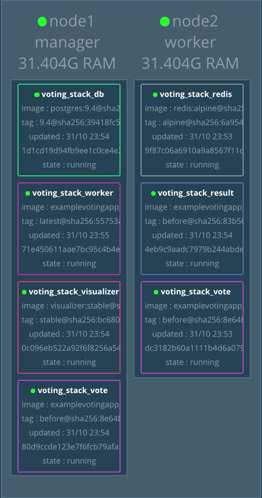
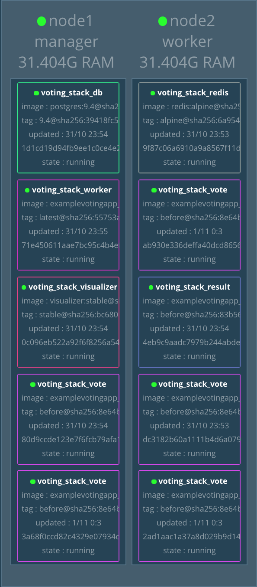

> This lab demonstrated how to use Swarm to orchestrate multiple containers to form services and
work as a stack. The stack exposes its functional components as services, each service
could be distributed to multiple worker nodes as task replicas (one container per replica). 
At last, we see how to dynamically scale up the task replicas of a service.

## Official Links

[Lab: Swarm Mode Introduction](https://training.play-with-docker.com/ops-s1-swarm-intro/)

## Operations

### 0: Start _Swarm_ and Join

To build up architecture as below,


- On manager node, start _Swarm_

```bash
docker swarm init --advertise-addr $(hostname -i)
```

- On worker node, join _Swarm_

```bash
docker swarm join --token <join token> <manager node IP:port>
```

### 1: Deploy a Stack


A __stack__ is a group of __services__ that are deployed together: 
multiple containerized components of an application that run in separate instances. 
Each individual service can actually be made up of one or more containers, 
called __tasks__ and then all the tasks & services together make up a stack.

- Clone demo repository on manager node

```bash
git clone https://github.com/docker/example-voting-app
cd example-voting-app
```

The _docker-stack.yml_ YAML file defines our entire stack: 
the architecture of the services, number of instances, how everything is wired together, how to handle updates to each service. 
It is the source code for our application design.

- Deploy Stack Using the YAML file on manager node

```bash
docker stack deploy --compose-file=docker-stack.yml voting_stack
```

- See all services in stack

```bash
docker stack ls
docker stack services voting_stack
```

- List the tasks of the _vote_ service, see 2 replicas

```bash
docker service ps voting_stack_vote
```



### 2: Scaling An Application


- As shown above, we will scale the _vote_ service up to 5 replicas

```bash
docker service scale voting_stack_vote=5
```

