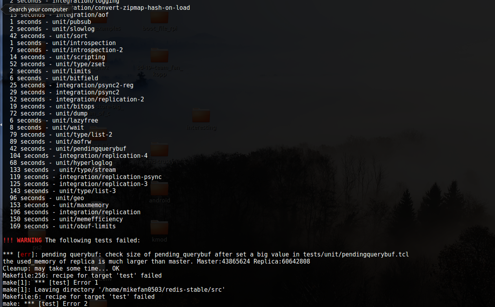
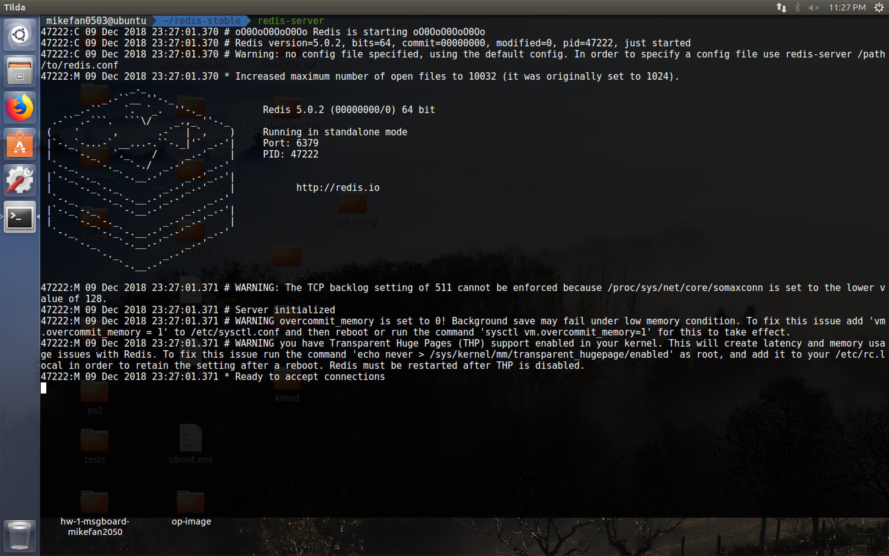
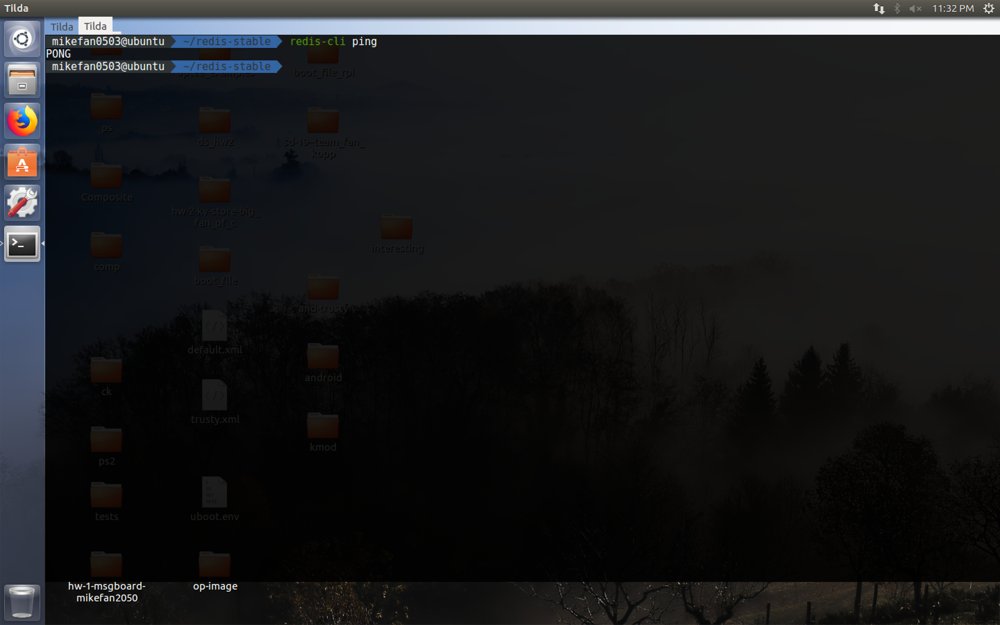
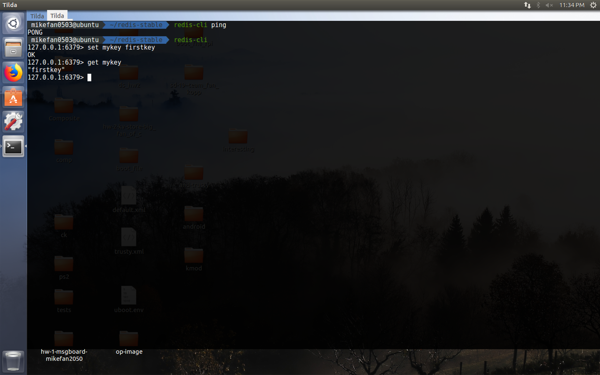

# Redis

## What is Redis

Redis is a distributed in-memory key-value storage server. Since its creation in 2009, a lot of companies such as Twitter, StackOverflow has used Redis in their service. Some popular usage of Redis are caching (Store popular item in memory to avoid latency of database query), uuid generator (keep the ordering in concurrent environment) or even serving as a distributed lock.

## Implementation detail
For distributed systems, the memory allication can be a serious performance bottleneck. Redis uses jemalloc for memory allocation. In short, jemalloc distributes memory allocation requests to different "arenas" (pools of memory) using round-robin. This is especially helpful for the multi-thread environments such as a distributed system since it largely reduced the wait time during the lock contention of same memory pool. jemalloc also uses algorithms to improve the cache locality and prevent false cache sharing (the same physical cache line is shared by separate threads). 


For scalability, Redis uses a master-replication model. Master node can manage multiple replications at the same time. The data can be distributed to 90 shards (different nodes or servers). 

Redis mostly use a single-producer model (use only one thread). 

## Redis vs. Memcached
Redis and Memcached are both in-memory key-value storage server. Despite the similarity, 

* Support data types: While Memcached only supports String and integer as key or value in its storage. In contrast, Redis supports more complex data structures such maps, sets in addition to the ones Memcached supports. 

* Read/Write speed: As stated in the support document, Redis is mostly running as single-thread mode. For a single thread, Redis is not good at handling high-volume traffic. Memcached, on the other hand, uses mechanisms such RCU (read-copy-update) to handle large amount of requests.


## How to run Redis

To install Redis simple run
```
wget http://download.redis.io/redis-stable.tar.gz
tar xvzf redis-stable.tar.gz
cd redis-stable
make
```
During the first run of the make test on my local VM (Ubuntu 16.04), I got an error during the test for setting large value. However, during the second run, the error disappeared. 



To start the server, copy the server/cli binary into `/usr/local/bin/` and simply run `redis-server`. To interact with the server, we can use the command line interface `redis-cli`. For example, we can also use `redis-cli ping` to test if the Redis server is started properly.





`redis-cli` also provides a interactive mode. `SET` and `GET` are the basic commands for storing and retrieving key-value pairs from the server.


